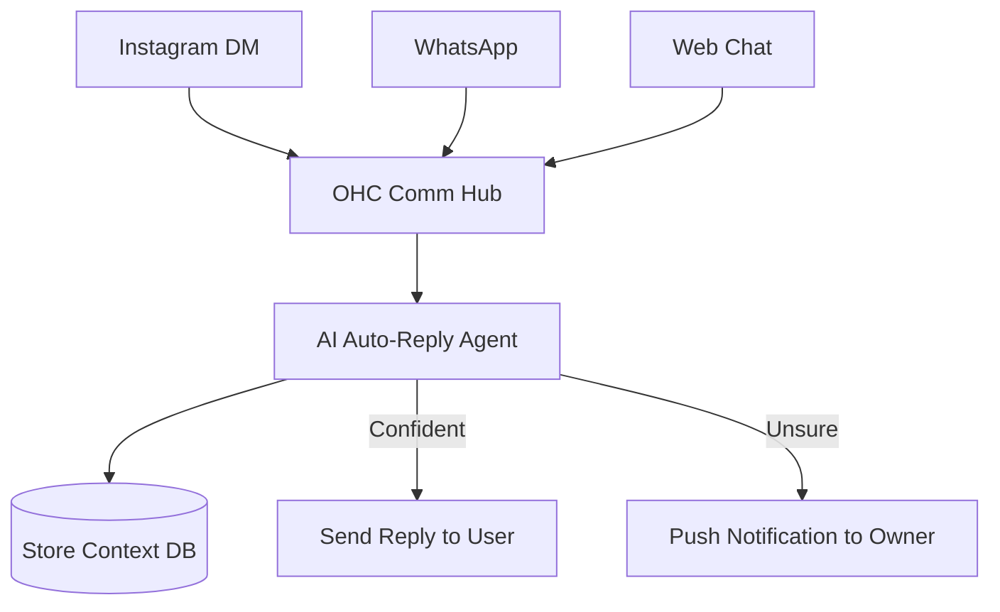

**Title**: Omni-Channel Auto-Reply Agent
**Problem Statement**: Small business owners (like Maya the baker) spend hours every day manually answering the same routine questions (shipping times, business hours, pricing) across fragmented channels like Instagram DMs, WhatsApp, and their website contact form. This manual effort leads to delayed responses, lost sales, and founder burnout.
**Research Report**: Competitor analysis shows that while platforms like Shopify offer an "Inbox" app to centralize messages, it still requires manual response or simple keyword-based auto-replies. No competitor offers a truly intelligent, zero-configuration agent that understands the business context and handles conversations autonomously. Real user feedback across Reddit (r/smallbusiness) frequently cites "keeping up with messages" as a top-3 daily pain point.
**Design Doc**:
- **Architecture**: A central `Communication Hub` entity that ingests webhooks from Instagram/Facebook Messenger APIs, WhatsApp Business API, and the native OHC Web Chat.
- **Key Relationships**: The Hub routes messages to the `Auto-Reply Agent`, which leverages the `Store Context` (inventory, policies, FAQs) to generate responses.
- **Mobile UX Flow (375px)**:
  1. A unified 'Inbox' tab showing all conversations.
  2. A toggle at the top: 'AI Assistant: ON/OFF'.
  3. Messages handled by AI have a subtle sparkle icon.
  4. If the AI is unsure, the message is marked 'Needs your attention' and sends a push notification to the owner.
- **Mermaid Flow**:

**Implementation Prompt**: Build the Omni-Channel Communication Hub and the underlying agentic routing logic. The user-facing outcome is a unified mobile inbox where incoming customer inquiries are automatically answered based on store context. The Critical User Journey involves the owner connecting their Instagram account, receiving a customer question about shipping, and the AI correctly answering it without owner intervention. The acceptance criteria require the system to correctly identify when it lacks the knowledge to answer and reliably escalate the message to the owner's manual inbox view.
**Priority**: P0
**Estimated Scope**: Large
