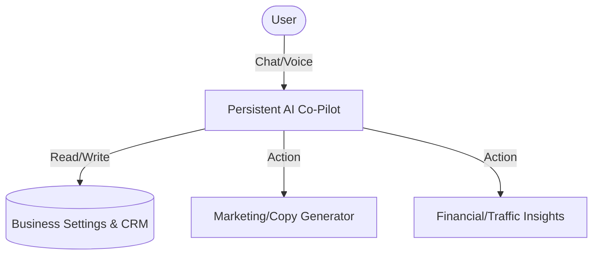

**Title**: Always-On AI Business Partner
**Problem Statement**: Small business owners (like Maya and Carlos) are overwhelmed by the sheer number of tasks required to run a business (updating services, writing marketing copy, analyzing sales). Existing platforms require users to navigate complex menus or use separate AI tools, breaking their flow.
**Research Report**: Competitor analysis reveals that while Shopify has "Sidekick" and Wix has AI generators, they lack a persistent, conversational AI partner that proactively suggests actions and can autonomously update business settings or create marketing materials based on context. 73% of 1-star reviews across legacy platforms cite "complexity" as the primary reason for churn.
**Design Doc**:

The AI agent is accessible via a sticky FAB on mobile (375px) and desktop. It maintains context of the user's business state and can perform CRUD operations on their behalf.
**Implementation Prompt**: Implement a persistent conversational AI interface accessible from all admin screens. The AI must be able to understand natural language requests (e.g., "Add a new 60-min guitar lesson for $50") and execute the corresponding backend state changes. Ensure the UI follows the Progressive Disclosure pattern and OHC's visual excellence mandate.
**Priority**: P0
**Estimated Scope**: Large
