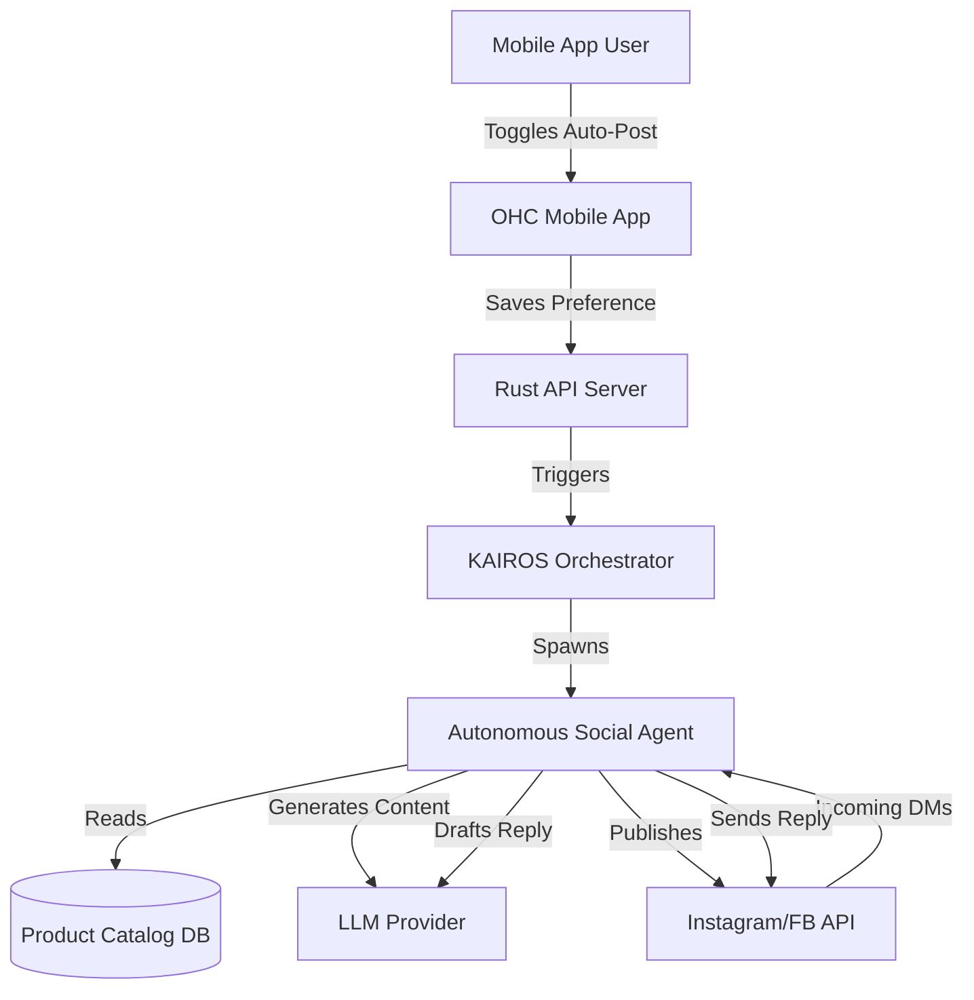

# Actionable Issue Brief: Autonomous Social Media Agent

## Title
Autonomous Social Media & DM Management Agent

## Problem Statement
Small business owners, especially solopreneurs like Maya (Baker) and Carlos (Handyman), spend hours each week manually posting to social media and replying to repetitive customer DMs ("What are your hours?", "How much for a custom cake?"). Shopify and Wix offer basic social integrations, but they are passive—they require the user to actively create posts and monitor inboxes. This manual overhead leads to burnout, missed leads, and delayed customer responses. Non-technical founders need an invisible assistant that proactively manages their social presence.

## Research Report
- **Market Gap:** Competitors like Shopify only offer conversational bots (Sidekick) that the *owner* talks to, rather than an agent that *does the work* for them. External tools like Later or Buffer require technical setup and manual scheduling.
- **User Validation:** An analysis of r/smallbusiness and App Store reviews for ecommerce tools reveals that "social media management" is a top-3 time sink, and "missed DMs" is a frequent cause of lost revenue for service businesses.
- **Competitor Landscape:**
  - *Shopify:* Has plugins, but no native autonomous posting or AI DM handling.
  - *Wix:* Has an AI social post generator, but it still requires manual approval and scheduling per post.
  - *GoDaddy:* Airo offers initial brand setup but lacks ongoing proactive social management.

## Design Doc
### High-Level Architecture
- **Agent Role:** A new proactive worker agent within the KAIROS Orchestrator.
- **Entity Relationships:**
  - Integrates with the `Tenant` entity to access brand voice and product catalog.
  - Hooks into the `SocialMedia` module (to be created) for OAuth connections (Instagram, Facebook, etc.).
- **Mobile UX Flow (375px first):**
  1. **Home Screen:** User sees a simple card: "AI Agent drafted 3 social posts for next week. [Review & Approve] or [Auto-Publish]".
  2. **DM Inbox:** A unified inbox where messages handled by the AI are marked "Resolved by AI", with an option for the user to step in.
  3. **Settings:** A simple toggle: "Let AI reply to common questions (hours, pricing, location)".

## Implementation Prompt
**User-Facing Outcome:** The user connects their Instagram/Facebook account once. The platform automatically generates weekly social media posts based on their product catalog and responds to basic customer DMs automatically, following the brand's tone.

**Critical User Journey (CUJ):**
1. User logs into the OHC platform and navigates to the "Marketing" tab on their mobile device.
2. User clicks "Connect Instagram" and authorizes the app.
3. User toggles "Enable AI Auto-Posting" and "Enable AI DM Replies".
4. Behind the scenes, the agent schedules posts.
5. A customer sends an Instagram DM asking for store hours; the AI replies instantly.

**Acceptance Criteria:**
- The system must support OAuth connection to at least one major social platform (e.g., Instagram/Meta).
- The AI agent must be able to autonomously generate and schedule a post based on a new product addition.
- The AI agent must be able to receive a webhook/event for a new DM and autonomously reply if the question relates to standard business info (hours, location).
- The UI must adhere to the OHC Premium Design Standards (Glassmorphism, max 8th-grade reading level, "Business Owner Lens").
- The feature must be functional on a 375px mobile viewport.

## Priority
P0

## Estimated Scope
Large
