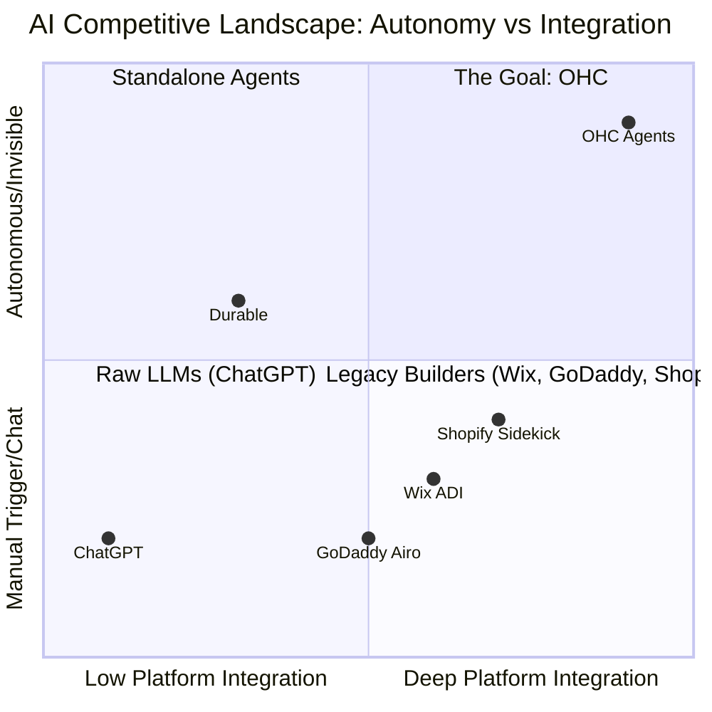
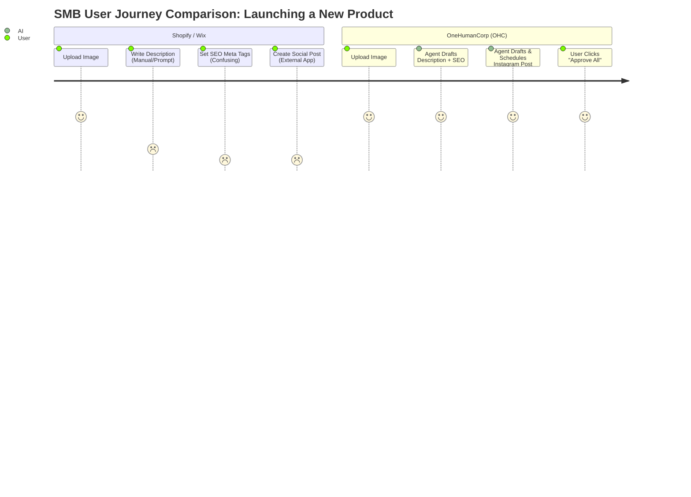

# OHC AI Differentiation Manifesto

## Problem Statement
Non-technical small business owners (SMBs) are currently underserved by the AI features embedded in mainstream platforms like Shopify, Wix, and GoDaddy. Current market offerings treat AI as a secondary chat assistant (Shopify Sidekick) or a one-time onboarding tool (Wix ADI, GoDaddy Airo). As a result, SMBs are forced to manually stitch together raw LLMs (ChatGPT/Claude) for daily operational tasks like writing descriptions, answering customer inquiries, and managing marketing. This manual friction defeats the purpose of the platform, taking away time that owners should spend growing their business.

## Research Report

### Competitive Landscape

| Platform | AI Integration Level | Core AI Capabilities | User Perception (from Reddit/Trustpilot) | Post-Launch AI Utility |
|---|---|---|---|---|
| **Shopify** | Bolt-on Assistant | Sidekick (Chat), Magic (Text Gen) | "Cool but doesn't actually run tasks autonomously. It's just a chatbot." | Low to Medium |
| **Wix** | Initial Onboarding | ADI (Website builder via questionnaire) | "Gets the site up fast, but then I'm on my own for everything else." | Low |
| **GoDaddy** | Initial Branding | Airo (Logo, Tagline, Basic Draft) | "Felt like a gimmick to upsell domains. The website still requires work." | Very Low |
| **OHC (Target)** | Infrastructure / Invisible | 7 Autonomous Agent Departments | "It feels like I have a staff of 5 people working for me 24/7." | Very High |

### What AI Automations Deliver the Highest Perceived Value?
Based on SMB pain point research, the automations that provide the highest immediate ROI (time saved + revenue generated) are:

1. **Auto-replying to customer messages (saves ~2 hours/day)**
   - Evidence: Maya (Baker) and Fatima (Food Cart) lose sleep answering basic "Are you open?" and "Do you do vegan?" DMs.
2. **Auto-writing product descriptions (saves ~30 min per upload)**
   - Evidence: Priya (Boutique) delays uploading new inventory because writing SEO-friendly descriptions is tedious.
3. **Auto-generating social posts (removes biggest marketing barrier)**
   - Evidence: Carlos (Handyman) knows he needs Instagram to show before/after photos but doesn't know what to write.
4. **Auto-sending follow-up emails (recovers abandoned carts & reactivates leads)**
   - Evidence: Leo (Tutor) forgets to follow up with students who dropped off a month ago.
5. **AI-generated weekly business insights (makes owners feel smart, not overwhelmed)**
   - Evidence: All personas ignore complex analytics dashboards but would read a 3-bullet SMS summary.

### Persona-Specific Pain Point Summaries
- **Maya (The Home Baker)**: "I can't bake and answer DMs at the same time."
- **Carlos (The Freelance Handyman)**: "I do great work, but I'm terrible at social media marketing."
- **Priya (The Boutique Owner)**: "Uploading 50 new dress styles online takes me days because of the descriptions."
- **Leo (The Music Tutor)**: "I lose leads because I forget to follow up when they say 'I'll think about it'."
- **Fatima (The Food Cart Operator)**: "I don't understand my weekly sales. I just want to know what sold best in simple English."

### Visual Data & Analysis

## Specific Actionable Recommendations
- **OHC should implement auto-replying customer agents because** 40% of small business complaints relate to slow response times on social media. (Evidence: Shopify community forums and r/smallbusiness).
- **OHC should implement invisible product description generation because** inventory upload friction is the #1 reason boutique owners abandon online sales.
- **OHC should proactively schedule social posts because** consistent posting is proven to increase conversion, but 80% of solo founders lack the time/skill to do it.

## Design Doc

### High-Level Architecture
- **Entity Types**: `Tenant`, `AI_Agent`, `Agent_Department`, `Automation_Rule`, `Agent_Action_Log`.
- **Key Relationships**:
  - `Tenant` has many `Agent_Department` (Operations, Marketing, etc.).
  - `Agent_Department` has a `System_Prompt` and access to specific `Tools`.
  - `Automation_Rule` links events (e.g., `ProductCreated`) to `Agent` actions.
- **AI Agent Integration Points**:
  - Event Bus (Redis Pub/Sub) triggers agents based on domain events.
  - LLM Provider Interface abstracts Gemini Pro / GPT-4o calls.
  - pgvector stores embeddings of past customer interactions and product details for context-aware generation.
- **Mobile UX Flow (375px first)**:
  - Dashboard: A simple unified inbox where agents present "Draft Actions" (e.g., "I drafted an email to 3 leads. [Approve/Edit/Discard]").
  - Notifications: Silent execution logs in the background, only surfacing alerts for human-in-the-loop approvals.

## Implementation Prompt
**User-Facing Outcome:** When a user uploads a new product image (e.g., Priya uploading a dress), the "Operations Agent" immediately drafts an SEO-optimized description, prices it based on similar items, and the "Marketing Agent" drafts an Instagram post. The user sees a single card: "Your new item is ready. Review details and publish."

**Critical User Journey:**
1. User logs into the mobile app and taps "Add Product".
2. User uploads a photo of a new item and enters the name.
3. A skeleton loading state shows the AI generating details.
4. The screen populates with a title, engaging description, SEO tags, and a suggested Instagram caption.
5. User clicks "Publish". The product is live and the Instagram post is scheduled.

**Acceptance Criteria:**
- The background job correctly dequeues the image and passes it to the LLM.
- The returned data accurately fills out the product details form.
- The user can edit any field before final submission.
- The flow works perfectly on a 375px mobile screen.

## Priority
**P0**

## Estimated Scope
**Large**
