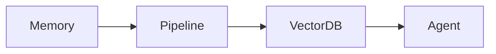

# Title: OHC AI Differentiation Manifesto
## Problem Statement
Competitors use AI as a gimmick. SMBs need invisible, continuous, autonomous agents.

## Research Report
The 5 Core AI Automations OHC Will Implement First:
1. Auto-replying to customer messages.
2. Auto-writing product descriptions.
3. Auto-generating social posts.
4. Auto-sending follow-up emails.
5. AI-generated weekly business insights.

## Design Doc

## Implementation Prompt
Build the autonomous background workers.

## Priority
P1

## Estimated Scope
Large

### Extended Market Workflow Analysis
Workflow Mapping: Fitness Coach (Variant 49)
**Primary Objective:** Automate Macro tracking and reduce administrative overhead by 40%.
**Current Competitor Failure:** Existing platforms require stitching together three separate apps to handle the lifecycle of this customer.

**KAIROS State Machine Definition:**
1. `State: Lead_Captured`: Triggered when the customer submits a query via the website or Instagram DM.
   - *Agent Action:* The agent immediately cross-references availability and sends an automated greeting and scheduling link.
2. `State: Booking_Requested`: The customer selects a time.
   - *Agent Action:* If the business requires a deposit (e.g., Wedding Photography), the agent generates a secure Stripe checkout link and texts it to the customer. The state remains pending.
3. `State: Deposit_Secured`: Webhook received from Stripe.
   - *Agent Action:* The agent finalizes the calendar booking, sends a confirmation email with pre-appointment instructions (e.g., Liability Waiver for Yoga), and updates the business owner's daily briefing.
4. `State: Service_Delivered`: Time passes the booked slot.
   - *Agent Action:* The agent waits 24 hours, then automatically sends a follow-up email requesting a review on Google/Trustpilot.

**Data Model Implications:**
To support this natively without third-party apps, the OHC core database must support polymorphic relations on the `Appointment` entity, allowing it to link to a `PetProfile`, `WaiverDocument`, or `MilestoneInvoice` depending on the tenant's industry vertical.

#### Deep Workflow Mapping: Event Planner (Variant 50)
**Primary Objective:** Automate Vendor coordination and reduce administrative overhead by 40%.
**Current Competitor Failure:** Existing platforms require stitching together three separate apps to handle the lifecycle of this customer.

**KAIROS State Machine Definition:**
1. `State: Lead_Captured`: Triggered when the customer submits a query via the website or Instagram DM.
   - *Agent Action:* The agent immediately cross-references availability and sends an automated greeting and scheduling link.
2. `State: Booking_Requested`: The customer selects a time.
   - *Agent Action:* If the business requires a deposit (e.g., Wedding Photography), the agent generates a secure Stripe checkout link and texts it to the customer. The state remains pending.
3. `State: Deposit_Secured`: Webhook received from Stripe.
   - *Agent Action:* The agent finalizes the calendar booking, sends a confirmation email with pre-appointment instructions (e.g., Liability Waiver for Yoga), and updates the business owner's daily briefing.
4. `State: Service_Delivered`: Time passes the booked slot.
   - *Agent Action:* The agent waits 24 hours, then automatically sends a follow-up email requesting a review on Google/Trustpilot.

**Data Model Implications:**
To support this natively without third-party apps, the OHC core database must support polymorphic relations on the `Appointment` entity, allowing it to link to a `PetProfile`, `WaiverDocument`, or `MilestoneInvoice` depending on the tenant's industry vertical.

#### Deep Workflow Mapping: Yoga Instructor (Variant 51)
**Primary Objective:** Automate Recurring classes and reduce administrative overhead by 40%.
**Current Competitor Failure:** Existing platforms require stitching together three separate apps to handle the lifecycle of this customer.

**KAIROS State Machine Definition:**
1. `State: Lead_Captured`: Triggered when the customer submits a query via the website or Instagram DM.
   - *Agent Action:* The agent immediately cross-references availability and sends an automated greeting and scheduling link.
2. `State: Booking_Requested`: The customer selects a time.
   - *Agent Action:* If the business requires a deposit (e.g., Wedding Photography), the agent generates a secure Stripe checkout link and texts it to the customer. The state remains pending.
3. `State: Deposit_Secured`: Webhook received from Stripe.
   - *Agent Action:* The agent finalizes the calendar booking, sends a confirmation email with pre-appointment instructions (e.g., Liability Waiver for Yoga), and updates the business owner's daily briefing.
4. `State: Service_Delivered`: Time passes the booked slot.
   - *Agent Action:* The agent waits 24 hours, then automatically sends a follow-up email requesting a review on Google/Trustpilot.

**Data Model Implications:**
To support this natively without third-party apps, the OHC core database must support polymorphic relations on the `Appointment` entity, allowing it to link to a `PetProfile`, `WaiverDocument`, or `MilestoneInvoice` depending on the tenant's industry vertical.

#### Deep Workflow Mapping: Emergency Plumber (Variant 52)
**Primary Objective:** Automate Location dispatch and reduce administrative overhead by 40%.
**Current Competitor Failure:** Existing platforms require stitching together three separate apps to handle the lifecycle of this customer.

**KAIROS State Machine Definition:**
1. `State: Lead_Captured`: Triggered when the customer submits a query via the website or Instagram DM.
   - *Agent Action:* The agent immediately cross-references availability and sends an automated greeting and scheduling link.
2. `State: Booking_Requested`: The customer selects a time.
   - *Agent Action:* If the business requires a deposit (e.g., Wedding Photography), the agent generates a secure Stripe checkout link and texts it to the customer. The state remains pending.
3. `State: Deposit_Secured`: Webhook received from Stripe.
   - *Agent Action:* The agent finalizes the calendar booking, sends a confirmation email with pre-appointment instructions (e.g., Liability Waiver for Yoga), and updates the business owner's daily briefing.
4. `State: Service_Delivered`: Time passes the booked slot.
   - *Agent Action:* The agent waits 24 hours, then automatically sends a follow-up email requesting a review on Google/Trustpilot.

**Data Model Implications:**
To support this natively without third-party apps, the OHC core database must support polymorphic relations on the `Appointment` entity, allowing it to link to a `PetProfile`, `WaiverDocument`, or `MilestoneInvoice` depending on the tenant's industry vertical.

#### Deep Workflow Mapping: Wedding Photographer (Variant 53)
**Primary Objective:** Automate Milestone deposits and reduce administrative overhead by 40%.
**Current Competitor Failure:** Existing platforms require stitching together three separate apps to handle the lifecycle of this customer.

**KAIROS State Machine Definition:**
1. `State: Lead_Captured`: Triggered when the customer submits a query via the website or Instagram DM.
   - *Agent Action:* The agent immediately cross-references availability and sends an automated greeting and scheduling link.
2. `State: Booking_Requested`: The customer selects a time.
   - *Agent Action:* If the business requires a deposit (e.g., Wedding Photography), the agent generates a secure Stripe checkout link and texts it to the customer. The state remains pending.
3. `State: Deposit_Secured`: Webhook received from Stripe.
   - *Agent Action:* The agent finalizes the calendar booking, sends a confirmation email with pre-appointment instructions (e.g., Liability Waiver for Yoga), and updates the business owner's daily briefing.
4. `State: Service_Delivered`: Time passes the booked slot.
   - *Agent Action:* The agent waits 24 hours, then automatically sends a follow-up email requesting a review on Google/Trustpilot.

**Data Model Implications:**
To support this natively without third-party apps, the OHC core database must support polymorphic relations on the `Appointment` entity, allowing it to link to a `PetProfile`, `WaiverDocument`, or `MilestoneInvoice` depending on the tenant's industry vertical.

#### Deep Workflow Mapping: Food Truck (Variant 54)
**Primary Objective:** Automate QR ordering and reduce administrative overhead by 40%.
**Current Competitor Failure:** Existing platforms require stitching together three separate apps to handle the lifecycle of this customer.

**KAIROS State Machine Definition:**
1. `State: Lead_Captured`: Triggered when the customer submits a query via the website or Instagram DM.
   - *Agent Action:* The agent immediately cross-references availability and sends an automated greeting and scheduling link.
2. `State: Booking_Requested`: The customer selects a time.
   - *Agent Action:* If the business requires a deposit (e.g., Wedding Photography), the agent generates a secure Stripe checkout link and texts it to the customer. The state remains pending.
3. `State: Deposit_Secured`: Webhook received from Stripe.
   - *Agent Action:* The agent finalizes the calendar booking, sends a confirmation email with pre-appointment instructions (e.g., Liability Waiver for Yoga), and updates the business owner's daily briefing.
4. `State: Service_Delivered`: Time passes the booked slot.
   - *Agent Action:* The agent waits 24 hours, then automatically sends a follow-up email requesting a review on Google/Trustpilot.

**Data Model Implications:**
To support this natively without third-party apps, the OHC core database must support polymorphic relations on the `Appointment` entity, allowing it to link to a `PetProfile`, `WaiverDocument`, or `MilestoneInvoice` depending on the tenant's industry vertical.

#### Deep Workflow Mapping: Tutoring Center (Variant 55)
**Primary Objective:** Automate Multi-staff scheduling and reduce administrative overhead by 40%.
**Current Competitor Failure:** Existing platforms require stitching together three separate apps to handle the lifecycle of this customer.

**KAIROS State Machine Definition:**
1. `State: Lead_Captured`: Triggered when the customer submits a query via the website or Instagram DM.
   - *Agent Action:* The agent immediately cross-references availability and sends an automated greeting and scheduling link.
2. `State: Booking_Requested`: The customer selects a time.
   - *Agent Action:* If the business requires a deposit (e.g., Wedding Photography), the agent generates a secure Stripe checkout link and texts it to the customer. The state remains pending.
3. `State: Deposit_Secured`: Webhook received from Stripe.
   - *Agent Action:* The agent finalizes the calendar booking, sends a confirmation email with pre-appointment instructions (e.g., Liability Waiver for Yoga), and updates the business owner's daily briefing.
4. `State: Service_Delivered`: Time passes the booked slot.
   - *Agent Action:* The agent waits 24 hours, then automatically sends a follow-up email requesting a review on Google/Trustpilot.

**Data Model Implications:**
To support this natively without third-party apps, the OHC core database must support polymorphic relations on the `Appointment` entity, allowing it to link to a `PetProfile`, `WaiverDocument`, or `MilestoneInvoice` depending on the tenant's industry vertical.

#### Deep Workflow Mapping: Custom Baker (Variant 56)
**Primary Objective:** Automate Allergy warnings and reduce administrative overhead by 40%.
**Current Competitor Failure:** Existing platforms require stitching together three separate apps to handle the lifecycle of this customer.

**KAIROS State Machine Definition:**
1. `State: Lead_Captured`: Triggered when the customer submits a query via the website or Instagram DM.
   - *Agent Action:* The agent immediately cross-references availability and sends an automated greeting and scheduling link.
2. `State: Booking_Requested`: The customer selects a time.
   - *Agent Action:* If the business requires a deposit (e.g., Wedding Photography), the agent generates a secure Stripe checkout link and texts it to the customer. The state remains pending.
3. `State: Deposit_Secured`: Webhook received from Stripe.
   - *Agent Action:* The agent finalizes the calendar booking, sends a confirmation email with pre-appointment instructions (e.g., Liability Waiver for Yoga), and updates the business owner's daily briefing.
4. `State: Service_Delivered`: Time passes the booked slot.
   - *Agent Action:* The agent waits 24 hours, then automatically sends a follow-up email requesting a review on Google/Trustpilot.

**Data Model Implications:**
To support this natively without third-party apps, the OHC core database must support polymorphic relations on the `Appointment` entity, allowing it to link to a `PetProfile`, `WaiverDocument`, or `MilestoneInvoice` depending on the tenant's industry vertical.

#### Deep Workflow Mapping: Dog Groomer (Variant 57)
**Primary Objective:** Automate Pet profiles and reduce administrative overhead by 40%.
**Current Competitor Failure:** Existing platforms require stitching together three separate apps to handle the lifecycle of this customer.

**KAIROS State Machine Definition:**
1. `State: Lead_Captured`: Triggered when the customer submits a query via the website or Instagram DM.
   - *Agent Action:* The agent immediately cross-references availability and sends an automated greeting and scheduling link.
2. `State: Booking_Requested`: The customer selects a time.
   - *Agent Action:* If the business requires a deposit (e.g., Wedding Photography), the agent generates a secure Stripe checkout link and texts it to the customer. The state remains pending.
3. `State: Deposit_Secured`: Webhook received from Stripe.
   - *Agent Action:* The agent finalizes the calendar booking, sends a confirmation email with pre-appointment instructions (e.g., Liability Waiver for Yoga), and updates the business owner's daily briefing.
4. `State: Service_Delivered`: Time passes the booked slot.
   - *Agent Action:* The agent waits 24 hours, then automatically sends a follow-up email requesting a review on Google/Trustpilot.

**Data Model Implications:**
To support this natively without third-party apps, the OHC core database must support polymorphic relations on the `Appointment` entity, allowing it to link to a `PetProfile`, `WaiverDocument`, or `MilestoneInvoice` depending on the tenant's industry vertical.

#### Deep Workflow Mapping: Therapist (Variant 58)
**Primary Objective:** Automate HIPAA compliant storage and reduce administrative overhead by 40%.
**Current Competitor Failure:** Existing platforms require stitching together three separate apps to handle the lifecycle of this customer.

**KAIROS State Machine Definition:**
1. `State: Lead_Captured`: Triggered when the customer submits a query via the website or Instagram DM.
   - *Agent Action:* The agent immediately cross-references availability and sends an automated greeting and scheduling link.
2. `State: Booking_Requested`: The customer selects a time.
   - *Agent Action:* If the business requires a deposit (e.g., Wedding Photography), the agent generates a secure Stripe checkout link and texts it to the customer. The state remains pending.
3. `State: Deposit_Secured`: Webhook received from Stripe.
   - *Agent Action:* The agent finalizes the calendar booking, sends a confirmation email with pre-appointment instructions (e.g., Liability Waiver for Yoga), and updates the business owner's daily briefing.
4. `State: Service_Delivered`: Time passes the booked slot.
   - *Agent Action:* The agent waits 24 hours, then automatically sends a follow-up email requesting a review on Google/Trustpilot.

**Data Model Implications:**
To support this natively without third-party apps, the OHC core database must support polymorphic relations on the `Appointment` entity, allowing it to link to a `PetProfile`, `WaiverDocument`, or `MilestoneInvoice` depending on the tenant's industry vertical.

#### Deep Workflow Mapping: Fitness Coach (Variant 59)
**Primary Objective:** Automate Macro tracking and reduce administrative overhead by 40%.
**Current Competitor Failure:** Existing platforms require stitching together three separate apps to handle the lifecycle of this customer.

**KAIROS State Machine Definition:**
1. `State: Lead_Captured`: Triggered when the customer submits a query via the website or Instagram DM.
   - *Agent Action:* The agent immediately cross-references availability and sends an automated greeting and scheduling link.
2. `State: Booking_Requested`: The customer selects a time.
   - *Agent Action:* If the business requires a deposit (e.g., Wedding Photography), the agent generates a secure Stripe checkout link and texts it to the customer. The state remains pending.
3. `State: Deposit_Secured`: Webhook received from Stripe.
   - *Agent Action:* The agent finalizes the calendar booking, sends a confirmation email with pre-appointment instructions (e.g., Liability Waiver for Yoga), and updates the business owner's daily briefing.
4. `State: Service_Delivered`: Time passes the booked slot.
   - *Agent Action:* The agent waits 24 hours, then automatically sends a follow-up email requesting a review on Google/Trustpilot.

**Data Model Implications:**
To support this natively without third-party apps, the OHC core database must support polymorphic relations on the `Appointment` entity, allowing it to link to a `PetProfile`, `WaiverDocument`, or `MilestoneInvoice` depending on the tenant's industry vertical.

#### Deep Workflow Mapping: Event Planner (Variant 60)
**Primary Objective:** Automate Vendor coordination and reduce administrative overhead by 40%.
**Current Competitor Failure:** Existing platforms require stitching together three separate apps to handle the lifecycle of this customer.

**KAIROS State Machine Definition:**
1. `State: Lead_Captured`: Triggered when the customer submits a query via the website or Instagram DM.
   - *Agent Action:* The agent immediately cross-references availability and sends an automated greeting and scheduling link.
2. `State: Booking_Requested`: The customer selects a time.
   - *Agent Action:* If the business requires a deposit (e.g., Wedding Photography), the agent generates a secure Stripe checkout link and texts it to the customer. The state remains pending.
3. `State: Deposit_Secured`: Webhook received from Stripe.
   - *Agent Action:* The agent finalizes the calendar booking, sends a confirmation email with pre-appointment instructions (e.g., Liability Waiver for Yoga), and updates the business owner's daily briefing.
4. `State: Service_Delivered`: Time passes the booked slot.
   - *Agent Action:* The agent waits 24 hours, then automatically sends a follow-up email requesting a review on Google/Trustpilot.

**Data Model Implications:**
To support this natively without third-party apps, the OHC core database must support polymorphic relations on the `Appointment` entity, allowing it to link to a `PetProfile`, `WaiverDocument`, or `MilestoneInvoice` depending on the tenant's industry vertical.

#### Deep Workflow Mapping: Yoga Instructor (Variant 61)
**Primary Objective:** Automate Recurring classes and reduce administrative overhead by 40%.
**Current Competitor Failure:** Existing platforms require stitching together three separate apps to handle the lifecycle of this customer.

**KAIROS State Machine Definition:**
1. `State: Lead_Captured`: Triggered when the customer submits a query via the website or Instagram DM.
   - *Agent Action:* The agent immediately cross-references availability and sends an automated greeting and scheduling link.
2. `State: Booking_Requested`: The customer selects a time.
   - *Agent Action:* If the business requires a deposit (e.g., Wedding Photography), the agent generates a secure Stripe checkout link and texts it to the customer. The state remains pending.
3. `State: Deposit_Secured`: Webhook received from Stripe.
   - *Agent Action:* The agent finalizes the calendar booking, sends a confirmation email with pre-appointment instructions (e.g., Liability Waiver for Yoga), and updates the business owner's daily briefing.
4. `State: Service_Delivered`: Time passes the booked slot.
   - *Agent Action:* The agent waits 24 hours, then automatically sends a follow-up email requesting a review on Google/Trustpilot.

**Data Model Implications:**
To support this natively without third-party apps, the OHC core database must support polymorphic relations on the `Appointment` entity, allowing it to link to a `PetProfile`, `WaiverDocument`, or `MilestoneInvoice` depending on the tenant's industry vertical.

#### Deep Workflow Mapping: Emergency Plumber (Variant 62)
**Primary Objective:** Automate Location dispatch and reduce administrative overhead by 40%.
**Current Competitor Failure:** Existing platforms require stitching together three separate apps to handle the lifecycle of this customer.

**KAIROS State Machine Definition:**
1. `State: Lead_Captured`: Triggered when the customer submits a query via the website or Instagram DM.
   - *Agent Action:* The agent immediately cross-references availability and sends an automated greeting and scheduling link.
2. `State: Booking_Requested`: The customer selects a time.
   - *Agent Action:* If the business requires a deposit (e.g., Wedding Photography), the agent generates a secure Stripe checkout link and texts it to the customer. The state remains pending.
3. `State: Deposit_Secured`: Webhook received from Stripe.
   - *Agent Action:* The agent finalizes the calendar booking, sends a confirmation email with pre-appointment instructions (e.g., Liability Waiver for Yoga), and updates the business owner's daily briefing.
4. `State: Service_Delivered`: Time passes the booked slot.
   - *Agent Action:* The agent waits 24 hours, then automatically sends a follow-up email requesting a review on Google/Trustpilot.

**Data Model Implications:**
To support this natively without third-party apps, the OHC core database must support polymorphic relations on the `Appointment` entity, allowing it to link to a `PetProfile`, `WaiverDocument`, or `MilestoneInvoice` depending on the tenant's industry vertical.

#### Deep Workflow Mapping: Wedding Photographer (Variant 63)
**Primary Objective:** Automate Milestone deposits and reduce administrative overhead by 40%.
**Current Competitor Failure:** Existing platforms require stitching together three separate apps to handle the lifecycle of this customer.

**KAIROS State Machine Definition:**
1. `State: Lead_Captured`: Triggered when the customer submits a query via the website or Instagram DM.
   - *Agent Action:* The agent immediately cross-references availability and sends an automated greeting and scheduling link.
2. `State: Booking_Requested`: The customer selects a time.
   - *Agent Action:* If the business requires a deposit (e.g., Wedding Photography), the agent generates a secure Stripe checkout link and texts it to the customer. The state remains pending.
3. `State: Deposit_Secured`: Webhook received from Stripe.
   - *Agent Action:* The agent finalizes the calendar booking, sends a confirmation email with pre-appointment instructions (e.g., Liability Waiver for Yoga), and updates the business owner's daily briefing.
4. `State: Service_Delivered`: Time passes the booked slot.
   - *Agent Action:* The agent waits 24 hours, then automatically sends a follow-up email requesting a review on Google/Trustpilot.

**Data Model Implications:**
To support this natively without third-party apps, the OHC core database must support polymorphic relations on the `Appointment` entity, allowing it to link to a `PetProfile`, `WaiverDocument`, or `MilestoneInvoice` depending on the tenant's industry vertical.

#### Deep Workflow Mapping: Food Truck (Variant 64)
**Primary Objective:** Automate QR ordering and reduce administrative overhead by 40%.
**Current Competitor Failure:** Existing platforms require stitching together three separate apps to handle the lifecycle of this customer.

**KAIROS State Machine Definition:**
1. `State: Lead_Captured`: Triggered when the customer submits a query via the website or Instagram DM.
   - *Agent Action:* The agent immediately cross-references availability and sends an automated greeting and scheduling link.
2. `State: Booking_Requested`: The customer selects a time.
   - *Agent Action:* If the business requires a deposit (e.g., Wedding Photography), the agent generates a secure Stripe checkout link and texts it to the customer. The state remains pending.
3. `State: Deposit_Secured`: Webhook received from Stripe.
   - *Agent Action:* The agent finalizes the calendar booking, sends a confirmation email with pre-appointment instructions (e.g., Liability Waiver for Yoga), and updates the business owner's daily briefing.
4. `State: Service_Delivered`: Time passes the booked slot.
   - *Agent Action:* The agent waits 24 hours, then automatically sends a follow-up email requesting a review on Google/Trustpilot.

**Data Model Implications:**
To support this natively without third-party apps, the OHC core database must support polymorphic relations on the `Appointment` entity, allowing it to link to a `PetProfile`, `WaiverDocument`, or `MilestoneInvoice` depending on the tenant's industry vertical.

#### Deep Workflow Mapping: Tutoring Center (Variant 65)
**Primary Objective:** Automate Multi-staff scheduling and reduce administrative overhead by 40%.
**Current Competitor Failure:** Existing platforms require stitching together three separate apps to handle the lifecycle of this customer.

**KAIROS State Machine Definition:**
1. `State: Lead_Captured`: Triggered when the customer submits a query via the website or Instagram DM.
   - *Agent Action:* The agent immediately cross-references availability and sends an automated greeting and scheduling link.
2. `State: Booking_Requested`: The customer selects a time.
   - *Agent Action:* If the business requires a deposit (e.g., Wedding Photography), the agent generates a secure Stripe checkout link and texts it to the customer. The state remains pending.
3. `State: Deposit_Secured`: Webhook received from Stripe.
   - *Agent Action:* The agent finalizes the calendar booking, sends a confirmation email with pre-appointment instructions (e.g., Liability Waiver for Yoga), and updates the business owner's daily briefing.
4. `State: Service_Delivered`: Time passes the booked slot.
   - *Agent Action:* The agent waits 24 hours, then automatically sends a follow-up email requesting a review on Google/Trustpilot.

**Data Model Implications:**
To support this natively without third-party apps, the OHC core database must support polymorphic relations on the `Appointment` entity, allowing it to link to a `PetProfile`, `WaiverDocument`, or `MilestoneInvoice` depending on the tenant's industry vertical.

#### Deep Workflow Mapping: Custom Baker (Variant 66)
**Primary Objective:** Automate Allergy warnings and reduce administrative overhead by 40%.
**Current Competitor Failure:** Existing platforms require stitching together three separate apps to handle the lifecycle of this customer.

**KAIROS State Machine Definition:**
1. `State: Lead_Captured`: Triggered when the customer submits a query via the website or Instagram DM.
   - *Agent Action:* The agent immediately cross-references availability and sends an automated greeting and scheduling link.
2. `State: Booking_Requested`: The customer selects a time.
   - *Agent Action:* If the business requires a deposit (e.g., Wedding Photography), the agent generates a secure Stripe checkout link and texts it to the customer. The state remains pending.
3. `State: Deposit_Secured`: Webhook received from Stripe.
   - *Agent Action:* The agent finalizes the calendar booking, sends a confirmation email with pre-appointment instructions (e.g., Liability Waiver for Yoga), and updates the business owner's daily briefing.
4. `State: Service_Delivered`: Time passes the booked slot.
   - *Agent Action:* The agent waits 24 hours, then automatically sends a follow-up email requesting a review on Google/Trustpilot.

**Data Model Implications:**
To support this natively without third-party apps, the OHC core database must support polymorphic relations on the `Appointment` entity, allowing it to link to a `PetProfile`, `WaiverDocument`, or `MilestoneInvoice` depending on the tenant's industry vertical.

#### Deep Workflow Mapping: Dog Groomer (Variant 67)
**Primary Objective:** Automate Pet profiles and reduce administrative overhead by 40%.
**Current Competitor Failure:** Existing platforms require stitching together three separate apps to handle the lifecycle of this customer.

**KAIROS State Machine Definition:**
1. `State: Lead_Captured`: Triggered when the customer submits a query via the website or Instagram DM.
   - *Agent Action:* The agent immediately cross-references availability and sends an automated greeting and scheduling link.
2. `State: Booking_Requested`: The customer selects a time.
   - *Agent Action:* If the business requires a deposit (e.g., Wedding Photography), the agent generates a secure Stripe checkout link and texts it to the customer. The state remains pending.
3. `State: Deposit_Secured`: Webhook received from Stripe.
   - *Agent Action:* The agent finalizes the calendar booking, sends a confirmation email with pre-appointment instructions (e.g., Liability Waiver for Yoga), and updates the business owner's daily briefing.
4. `State: Service_Delivered`: Time passes the booked slot.
   - *Agent Action:* The agent waits 24 hours, then automatically sends a follow-up email requesting a review on Google/Trustpilot.

**Data Model Implications:**
To support this natively without third-party apps, the OHC core database must support polymorphic relations on the `Appointment` entity, allowing it to link to a `PetProfile`, `WaiverDocument`, or `MilestoneInvoice` depending on the tenant's industry vertical.

#### Deep Workflow Mapping: Therapist (Variant 68)
**Primary Objective:** Automate HIPAA compliant storage and reduce administrative overhead by 40%.
**Current Competitor Failure:** Existing platforms require stitching together three separate apps to handle the lifecycle of this customer.

**KAIROS State Machine Definition:**
1. `State: Lead_Captured`: Triggered when the customer submits a query via the website or Instagram DM.
   - *Agent Action:* The agent immediately cross-references availability and sends an automated greeting and scheduling link.
2. `State: Booking_Requested`: The customer selects a time.
   - *Agent Action:* If the business requires a deposit (e.g., Wedding Photography), the agent generates a secure Stripe checkout link and texts it to the customer. The state remains pending.
3. `State: Deposit_Secured`: Webhook received from Stripe.
   - *Agent Action:* The agent finalizes the calendar booking, sends a confirmation email with pre-appointment instructions (e.g., Liability Waiver for Yoga), and updates the business owner's daily briefing.
4. `State: Service_Delivered`: Time passes the booked slot.
   - *Agent Action:* The agent waits 24 hours, then automatically sends a follow-up email requesting a review on Google/Trustpilot.

**Data Model Implications:**
To support this natively without third-party apps, the OHC core database must support polymorphic relations on the `Appointment` entity, allowing it to link to a `PetProfile`, `WaiverDocument`, or `MilestoneInvoice` depending on the tenant's industry vertical.

#### Deep Workflow Mapping: Fitness Coach (Variant 69)
**Primary Objective:** Automate Macro tracking and reduce administrative overhead by 40%.
**Current Competitor Failure:** Existing platforms require stitching together three separate apps to handle the lifecycle of this customer.

**KAIROS State Machine Definition:**
1. `State: Lead_Captured`: Triggered when the customer submits a query via the website or Instagram DM.
   - *Agent Action:* The agent immediately cross-references availability and sends an automated greeting and scheduling link.
2. `State: Booking_Requested`: The customer selects a time.
   - *Agent Action:* If the business requires a deposit (e.g., Wedding Photography), the agent generates a secure Stripe checkout link and texts it to the customer. The state remains pending.
3. `State: Deposit_Secured`: Webhook received from Stripe.
   - *Agent Action:* The agent finalizes the calendar booking, sends a confirmation email with pre-appointment instructions (e.g., Liability Waiver for Yoga), and updates the business owner's daily briefing.
4. `State: Service_Delivered`: Time passes the booked slot.
   - *Agent Action:* The agent waits 24 hours, then automatically sends a follow-up email requesting a review on Google/Trustpilot.

**Data Model Implications:**
To support this natively without third-party apps, the OHC core database must support polymorphic relations on the `Appointment` entity, allowing it to link to a `PetProfile`, `WaiverDocument`, or `MilestoneInvoice` depending on the tenant's industry vertical.

#### Deep Workflow Mapping: Event Planner (Variant 70)
**Primary Objective:** Automate Vendor coordination and reduce administrative overhead by 40%.
**Current Competitor Failure:** Existing platforms require stitching together three separate apps to handle the lifecycle of this customer.

**KAIROS State Machine Definition:**
1. `State: Lead_Captured`: Triggered when the customer submits a query via the website or Instagram DM.
   - *Agent Action:* The agent immediately cross-references availability and sends an automated greeting and scheduling link.
2. `State: Booking_Requested`: The customer selects a time.
   - *Agent Action:* If the business requires a deposit (e.g., Wedding Photography), the agent generates a secure Stripe checkout link and texts it to the customer. The state remains pending.
3. `State: Deposit_Secured`: Webhook received from Stripe.
   - *Agent Action:* The agent finalizes the calendar booking, sends a confirmation email with pre-appointment instructions (e.g., Liability Waiver for Yoga), and updates the business owner's daily briefing.
4. `State: Service_Delivered`: Time passes the booked slot.
   - *Agent Action:* The agent waits 24 hours, then automatically sends a follow-up email requesting a review on Google/Trustpilot.

**Data Model Implications:**
To support this natively without third-party apps, the OHC core database must support polymorphic relations on the `Appointment` entity, allowing it to link to a `PetProfile`, `WaiverDocument`, or `MilestoneInvoice` depending on the tenant's industry vertical.

#### Deep Workflow Mapping: Yoga Instructor (Variant 71)
**Primary Objective:** Automate Recurring classes and reduce administrative overhead by 40%.
**Current Competitor Failure:** Existing platforms require stitching together three separate apps to handle the lifecycle of this customer.

**KAIROS State Machine Definition:**
1. `State: Lead_Captured`: Triggered when the customer submits a query via the website or Instagram DM.
   - *Agent Action:* The agent immediately cross-references availability and sends an automated greeting and scheduling link.
2. `State: Booking_Requested`: The customer selects a time.
   - *Agent Action:* If the business requires a deposit (e.g., Wedding Photography), the agent generates a secure Stripe checkout link and texts it to the customer. The state remains pending.
3. `State: Deposit_Secured`: Webhook received from Stripe.
   - *Agent Action:* The agent finalizes the calendar booking, sends a confirmation email with pre-appointment instructions (e.g., Liability Waiver for Yoga), and updates the business owner's daily briefing.
4. `State: Service_Delivered`: Time passes the booked slot.
   - *Agent Action:* The agent waits 24 hours, then automatically sends a follow-up email requesting a review on Google/Trustpilot.

**Data Model Implications:**
To support this natively without third-party apps, the OHC core database must support polymorphic relations on the `Appointment` entity, allowing it to link to a `PetProfile`, `WaiverDocument`, or `MilestoneInvoice` depending on the tenant's industry vertical.

#### Deep Workflow Mapping: Emergency Plumber (Variant 72)
**Primary Objective:** Automate Location dispatch and reduce administrative overhead by 40%.
**Current Competitor Failure:** Existing platforms require stitching together three separate apps to handle the lifecycle of this customer.

**KAIROS State Machine Definition:**
1. `State: Lead_Captured`: Triggered when the customer submits a query via the website or Instagram DM.
   - *Agent Action:* The agent immediately cross-references availability and sends an automated greeting and scheduling link.
2. `State: Booking_Requested`: The customer selects a time.
   - *Agent Action:* If the business requires a deposit (e.g., Wedding Photography), the agent generates a secure Stripe checkout link and texts it to the customer. The state remains pending.
3. `State: Deposit_Secured`: Webhook received from Stripe.
   - *Agent Action:* The agent finalizes the calendar booking, sends a confirmation email with pre-appointment instructions (e.g., Liability Waiver for Yoga), and updates the business owner's daily briefing.
4. `State: Service_Delivered`: Time passes the booked slot.
   - *Agent Action:* The agent waits 24 hours, then automatically sends a follow-up email requesting a review on Google/Trustpilot.

**Data Model Implications:**
To support this natively without third-party apps, the OHC core database must support polymorphic relations on the `Appointment` entity, allowing it to link to a `PetProfile`, `WaiverDocument`, or `MilestoneInvoice` depending on the tenant's industry vertical.

#### Deep

## Research: Deep learning

In machine learning, deep learning (DL) focuses on utilizing multilayered neural networks to perform tasks such as classification, regression, and representation learning. The field takes inspiration from biological neuroscience and revolves around stacking artificial neurons into layers and "training" them to process data. The adjective "deep" refers to the use of multiple layers (ranging from three to several hundred or thousands) in the network. Methods used can be supervised, semi-supervised or unsupervised.

Some common deep learning network architectures include fully connected networks, deep belief networks, recurrent neural networks, convolutional neural networks, generative adversarial networks, transformers, and neural radiance fields. These architectures have been applied to fields including computer vision, speech recognition, natural language processing, machine translation, bioinformatics, drug design, medical image analysis, climate science, material inspection and board game programs, where they have produced results comparable to and in some cases surpassing human expert performance.

Early forms of neural networks were inspired by information processing and distributed communication nodes in biological systems, particularly the human brain. However, current neural networks do not intend to model the brain function of organisms, and are generally seen as low-quality models for that purpose.

Most modern deep learning models are based on multi-layered neural networks such as convolutional neural networks and transformers, although they can also include propositional formulas or latent variables organized layer-wise in deep generative models such as the nodes in deep belief networks and deep Boltzmann machines.

Fundamentally, deep learning refers to a class of machine learning algorithms in which a hierarchy of layers is used to transform input data into a progressively more abstract and composite representation. For example, in an image recognition model, the raw input may be an image (represented as a tensor of pixels). The first representational layer may attempt to identify basic shapes such as lines and circles, the second layer may compose and encode arrangements of edges, the third layer may encode a nose and eyes, and the fourth layer may recognize that the image contains a face.

Importantly, a deep learning process can learn which features to optimally place at which level on its own. Prior to deep learning, machine learning techniques often involved hand-crafted feature engineering to transform the data into a more suitable representation for a classification algorithm to operate on. In the deep learning approach, features are not hand-crafted and the model discovers useful feature representations from the data automatically. This does not eliminate the need for hand-tuning; for example, varying numbers of layers and layer sizes can provide different degrees of abstraction.

The word "deep" in "deep learning" refers to the number of layers through which the data is transformed. More precisely, deep learning systems have a substantial credit assignment path (CAP) depth. The CAP is the chain of transformations from input to output. CAPs describe potentially causal connections between input and output. For a feedforward neural network, the depth of the CAPs is that of the network and is the number of hidden layers plus one (as the output layer is also parameterized). For recurrent neural networks, in which a signal may propagate through a layer more than once, the CAP depth is potentially unlimited. No universally agreed-upon threshold of depth divides shallow learning from deep learning, but most researchers agree that deep learning involves CAP depth higher than two. CAP of depth two has been shown to be a universal approximator in the sense that it can emulate any function. Beyond that, more layers do not add to the function approximator ability of the network. Deep models (CAP > two) are able to extract better features than shallow models and hence, extra layers help in learning the features effectively.

Deep learning architectures can be constructed with a greedy layer-by-layer method. Deep learning helps to disentangle these abstractions and pick out which features improve performance.

Deep learning algorithms can be applied to unsupervised learning tasks. This is an important benefit because unlabeled data is more abundant than labeled data. Examples of deep structures that can be trained in an unsupervised manner are deep belief networks.

The term deep learning was introduced to the machine learning community by Rina Dechter in 1986, and to artificial neural networks by Igor Aizenberg and colleagues in 2000, in the context of Boolean threshold neurons. The etymology of the term is more complicated.

Deep neural networks are generally interpreted in terms of the universal approximation theorem or probabilistic inference.

The classic universal approximation theorem concerns the capacity of feedforward neural networks with a single hidden layer of finite size to approximate continuous functions. In 1989, the first proof was published by George Cybenko for sigmoid activation functions and was generalised to feed-forward multi-layer architectures in 1991 by Kurt Hornik. Recent work also showed that universal approximation also holds for non-bounded activation functions such as Kunihiko Fukushima's rectified linear unit.

The universal approximation theorem for deep neural networks concerns the capacity of networks with bounded width but the depth is allowed to grow. Lu et al. proved that if the width of a deep neural network with ReLU activation is strictly larger than the input dimension, then the network can approximate any Lebesgue integrable function; if the width is smaller or equal to the input dimension, then a deep neural network is not a universal approximator.

The probabilistic interpretation derives from the field of machine learning. It features inference, as well as the optimization concepts of training and testing, related to fitting and generalization, respectively. More specifically, the probabilistic interpretation considers the activation nonlinearity as a cumulative distribution function. The probabilistic interpretation led to the introduction of dropout as regularizer in neural networks. The probabilistic interpretation was introduced by researchers including Hopfield, Widrow and Narendra and popularized in surveys such as the one by Bishop.

There are two types of artificial neural network (ANN): feedforward neural network (FNN) or multilayer perceptron (MLP) and recurrent neural networks (RNN). RNNs have cycles in their connectivity structure, whereas FNNs do not. In the 1920s, Wilhelm Lenz and Ernst Ising created the Ising model which is essentially a non-learning RNN architecture consisting of neuron-like threshold elements. In 1972, Shun'ichi Amari made this architecture adaptive. His learning RNN was republished by John Hopfield in 1982. Other early recurrent neural networks were published by Kaoru Nakano in 1971. Already in 1948, Alan Turing produced work on "Intelligent Machinery"  that was not published in his lifetime, containing "ideas related to artificial evolution and learning RNNs".

Frank Rosenblatt (1958) proposed the perceptron, an MLP with 3 layers: an input layer, a hidden layer with randomized weights that did not learn, and an output layer. He later published a 1962 book that also introduced variants and computer experiments, including a version with four-layer perceptrons "with adaptive preterminal networks" where the last two layers have learned weights (here he credits H. D. Block and B. W. Knight). The book cites an earlier network by R. D. Joseph (1960) "functionally equivalent to a variation of" this four-layer system (the book mentions Joseph over 30 times). Should Joseph therefore be considered the originator of proper adaptive multilayer perceptrons with learning hidden units? Unfortunately, the learning algorithm was not a functional one, and fell into oblivion.

The first working deep learning algorithm was the Group method of data handling, a method to train arbitrarily deep neural networks, published by Alexey Ivakhnenko and Lapa in 1965. They regarded it as a form of polynomial regression, or a generalization of Rosenblatt's perceptron to handle more complex, nonlinear, and hierarchical relationships. A 1971 paper described a deep network with eight layers trained by this method, which is based on layer by layer training through regression analysis. Superfluous hidden units are pruned using a separate validation set. Since the activation functions of the nodes are Kolmogorov-Gabor polynomials, these were also the first deep networks with multiplicative units or "gates".

The first deep learning multilayer perceptron trained by stochastic gradient descent was published in 1967 by Shun'ichi Amari. In computer experiments conducted by Amari's student Saito, a five layer MLP with two modifiable layers learned  internal representations to classify non-linearily separable pattern classes. Subsequent developments in hardware and hyperparameter tunings have made end-to-end stochastic gradient descent the currently dominant training technique.

In 1969, Kunihiko Fukushima introduced the ReLU (rectified linear unit) activation function. The rectifier has become the most popular activation function for deep learning.

Deep learning architectures for convolutional neural networks (CNNs) with convolutional layers and downsampling layers began with the Neocognitron introduced by Kunihiko Fukushima in 1979, though not trained by backpropagation.

Backpropagation is an efficient application of the chain rule derived by Gottfried Wilhelm Leibniz in 1673 to networks of differentiable nodes. The terminology "back-propagating errors" was actually introduced in 1962 by Rosenblatt, but he did not know how to implement this, although Henry J. Kelley had a continuous precursor of backpropagation in 1960 in the context of control theory. The modern form of backpropagation was first published in Seppo Linnainmaa's master thesis (1970). G.M. Ostrovski et al. republished it in 1971. Paul Werbos applied backpropagation to neural networks in 1982 (his 1974 PhD thesis, reprinted in a 1994 book, did not yet describe the algorithm). In 1986, David E. Rumelhart et al. popularised backpropagation but did not cite the original work.

The time delay neural network (TDNN) was introduced in 1987 by Alex Waibel to apply CNN to phoneme recognition. It used convolutions, weight sharing, and backpropagation. In 1988, Wei Zhang applied a backpropagation-trained CNN to alphabet recognition.

In 1989, Yann LeCun et al. created a CNN called LeNet for recognizing handwritten ZIP codes on mail. Training required 3 days. In 1990, Wei Zhang implemented a CNN on optical computing hardware. In 1991, a CNN was applied to medical image object segmentation and breast cancer detection in mammograms. LeNet-5 (1998), a 7-level CNN by Yann LeCun et al., that classifies digits, was applied by several banks to recognize hand-written numbers on checks  digitized in 32x32 pixel images.

Recurrent neural networks (RNN) were further developed in the 1980s. Recurrence is used for sequence processing, and when a recurrent network is unrolled, it mathematically resembles a deep feedforward layer. Consequently, they have similar properties and issues, and their developments had mutual influences. In RNN, two early influential works were the Jordan network (1986) and the Elman network (1990), which applied RNN to study problems in cognitive psychology.

In the 1980s, backpropagation did not work well for deep learning with long credit assignment paths. To overcome this problem, in 1991, Jürgen Schmidhuber proposed a hierarchy of RNNs pre-trained one level at a time by self-supervised learning where each RNN tries to predict its own next input, which is the next unexpected input of the RNN below. This "neural history compressor" uses predictive coding  to learn internal representations at multiple self-organizing time scales. This can substantially facilitate downstream deep learning. The RNN hierarchy can be collapsed into a single RNN, by  distilling a higher level chunker network into a lower level automatizer network. In 1993, a neural history compressor solved a "Very Deep Learning" task that required more than 1000 subsequent layers in an RNN unfolded in time. The "P" in ChatGPT refers to such pre-training.

Sepp Hochreiter's diploma thesis (1991) implemented the neural history compressor, and identified and analyzed the vanishing gradient problem.  Hochreiter proposed recurrent residual connections to solve the vanishing gradient problem. This led to the long short-term memory (LSTM), published in 1995. LSTM can learn "very deep learning" tasks with long credit assignment paths that require memories of events that happened thousands of discrete time steps before. That LSTM was not yet the modern architecture, which required a "forget gate", introduced in 1999, which became the standard RNN architecture.

In 1991, Jürgen Schmidhuber also published adversarial neural networks that contest with each other in the form of a zero-sum game, where one network's gain is the other network's loss. The first network is a generative model that models a probability distribution over output patterns. The second network learns by gradient descent to predict the reactions of the environment to these patterns. This was called "artificial curiosity". In 2014, this principle was used in generative adversarial networks (GANs).

During 1985–1995, inspired by statistical mechanics, several architectures and methods were developed by Terry Sejnowski, Peter Dayan, Geoffrey Hinton, etc., including the Boltzmann machine, restricted Boltzmann machine, Helmholtz machine, and the wake-sleep algorithm. These were designed for unsupervised learning of deep generative models. However, those were more computationally expensive compared to backpropagation. Boltzmann machine learning algorithm, published in 1985, was briefly popular before being eclipsed by the backpropagation algorithm in 1986. (p. 112 ). A 1988 network became state of the art in protein structure prediction, an early application of deep learning to bioinformatics.

Both shallow and deep learning (e.g., recurrent nets) of ANNs for speech recognition have been explored for many years. These methods never outperformed non-uniform internal-handcrafting Gaussian mixture model/Hidden Markov model (GMM-HMM) technology based on generative models of speech trained discriminatively. Key difficulties have been analyzed, including gradient diminishing and weak temporal correlation structure in neural predictive models. Additional difficulties were the lack of training data and limited computing power.

Most speech recognition researchers moved away from neural nets to pursue generative modeling. An exception was at SRI International in the late 1990s. Funded by the US government's NSA and DARPA, SRI researched in speech and speaker recognition. The speaker recognition team led by Larry Heck reported significant success with deep neural networks in speech processing in the 1998 NIST Speaker Recognition benchmark. It was deployed in the Nuance Verifier, representing the first major industrial application of deep learning.

The principle of elevating "raw" features over hand-crafted optimization was first explored successfully in the architecture of deep autoencoder on the "raw" spectrogram or linear filter-bank features in the late 1990s, showing its superiority over the Mel-Cepstral features that contain stages of fixed transformation from spectrograms. The raw features of speech, waveforms, later produced excellent larger-scale results.

Neural networks entered a lull, and simpler models that use task-specific handcrafted features such as Gabor filters and support vector machines (SVMs) became the preferred choices in the 1990s and 2000s, because of artificial neural networks' computational cost and a lack of understanding of how the brain wires its biological networks.

In 2003, LSTM became competitive with traditional speech recognizers on certain tasks. In 2006, Alex Graves, Santiago Fernández, Faustino Gomez, and Schmidhuber combined it with connectionist temporal classification (CTC) in stacks of LSTMs. In 2009, it became the first RNN to win a pattern recognition contest, in connected handwriting recognition.

In 2006, publications by Geoff Hinton, Ruslan Salakhutdinov, Osindero and Teh deep belief networks were developed for generative modeling. They are trained by training one restricted Boltzmann machine, then freezing it and training another one on top of the first one, and so on, then optionally fine-tuned using supervised backpropagation. They could model high-dimensional probability distributions, such as the distribution of MNIST images, but convergence was slow.

The impact of deep learning in industry began in the early 2000s, when CNNs already processed an estimated 10% to 20% of all the checks written in the US, according to Yann LeCun. Industrial applications of deep learning to large-scale speech recognition started around 2010.

The 2009 NIPS Workshop on Deep Learning for Speech Recognition was motivated by the limitations of deep generative models of speech, and the possibility that given more capable hardware and large-scale data sets that deep neural nets might become practical. It was believed that pre-training DNNs using generative models of deep belief nets (DBN) would overcome the main difficulties of neural nets. However, it was discovered that replacing pre-training with large amounts of training data for straightforward backpropagation when using DNNs with large, context-dependent output layers produced error rates dramatically lower than then-state-of-the-art Gaussian mixture model (GMM)/Hidden Markov Model (HMM) and also than more-advanced generative model-based systems. The nature of the recognition errors produced by the two types of systems was characteristically different, offering technical insights into how to integrate deep learning into the existing highly efficient, run-time speech decoding system deployed by all major speech recognition systems. Analysis around 2009–2010, contrasting the GMM (and other generative speech models) vs. DNN models, stimulated early industrial investment in deep learning for speech recognition.  That analysis was done with comparable performance (less than 1.5% in error rate) between discriminative DNNs and generative models.

In 2010, researchers extended deep learning from TIMIT to large vocabulary speech recognition, by adopting large output layers of the DNN based on context-dependent HMM states constructed by decision trees.

The deep learning revolution started around CNN- and GPU-based computer vision.

Although CNNs trained by backpropagation had been around for decades and GPU implementations of NNs for years, including CNNs, faster implementations of CNNs on GPUs were needed to progress on computer vision. Later, as deep learning becomes widespread, specialized hardware and algorithm optimizations were developed specifically for deep learning.

A key advance for the deep learning revolution was hardware advances, especially GPU. Some early work dated back to 2004. In 2009, Raina, Madhavan, and Andrew Ng reported a 100M deep belief network trained on 30 Nvidia GeForce GTX 280 GPUs, an early demonstration of GPU-based deep learning. They reported up to 70 times faster training.

In 2011, a CNN named DanNet by Dan Ciresan, Ueli Meier, Jonathan Masci, Luca Maria Gambardella, and Jürgen Schmidhuber achieved for the first time superhuman performance in a visual pattern recognition contest, outperforming traditional methods by a factor of 3. It then won more contests. They also showed how max-pooling CNNs on GPU improved performance significantly.

In 2012, Andrew Ng and Jeff Dean created an FNN that learned to recognize higher-level concepts, such as cats, only from watching unlabeled images taken from YouTube videos.

In October 2012, AlexNet by Alex Krizhevsky, Ilya Sutskever, and Geoffrey Hinton won the large-scale ImageNet competition by a significant margin over shallow machine learning methods. Further incremental improvements included the VGG-16 network by Karen Simonyan and Andrew Zisserman and Google's Inceptionv3.

The success in image classification was then extended to the more challenging task of generating descriptions (captions) for images, often as a combination of CNNs and LSTMs.

In 2014, the state of the art was training "very deep neural network" with 20 to 30 layers. Stacking too many layers led to a steep reduction in training accuracy, known as the "degradation" problem. In 2015, two techniques were developed to train very deep networks: the highway network was published in May 2015, and the residual neural network (ResNet) in Dec 2015. ResNet behaves like an open-gated Highway Net.

Around the same time, deep learning started impacting the field of art. Early examples included Google DeepDream (2015), and neural style transfer (2015), both of which were based on pretrained image classification neural networks, such as VGG-19.

Generative adversarial network (GAN) by (Ian Goodfellow et al., 2014) (based on  Jürgen Schmidhuber's principle of artificial curiosity)

became state of the art in generative modeling during 2014-2018 period. Excellent image quality is achieved by Nvidia's StyleGAN (2018) based on the Progressive GAN by Tero Karras et al. Here the GAN generator is grown from small to large scale in a pyramidal fashion. Image generation by GAN reached popular success, and provoked discussions concerning deepfakes.  Diffusion models (2015) eclipsed GANs in generative modeling since then, with systems such as DALL·E 2 (2022) and Stable Diffusion (2022).

In 2015, Google's speech recognition improved by 49% by an LSTM-based model, which they made available through Google Voice Search on smartphone.

Deep learning is part of state-of-the-art systems in various disciplines, particularly computer vision and automatic speech recognition (ASR). Results on commonly used evaluation sets such as TIMIT (ASR) and MNIST (image classification), as well as a range of large-vocabulary speech recognition tasks have steadily improved. Convolutional neural networks were superseded for ASR by LSTM. but are more successful in computer vision.

Yoshua Bengio, Geoffrey Hinton and Yann LeCun were awarded the 2018 Turing Award for "conceptual and engineering breakthroughs that have made deep neural networks a critical component of computing".

Artificial neural networks (ANNs) or connectionist systems are computing systems inspired by the biological neural networks that constitute animal brains. Such systems learn (progressively improve their ability) to do tasks by considering examples, generally without task-specific programming. For example, in image recognition, they might learn to identify images that contain cats by analyzing example images that have been manually labeled as "cat" or "no cat" and using the analytic results to identify cats in other images. They have found most use in applications difficult to express with a traditional computer algorithm using rule-based programming.

An ANN is based on a collection of connected units called artificial neurons, (analogous to biological neurons in a biological brain). Each connection (synapse) between neurons can transmit a signal to another neuron. The receiving (postsynaptic) neuron can process the signal(s) and then signal downstream neurons connected to it. Neurons may have state, generally represented by real numbers, typically between 0 and 1. Neurons and synapses may also have a weight that varies as learning proceeds, which can increase or decrease the strength of the signal that it sends downstream.

Typically, neurons are organized in layers. Different layers may perform different kinds of transformations on their inputs. Signals travel from the first (input), to the last (output) layer, possibly after traversing the layers multiple times.

The original goal of the neural network approach was to solve problems in the same way that a human brain would. Over time, attention focused on matching specific mental abilities, leading to deviations from biology such as backpropagation, or passing information in the reverse direction and adjusting the network to reflect that information.

Neural networks have been used on a variety of tasks, including computer vision, speech recognition, machine translation, social network filtering, playing board and video games and medical diagnosis.

As of 2017, neural networks typically have a few thousand to a few million units and millions of connections. Despite this number being several order of magnitude less than the number of neurons on a human brain, these networks can perform many tasks at a level beyond that of humans (e.g., recognizing faces, or playing "Go").

A deep neural network (DNN) is an artificial neural network with multiple layers between the input and output layers. There are different types of neural networks but they always consist of the same components: neurons, synapses, weights, biases, and functions. These components as a whole function in a way that mimics functions of the human brain, and can be trained like any other ML algorithm.

For example, a DNN that is trained to recognize dog breeds will go over the given image and calculate the probability that the dog in the image is a certain breed. The user can review the results and select which probabilities the network should display (above a certain threshold, etc.) and return the proposed label. Each mathematical manipulation as such is considered a layer, and complex DNN have many layers, hence the name "deep" networks.

DNNs can model complex non-linear relationships. DNN architectures generate compositional models where the object is expressed as a layered composition of primitives. The extra layers enable composition of features from lower layers, potentially modeling complex data with fewer units than a similarly performing shallow network. For instance, it was proved that sparse multivariate polynomials are exponentially easier to approximate with DNNs than with shallow networks.

Deep architectures include many variants of a few basic approaches. Each architecture has found success in specific domains. It is not always possible to compare the performance of multiple architectures, unless they have been evaluated on the same data sets.

DNNs are typically feedforward networks in which data flows from the input layer to the output layer without looping back. At first, the DNN creates a map of virtual neurons and assigns random numerical values, or "weights", to connections between them. The weights and inputs are multiplied and return an output between 0 and 1. If the network did not accurately recognize a particular pattern, an algorithm would adjust the weights. That way the algorithm can make certain parameters more influential, until it determines the correct mathematical manipulation to fully process the data.

Recurrent neural networks, in which data can flow in any direction, are used for applications such as language modeling. Long short-term memory is particularly effective for this use.

Convolutional neural networks (CNNs) are used in computer vision. CNNs also have been applied to acoustic modeling for automatic speech recognition (ASR).

As with ANNs, many issues can arise with naively trained DNNs. Two common issues are overfitting and computation time.

DNNs are prone to overfitting because of the added layers of abstraction, which allow them to model rare dependencies in the training data. Regularization methods such as Ivakhnenko's unit pruning or weight decay (

-regularization) can be applied during training to combat overfitting. Alternatively dropout regularization randomly omits units from the hidden layers during training. This helps to exclude rare dependencies. Another interesting recent development is research into models of just enough complexity through an estimation of the intrinsic complexity of the task being modelled. This approach has been successfully applied for multivariate time series prediction tasks such as traffic prediction. Finally, data can be augmented via methods such as cropping and rotating such that smaller training sets can be increased in size to reduce the chances of overfitting.

DNNs must consider many training parameters, such as the size (number of layers and number of units per layer), the learning rate, and initial weights. Sweeping through the parameter space for optimal parameters may not be feasible due to the cost in time and computational resources. Various tricks, such as batching (computing the gradient on several training examples at once rather than individual examples) speed up computation. Large processing capabilities of many-core architectures (such as GPUs or the Intel Xeon Phi) have produced significant speedups in training, because of the suitability of such processing architectures for the matrix and vector computations.

Alternatively, engineers may look for other types of neural networks with more straightforward and convergent training algorithms. CMAC (cerebellar model articulation controller) is one such kind of neural network. It doesn't require learning rates or randomized initial weights. The training process can be guaranteed to converge in one step with a new batch of data, and the computational complexity of the training algorithm is linear with respect to the number of neurons involved.

Since the 2010s, advances in both machine learning algorithms and computer hardware have led to more efficient methods for training deep neural networks that contain many layers of non-linear hidden units and a very large output layer. By 2019, graphics processing units (GPUs), often with AI-specific enhancements, had displaced CPUs as the dominant method for training large-scale commercial cloud AI . OpenAI estimated the hardware computation used in the largest deep learning projects from AlexNet (2012) to AlphaZero (2017) and found a 300,000-fold increase in the amount of computation required, with a doubling-time trendline of 3.4 months.

Special electronic circuits called deep learning processors were designed to speed up deep learning algorithms. Deep learning processors include neural processing units (NPUs) in Huawei cellphones and cloud computing servers such as tensor processing units (TPU) in the Google Cloud Platform. Cerebras Systems has also built a dedicated system to handle large deep learning models, the CS-2, based on the largest processor in the industry, the second-generation Wafer Scale Engine (WSE-2).

Atomically thin semiconductors are considered promising for energy-efficient deep learning hardware where the same basic device structure is used for both logic operations and data storage.

In 2020, Marega et al. published experiments with a large-area active channel material for developing logic-in-memory devices and circuits based on floating-gate field-effect transistors (FGFETs).

In 2021, J. Feldmann et al. proposed an integrated photonic hardware accelerator for parallel convolutional processing. The authors identify two key advantages of integrated photonics over its electronic counterparts: (1) massively parallel data transfer through wavelength division multiplexing in conjunction with frequency combs, and (2) extremely high data modulation speeds. Their system can execute trillions of multiply-accumulate operations per second, indicating the potential of integrated photonics in data-heavy AI applications.

Large-scale automatic speech recognition is the first and most convincing successful case of deep learning. LSTM RNNs can learn "Very Deep Learning" tasks that involve multi-second intervals containing speech events separated by thousands of discrete time steps, where one time step corresponds to about 10 ms. LSTM with forget gates is competitive with traditional speech recognizers on certain tasks.

The initial success in speech recognition was based on small-scale recognition tasks based on TIMIT. The data set contains 630 speakers from eight major dialects of American English, where each speaker reads 10 sentences. Its small size lets many configurations be tried. More importantly, the TIMIT task concerns phone-sequence recognition, which, unlike word-sequence recognition, allows weak phone bigram language models. This lets the strength of the acoustic modeling aspects of speech recognition be more easily analyzed. The error rates listed below, including these early results and measured as percent phone error rates (PER), have been summarized since 1991.

The debut of DNNs for speaker recognition in the late 1990s and speech recognition around 2009-2011 and of LSTM around 2003–2007, accelerated progress in eight major areas:

Feature processing by deep models with solid understanding of the underlying mechanisms

CNNs and how to design them to best exploit domain knowledge of speech

Other types of deep models including tensor-based models and integrated deep generative/discriminative models.

More recent speech recognition models use Transformers or Temporal Convolution Networks with significant success and widespread applications. All major commercial speech recognition systems (e.g., Microsoft Cortana, Xbox, Skype Translator, Amazon Alexa, Google Now, Apple Siri, Baidu and iFlyTek voice search, and a range of Nuance speech products, etc.) are based on deep learning.

A common evaluation set for image classification is the MNIST database data set. MNIST is composed of handwritten digits and includes 60,000 training examples and 10,000 test examples. As with TIMIT, its small size lets users test multiple configurations. A comprehensive list of results on this set is available.

Deep learning-based image recognition has become "superhuman", producing more accurate results than human contestants. This first occurred in 2011 in recognition of traffic signs, and in 2014, with recognition of human faces.

Deep learning-trained vehicles now interpret 360° camera views. Another example is Facial Dysmorphology Novel Analysis (FDNA) used to analyze cases of human malformation connected to a large database of genetic syndromes.

Closely related to the progress that has been made in image recognition is the increasing application of deep learning techniques to various visual art tasks. DNNs have proven themselves capable, for example, of

Neural Style Transfer –  capturing the style of a given artwork and applying it in a visually pleasing manner to an arbitrary photograph or video

Neural networks have been used for implementing language models since the early 2000s. LSTM helped to improve machine translation and language modeling.

Other key techniques in this field are negative sampling and word embedding. Word embedding, such as word2vec, can be thought of as a representational layer in a deep learning architecture that transforms an atomic word into a positional representation of the word relative to other words in the dataset; the position is represented as a point in a vector space. Using word embedding as an RNN input layer allows the network to parse sentences and phrases using an effective compositional vector grammar. A compositional vector grammar can be thought of as probabilistic context free grammar (PCFG) implemented by an RNN. Recursive auto-encoders built atop word embeddings can assess sentence similarity and detect paraphrasing. Deep neural architectures provide the best results for constituency parsing, sentiment analysis, information retrieval, spoken language understanding, machine translation, contextual entity linking, writing style recognition, named-entity recognition (token classification), text classification, and others.

Google Translate (GT) uses a large end-to-end long short-term memory (LSTM) network. Google Neural Machine Translation (GNMT) uses an example-based machine translation method in which the system "learns from millions of examples". It translates "whole sentences at a time, rather than pieces". Google Translate supports over one hundred languages. The network encodes the "semantics of the sentence rather than simply memorizing phrase-to-phrase translations". GT uses English as an intermediate between most language pairs.

A large percentage of candidate drugs fail to win regulatory approval. These failures are caused by insufficient efficacy (on-target effect), undesired interactions (off-target effects), or unanticipated toxic effects. Research has explored use of deep learning to predict the biomolecular targets, off-targets, and toxic effects of environmental chemicals in nutrients, household products and drugs.

AtomNet is a deep learning system for structure-based rational drug design. AtomNet was used to predict novel candidate biomolecules for disease targets such as the Ebola virus and multiple sclerosis.

In 2017 graph neural networks were used for the first time to predict various properties of molecules in a large toxicology data set. In 2019, generative neural networks were used to produce molecules that were validated experimentally all the way into mice.

Recommendation systems have used deep learning to extract meaningful features for a latent factor model for content-based music and journal recommendations. Multi-view deep learning has been applied for learning user preferences from multiple domains. The model uses a hybrid collaborative and content-based approach and enhances recommendations in multiple tasks.

An autoencoder ANN was used in bioinformatics, to predict gene ontology annotations and gene-function relationships.

In medical informatics, deep learning was used to predict sleep quality based on data from wearables and predictions of health complications from electronic health record data.

Deep neural networks have shown unparalleled performance in predicting protein structure, according to the sequence of the amino acids that make it up. In 2020, AlphaFold, a deep-learning based system, achieved a level of accuracy significantly higher than all previous computational methods.

Deep neural networks can be used to estimate the entropy of a stochastic process through an arrangement called a Neural Joint Entropy Estimator (NJEE). Such an estimation provides insights on the effects of input random variables on an independent random variable. Practically, the DNN is trained as a classifier that maps an input vector or matrix X to an output probability distribution over the possible classes of random variable Y, given input X. For example, in image classification tasks, the NJEE maps a vector of pixels' color values to probabilities over possible image classes. In practice, the probability distribution of Y is obtained by a Softmax layer with number of nodes that is equal to the alphabet size of Y. NJEE uses continuously differentiable activation functions, such that the conditions for the universal approximation theorem holds. It is shown that this method provides a strongly consistent estimator and outperforms other methods in cases of large alphabet sizes.

Deep learning has been shown to produce competitive results in medical applications such as cancer cell classification, lesion detection, organ segmentation and image enhancement. Modern deep learning tools demonstrate the high accuracy of detecting various diseases and the helpfulness of their use by specialists to improve the diagnosis efficiency.

Finding the appropriate mobile audience for mobile advertising is always challenging, since many data points must be considered and analyzed before a target segment can be created and used in ad serving by any ad server. Deep learning has been used to interpret large, many-dimensioned advertising datasets. Many data points are collected during the request/serve/click internet advertising cycle. This information can form the basis of machine learning to improve ad selection.

Deep learning has been successfully applied to inverse problems such as denoising, super-resolution, inpainting, and film colorization. These applications include learning methods such as "Shrinkage Fields for Effective Image Restoration" which trains on an image dataset, and Deep Image Prior, which trains on the image that needs restoration.

Deep learning is being applied to financial fraud detection, tax evasion detection, and anti-money laundering.

In November 2023, researchers at Google DeepMind and Lawrence Berkeley National Laboratory announced that they had developed an AI system known as GNoME. This system has contributed to materials science by discovering over 2 million new materials within a relatively short timeframe. GNoME employs deep learning techniques to efficiently explore potential material structures, achieving a significant increase in the identification of stable inorganic crystal structures. The system's predictions were validated through autonomous robotic experiments, demonstrating a noteworthy success rate of 71%. The data of newly discovered materials is publicly available through the Materials Project database, offering researchers the opportunity to identify materials with desired properties for various applications. This development has implications for the future of scientific discovery and the integration of AI in material science research, potentially expediting material innovation and reducing costs in product development. The use of AI and deep learning suggests the possibility of minimizing or eliminating manual lab experiments and allowing scientists to focus more on the design and analysis of unique compounds.

The United States Department of Defense applied deep learning to train robots in new tasks through observation.

Physics informed neural networks have been used to solve partial differential equations in both forward and inverse problems in a data driven manner. One example is the reconstructing fluid flow governed by the Navier-Stokes equations. Using physics informed neural networks does not require the often expensive mesh generation that conventional CFD methods rely on. It is evident that geometric and physical constraints have a synergistic effect on neural PDE surrogates, thereby enhancing their efficacy in predicting stable and super long rollouts.

Deep backward stochastic differential equation method is a numerical method that combines deep learning with Backward stochastic differential equation (BSDE). This method is particularly useful for solving high-dimensional problems in financial mathematics. By leveraging the powerful function approximation capabilities of deep neural networks, deep BSDE addresses the computational challenges faced by traditional numerical methods in high-dimensional settings. Specifically, traditional methods like finite difference methods or Monte Carlo simulations often struggle with the curse of dimensionality, where computational cost increases exponentially with the number of dimensions. Deep BSDE methods, however, employ deep neural networks to approximate solutions of high-dimensional partial differential equations (PDEs), effectively reducing the computational burden.

In addition, the integration of Physics-informed neural networks (PINNs) into the deep BSDE framework enhances its capability by embedding the underlying physical laws directly into the neural network architecture. This ensures that the solutions not only fit the data but also adhere to the governing stochastic differential equations. PINNs leverage the power of deep learning while respecting the constraints imposed by the physical models, resulting in more accurate and reliable solutions for financial mathematics problems.

Image reconstruction is the reconstruction of the underlying images from the image-related measurements. Several works showed the better and superior performance of the deep learning methods compared to analytical methods for various applications, e.g., spectral imaging  and ultrasound imaging.

Traditional weather prediction systems solve a very complex system of partial differential equations. GraphCast is a deep learning based model, trained on a long history of weather data to predict how weather patterns change over time. It is able to  predict weather conditions for up to 10 days globally, at a very detailed level, and in under a minute, with precision similar to state of the art systems.

An epigenetic clock is a biochemical test that can be used to measure age. Galkin et al. used deep neural networks to train an epigenetic aging clock of unprecedented accuracy using >6,000 blood samples. The clock uses information from 1000 CpG sites and predicts people with certain conditions older than healthy controls: IBD, frontotemporal dementia, ovarian cancer, obesity. The aging clock was planned to be released for public use in 2021 by an Insilico Medicine spinoff company Deep Longevity.

Deep learning is closely related to a class of theories of brain development (specifically, neocortical development) proposed by cognitive neuroscientists in the early 1990s. These developmental theories were instantiated in computational models, making them predecessors of deep learning systems. These developmental models share the property that various proposed learning dynamics in the brain (e.g., a wave of nerve growth factor) support the self-organization somewhat analogous to the neural networks utilized in deep learning models. Like the neocortex, neural networks employ a hierarchy of layered filters in which each layer considers information from a prior layer (or the operating environment), and then passes its output (and possibly the original input), to other layers. This process yields a self-organizing stack of transducers, well-tuned to their operating environment. A 1995 description stated, "...the infant's brain seems to organize itself under the influence of waves of so-called trophic-factors ... different regions of the brain become connected sequentially, with one layer of tissue maturing before another and so on until the whole brain is mature".

A variety of approaches have been used to investigate the plausibility of deep learning models from a neurobiological perspective. On the one hand, several variants of the backpropagation algorithm have been proposed in order to increase its processing realism. Other researchers have argued that unsupervised forms of deep learning, such as those based on hierarchical generative models and deep belief networks, may be closer to biological reality. In this respect, generative neural network models have been related to neurobiological evidence about sampling-based processing in the cerebral cortex.

Although a systematic comparison between the human brain organization and the neuronal encoding in deep networks has not yet been established, several analogies have been reported. For example, the computations performed by deep learning units could be similar to those of actual neurons and neural populations. Similarly, the representations developed by deep learning models are similar to those measured in the primate visual system both at the single-unit and at the population levels.

Facebook's AI lab performs tasks such as automatically tagging uploaded pictures with the names of the people in them.

Google's DeepMind Technologies developed a system capable of learning how to play Atari video games using only pixels as data input. In 2015 they demonstrated their AlphaGo system, which learned the game of Go well enough to beat a professional Go player. Google Translate uses a neural network to translate between more than 100 languages.

In 2017, Covariant.ai was launched, which focuses on integrating deep learning into factories.

As of 2008, researchers at The University of Texas at Austin (UT) developed a machine learning framework called Training an Agent Manually via Evaluative Reinforcement, or TAMER, which proposed new methods for robots or computer programs to learn how to perform tasks by interacting with a human instructor. First developed as TAMER, a new algorithm called Deep TAMER was later introduced in 2018 during a collaboration between U.S. Army Research Laboratory (ARL) and UT researchers. Deep TAMER used deep learning to provide a robot with the ability to learn new tasks through observation. Using Deep TAMER, a robot learned a task with a human trainer, watching video streams or observing a human perform a task in-person. The robot later practiced the task with the help of some coaching from the trainer, who provided feedback such as "good job" and "bad job".

Deep learning has attracted both criticism and comment, in some cases from outside the field of computer science.

A main criticism concerns the lack of theory surrounding some methods. Learning in the most common deep architectures is implemented using well-understood gradient descent. However, the theory surrounding other algorithms, such as contrastive divergence is less clear. (e.g., Does it converge? If so, how fast? What is it approximating?) Deep learning methods are often looked at as a black box, with most confirmations done empirically, rather than theoretically.

In further reference to the idea that artistic sensitivity might be inherent in relatively low levels of the cognitive hierarchy, a published series of graphic representations of the internal states of deep (20-30 layers) neural networks attempting to discern within essentially random data the images on which they were trained demonstrate a visual appeal: the original research notice received well over 1,000 comments, and was the subject of what was for a time the most frequently accessed article on The Guardian's website.

With the support of Innovation Diffusion Theory (IDT), a study analyzed the diffusion of Deep Learning in BRICS and OECD countries using data from Google Trends.

Some deep learning architectures display problematic behaviors, such as confidently classifying unrecognizable images as belonging to a familiar category of ordinary images (2014) and misclassifying minuscule perturbations of correctly classified images (2013). Goertzel hypothesized that these behaviors are due to limitations in their internal representations and that these limitations would inhibit integration into heterogeneous multi-component artificial general intelligence (AGI) architectures. These issues may possibly be addressed by deep learning architectures that internally form states homologous to image-grammar decompositions of observed entities and events. Learning a grammar (visual or linguistic) from training data would be equivalent to restricting the system to commonsense reasoning that operates on concepts in terms of grammatical production rules and is a basic goal of both human language acquisition and artificial intelligence (AI).

As deep learning moves from the lab into the world, research and experience show that artificial neural networks are vulnerable to hacks and deception. By identifying patterns that these systems use to function, attackers can modify inputs to ANNs in such a way that the ANN finds a match that human observers would not recognize. For example, an attacker can make subtle changes to an image such that the ANN finds a match even though the image looks to a human nothing like the search target. Such manipulation is termed an "adversarial attack".

In 2016 researchers used one ANN to doctor images in trial and error fashion, identify another's focal points, and thereby generate images that deceived it. The modified images looked no different to human eyes. Another group showed that printouts of doctored images then photographed successfully tricked an image classification system. One defense is reverse image search, in which a possible fake image is submitted to a site such as TinEye that can then find other instances of it. A refinement is to search using only parts of the image, to identify images from which that piece may have been taken.

Another group showed that certain psychedelic spectacles could fool a facial recognition system into thinking ordinary people were celebrities, potentially allowing one person to impersonate another. In 2017 researchers added stickers to stop signs and caused an ANN to misclassify them.

ANNs can however be further trained to detect attempts at deception, potentially leading attackers and defenders into an arms race similar to the kind that already defines the malware defense industry. ANNs have been trained to defeat ANN-based anti-malware software by repeatedly attacking a defense with malware that was continually altered by a genetic algorithm until it tricked the anti-malware while retaining its ability to damage the target.

In 2016, another group demonstrated that certain sounds could make the Google Now voice command system open a particular web address, and hypothesized that this could "serve as a stepping stone for further attacks (e.g., opening a web page hosting drive-by malware)".

In "data poisoning", false data is continually smuggled into a machine learning system's training set to prevent it from achieving mastery.

The deep learning systems that are trained using supervised learning often rely on data that is created or annotated by humans, or both. It has been argued that not only low-paid clickwork (such as on Amazon Mechanical Turk) is regularly deployed for this purpose, but also implicit forms of human microwork that are often not recognized as such. The philosopher Rainer Mühlhoff distinguishes five types of "machinic capture" of human microwork to generate training data: (1) gamification (the embedding of annotation or computation tasks in the flow of a game), (2) "trapping and tracking" (e.g. CAPTCHAs for image recognition or click-tracking on Google search results pages), (3) exploitation of social motivations (e.g. tagging faces on Facebook to obtain labeled facial images), (4) information mining (e.g. by leveraging quantified-self devices such as activity trackers) and (5) clickwork.

## Research: Large language model

A large language model (LLM) is a neural network trained on a vast amount of text for natural language processing tasks, especially language generation. LLMs can generate, summarize, translate and parse text in many contexts, and are a foundational technology behind modern chatbots. Biased or inaccurate training data can make an LLM's output less reliable.

As of 2024, the largest and most capable LLMs are all based on transformer architectures, which, according to the 2017 paper "Attention Is All You Need", can be more efficient and parallelizable than earlier statistical and recurrent neural network models. Research into other architectures, such as state space models, is ongoing.

Benchmark evaluations for LLMs attempt to measure model reasoning, factual accuracy, alignment, and safety.

Before the emergence of transformer-based models in 2017, some language models were considered large relative to the computational and data constraints of their time. In the early 1990s, IBM's statistical models pioneered word alignment techniques for machine translation, laying the groundwork for corpus-based language modeling. In 2001, a smoothed n-gram model, such as those employing Kneser–Ney smoothing, trained on 300 million words, achieved state-of-the-art perplexity on benchmark tests. During the 2000s, with the rise of widespread internet access, researchers began compiling massive text datasets from the web ("web as corpus") to train statistical language models.

Moving beyond n-gram models, researchers started in 2000 to use neural networks as language models. Following the breakthrough of deep neural networks in image classification around 2012, similar architectures were adapted for language tasks. This shift was marked by the development of word embeddings (e.g., Word2Vec by Mikolov in 2013) and sequence-to-sequence (seq2seq) models using LSTM. In 2016, Google transitioned its translation service to neural machine translation (NMT), replacing statistical phrase-based models with deep recurrent neural networks. These early NMT systems used LSTM-based encoder-decoder architectures, as they preceded the invention of transformers.

At the 2017 NeurIPS conference, Google researchers introduced the transformer architecture in their landmark paper "Attention Is All You Need". This paper's goal was to improve upon 2014 seq2seq technology, and was based mainly on the attention mechanism developed by Bahdanau et al. in 2014. The following year in 2018, BERT was introduced and quickly became "ubiquitous". Though the original transformer has both encoder and decoder blocks, BERT is an encoder-only model. Academic and research usage of BERT began to decline in 2023, following rapid improvements in the abilities of decoder-only models (such as GPT) to solve tasks via prompting.

Although decoder-only GPT-1 was introduced in 2018, it was GPT-2 in 2019 that caught widespread attention because OpenAI claimed to have initially deemed it too powerful to release publicly, out of fear of malicious use. GPT-3 in 2020 went a step further and as of 2025 is available only via API with no offering of downloading the model to execute locally. But it was the 2022 consumer-facing chatbot ChatGPT that received extensive media coverage and public attention. The 2023 GPT-4 was praised for its increased accuracy and as a "holy grail" for its multimodal capabilities. OpenAI did not reveal the high-level architecture and the number of parameters of GPT-4. The release of ChatGPT led to an uptick in LLM usage across several research subfields of computer science, including robotics, software engineering, and societal impact work. In 2024, OpenAI released the reasoning model OpenAI o1, which generates long chains of thought before returning a final answer. Many LLMs with parameter counts comparable to those of OpenAI's GPT series have been developed.

Since 2022, weights-available models have been gaining popularity, especially at first with BLOOM and LLaMA, though both have restrictions on usage and deployment. Mistral AI's open-weight models Mistral 7B and Mixtral 8x7B have a more permissive Apache License. In January 2025, DeepSeek released DeepSeek R1, a 671-billion-parameter open-weight model that performs comparably to OpenAI o1 but at a much lower price per token for users.

Since 2023, many LLMs have been trained to be multimodal, having the ability to also process or generate other types of data, such as images, audio, or 3D meshes.

Open-weight LLMs have become more influential since 2023. Per Vake et al. (2025), community-driven contributions to open-weight models improve their efficiency and performance via collaborative platforms such as Hugging Face.

As machine learning algorithms process numbers rather than text, the text must be converted to numbers. In the first step, a vocabulary is decided upon, then integer indices are arbitrarily but uniquely assigned to each vocabulary entry, and finally, an embedding is associated with the integer index. Algorithms include byte-pair encoding (BPE) and WordPiece. There are also special tokens serving as control characters, such as [MASK] for masked-out token (as used in BERT), and [UNK] ("unknown") for characters not appearing in the vocabulary. Also, some special symbols are used to denote special text formatting. For example, "Ġ" denotes a preceding whitespace in RoBERTa and GPT and "##" denotes continuation of a preceding word in BERT.

For example, the BPE tokenizer used by the legacy version of GPT-3 would split tokenizer: texts -> series of numerical "tokens" as

Tokenization also compresses the datasets. Because LLMs generally require input to be an array that is not jagged, the shorter texts must be "padded" until they match the length of the longest one. According to Yenni Jun, the average number of words per token depends on the language.

As an example, consider a tokenizer based on byte-pair encoding. In the first step, all unique characters (including blanks and punctuation marks) are treated as an initial set of n-grams (i.e. initial set of uni-grams). Successively the most frequent pair of adjacent characters is merged into a bi-gram and all instances of the pair are replaced by it. All occurrences of adjacent pairs of (previously merged) n-grams that most frequently occur together are then again merged into even lengthier n-gram, until a vocabulary of prescribed size is obtained. After a tokenizer is trained, any text can be tokenized by it, as long as it does not contain characters not appearing in the initial-set of uni-grams.

In the context of training LLMs, datasets are typically cleaned by removing low-quality, duplicated, or toxic data. Cleaned datasets can increase training efficiency and lead to improved downstream performance. A trained LLM can be used to clean datasets for training a further LLM.

With the increasing proportion of LLM-generated content on the web, data cleaning in the future may include filtering out such content. LLM-generated content can pose a problem if the content is similar to human text (making filtering difficult) but of lower quality (degrading performance of models trained on it).

Training of largest language models might need more linguistic data than naturally available, or that the naturally occurring data is of insufficient quality. In these cases, synthetic data might be used.

An LLM is a type of foundation model (large X model) trained on language. LLMs can be trained in different ways. In particular, GPT models are first pretrained to predict the next word on a large amount of data, before being fine-tuned.

Substantial infrastructure is necessary for training the largest models. The tendency towards larger models is visible in the list of large language models. For example, the training of GPT-2 (i.e. a 1.5-billion-parameter model) in 2019 cost $50,000, while training of the PaLM (i.e. a 540-billion-parameter model) in 2022 cost $8 million, and Megatron-Turing NLG 530B (in 2021) cost around $11 million. The qualifier "large" in "large language model" is inherently vague, as there is no definitive threshold for the number of parameters required to qualify as "large".

Before being fine-tuned, most LLMs are next-token predictors. The fine-tuning shapes the LLM's behavior via techniques like reinforcement learning from human feedback (RLHF) or constitutional AI.

Instruction fine-tuning is a form of supervised learning used to teach LLMs to follow user instructions. In 2022, OpenAI demonstrated InstructGPT, a version of GPT-3 similarly fine-tuned to follow instructions.

Reinforcement learning from human feedback (RLHF) involves training a reward model to predict which text humans prefer. Then, the LLM can be fine-tuned through reinforcement learning to better satisfy this reward model. Since humans typically prefer truthful, helpful and harmless answers, RLHF favors such answers.

LLMs are generally based on the transformer architecture, which leverages an attention mechanism that enables the model to process relationships between all elements in a sequence simultaneously, regardless of their distance from each other.

In order to find out which tokens are relevant to each other within the scope of the context window, the attention mechanism calculates "soft" weights for each token, more precisely for its embedding, by using multiple attention heads, each with its own "relevance" for calculating its own soft weights. For example, the small (i.e. 117M parameter sized) GPT-2 model has had twelve attention heads and a context window of only 1k tokens. In its medium version it has 345M parameters and contains 24 layers, each with 12 attention heads. For the training with gradient descent a batch size of 512 was utilized.

Autoregressive models, such as GPTs, are trained to guess how a sequence continues; for example, whether the word sequence "I like to eat" is more likely to be followed by the word "bread" or the word "rocks". Masked models, such as BERT, are trained to guess parts that are missing from a sequence, such as whether the missing word in "I like to ___ roses" is more likely to be the word "smell" or the word "eat". The model's predictions are based on the properties of sequences within its training dataset.

A mixture of experts (MoE) is a machine learning architecture in which multiple specialized neural networks ("experts") work together, with a gating mechanism that routes each input to the most appropriate expert(s). Mixtures of experts can reduce inference costs, as only a fraction of the parameters are used for each input.

Typically, LLMs are trained with single or half-precision floating point numbers (float32 and float16). One float16 has 16 bits, or 2 bytes, and so one billion parameters require 2 gigabytes. The largest models typically have more than 100 billion parameters, which places them outside the range of most consumer electronics.

Post-training quantization aims to decrease the space requirement by lowering precision of the parameters of a trained model, while preserving most of its performance. Quantization can be further classified as static quantization if the quantization parameters are determined beforehand (typically during a calibration phase), and dynamic quantization if the quantization is applied during inference. The simplest form of quantization simply truncates all the parameters to a given number of bits: this is applicable to static as well as dynamic quantization, but loses much precision. Dynamic quantization allows for the use of a different quantization codebook per layer, either a lookup table of values or a linear mapping (scaling factor and bias), at the cost of foregoing the possible speed improvements from using lower-precision arithmetic.

Beyond basic text generation, various techniques have been developed to extend LLM capabilities, including the use of external tools and data sources, improved reasoning on complex problems, and enhanced instruction-following or autonomy through prompting methods.

In 2020, OpenAI researchers demonstrated that their new model GPT-3 could understand what format to use given a few rounds of Q and A (or other type of task) in the input data as example, thanks in part due to the RLHF technique. This technique, called few-shot prompting, allows LLMs to be adapted to any task without requiring fine-tuning. Also in 2022, it was found that the base GPT-3 model can generate an instruction based on user input. The generated instruction along with user input is then used as input to another instance of the model under a "Instruction: [...], Input: [...], Output:" format. The other instance is able to complete the output and often produces the correct answer in doing so. The ability to "self-instruct" makes LLMs able to bootstrap themselves toward a correct answer.

An LLM can be turned into a chatbot by specializing it for conversation. User input is prefixed with a marker such as "Q:" or "User:" and the LLM is asked to predict the output after a fixed "A:" or "Assistant:". This type of model became commercially available in 2022 with ChatGPT, a sibling model of InstructGPT fine-tuned to accept and produce dialog-formatted text based on GPT-3.5. It could similarly follow user instructions. Before the stream of User and Assistant lines, a chat context usually starts with a few lines of overarching instructions, from a role called "developer" or "system" to convey a higher authority than the user's input. This is called a "system prompt".

Retrieval-augmented generation (RAG) is an approach that integrates LLMs with document retrieval systems. Given a query, a document retriever is called to retrieve the most relevant documents. This is usually done by encoding the query and the documents into vectors, then finding the documents with vectors (usually stored in a vector database) most similar to the vector of the query. The LLM then generates an output based on both the query and context included from the retrieved documents.

Tool use is a mechanism that enables LLMs to interact with external systems, applications, or data sources. It can allow for example to fetch real-time information from an API or to execute code. A program separate from the LLM watches the output stream of the LLM for a special tool-calling syntax. When these special tokens appear, the program calls the tool accordingly and feeds its output back into the LLM's input stream.

Early tool-using LLMs were fine-tuned on the use of specific tools. But fine-tuning LLMs for the ability to read API documentation and call APIs correctly has greatly expanded the range of tools accessible to an LLM.

An LLM is typically not an autonomous agent by itself, as it lacks the ability to interact with dynamic environments, recall past behaviors, and plan future actions. But it can be transformed into an agent by adding supporting elements: the role (profile) and the surrounding environment of an agent can be additional inputs to the LLM, while memory can be integrated as a tool or provided as additional input. Instructions and input patterns are used to make the LLM plan actions and tool use is used to potentially carry out these actions.

In the DEPS ("describe, explain, plan and select") method, an LLM is first connected to the visual world via image descriptions. It is then prompted to produce plans for complex tasks and behaviors based on its pretrained knowledge and the environmental feedback it receives.

The Reflexion method constructs an agent that learns over multiple episodes. At the end of each episode, the LLM is given the record of the episode, and prompted to think up "lessons learned", which would help it perform better at a subsequent episode. These "lessons learned" are stored as a form of long-term memory and given to the agent in the subsequent episodes.

Monte Carlo tree search can use an LLM as rollout heuristic. When a programmatic world model is not available, an LLM can also be prompted with a description of the environment to act as world model.

Prompt chaining was introduced in 2022. In this method, a user manually breaks a complex problem down into several steps. In each step, the LLM receives as input a prompt telling it what to do and some results from preceding steps. The result from one step is then reused in a next step, until a final answer is reached. The ability of an LLM to follow instructions means that even non-experts can write a successful collection of stepwise prompts given a few rounds of trial and error.

A 2022 paper demonstrated a separate technique called chain-of-thought prompting, which makes the LLM break the question down autonomously. An LLM is given some examples where the "assistant" verbally breaks down the thought process before arriving at an answer. The LLM mimics these examples and also tries to spend some time generating intermediate steps before providing the final answer. This additional step elicited by prompting improves the correctness of the LLM on relatively complex questions. On math word questions, a prompted model can exceed even fine-tuned GPT-3 with a verifier. Chain-of-thought can also be elicited by simply adding an instruction like "Let's think step by step" to the prompt, in order to encourage the LLM to proceed methodically instead of trying to directly guess the answer.

In late 2024, a new approach to LLM development emerged with "reasoning models". These are trained to generate step-by-step analysis before producing final answers, enabling better results on complex tasks, for instance in mathematics, coding and logic. OpenAI introduced this concept with their o1 model in September 2024, followed by o3 in April 2025. On the International Mathematics Olympiad qualifying exam problems, GPT-4o achieved 13% accuracy while o1 reached 83%.

In January 2025, the Chinese company DeepSeek released DeepSeek-R1, a 671-billion-parameter open-weight reasoning model that achieved comparable performance to OpenAI's o1 while being significantly more cost-effective to operate. Unlike proprietary models from OpenAI, DeepSeek-R1's open-weight nature allowed researchers to study and build upon the algorithm, though its training data remained private.

These reasoning models typically require more computational resources per query compared to traditional LLMs, as they perform more extensive processing to work through problems step by step.

Multimodality means having multiple modalities, where a "modality" refers to a type of input or output, such as video, image, audio, text, proprioception, etc. For example, Google PaLM model was fine-tuned into a multimodal model and applied to robotic control. LLaMA models have also been turned multimodal using the tokenization method, to allow image inputs, and video inputs. GPT-4o can process and generate text, audio and images.

A common method to create multimodal models out of an LLM is to "tokenize" the output of a trained encoder. Concretely, one can construct an LLM that can understand images as follows: take a trained LLM, and take a trained image encoder

 has the same dimensions as an encoded token. That is an "image token". Then, one can interleave text tokens and image tokens. The compound model is then fine-tuned on an image-text dataset. This basic construction can be applied with more sophistication to improve the model. The image encoder may be frozen to improve stability. This type of method, where embeddings from multiple modalities are fused and the predictor is trained on the combined embeddings, is called early fusion.

Another method, called intermediate fusion, involves each modality being first processed independently to obtain modality-specific representations; then these intermediate representations are fused together. In general, cross-attention is used for integrating information from different modalities. As an example, the Flamingo model uses cross-attention layers to inject visual information into its pre-trained language model.

LLMs can handle programming languages similarly to how they handle natural languages. No special change in token handling is needed as code, like human language, is represented as plain text. LLMs can generate code based on problems or instructions written in natural language. They can also describe code in natural language or translate it into other programming languages. They were originally used as a code completion tool, but advances have moved them towards automatic programming. Services such as GitHub Copilot offer LLMs specifically trained, fine-tuned, or prompted for programming.

In computational biology, transformer-base architectures, such as DNA LLMs, have also proven useful in analyzing biological sequences: protein, DNA, and RNA. With proteins they appear able to capture a degree of "grammar" from the amino-acid sequence, by mapping that sequence into an embedding. On tasks such as structure prediction and mutational outcome prediction, a small model using an embedding as input can approach or exceed much larger models using multiple sequence alignments (MSA) as input. ESMFold, Meta Platforms' embedding-based method for protein structure prediction, runs an order of magnitude faster than AlphaFold2 thanks to the removal of an MSA requirement and a lower parameter count due to the use of embeddings. Meta hosts ESM Atlas, a database of 772 million structures of metagenomic proteins predicted using ESMFold. An LLM can also design proteins unlike any seen in nature. Nucleic acid models have proven useful in detecting regulatory sequences, sequence classification, RNA-RNA interaction prediction, and RNA structure prediction.

The performance of an LLM after pretraining largely depends on the:

: size of the artificial neural network itself, such as number of parameters (i.e. amount of neurons in its layers, amount of weights between them and biases),

: size of its pretraining dataset (i.e. number of tokens in corpus).

Scaling laws are empirical statistical laws that predict LLM performance based on such factors. One particular scaling law ("Chinchilla scaling") for LLM autoregressively trained for one epoch, with a log-log learning rate schedule, states that:

 is the average negative log-likelihood loss per token (nats/token), achieved by the trained LLM on the test dataset.

, meaning that it costs 6 FLOPs per parameter to train on one token. Note that training cost is much higher than inference cost, where it costs 1 to 2 FLOPs per parameter to infer on one token.

Performance of bigger models on various tasks, when plotted on a log-log scale, appears as a linear extrapolation of performance achieved by smaller models. However, this linearity may be punctuated by "break(s)" in the scaling law, where the slope of the line changes abruptly, and where larger models acquire "emergent abilities". They arise from the complex interaction of the model's components and are not explicitly programmed or designed.

One of the emergent abilities is in-context learning from example demonstrations. In-context learning is involved in tasks, such as:

cardinal directions (for example, replying "northeast" in response to a 3x3 grid of 8 zeros and a 1 in the top-right), color terms represented in text.

chain-of-thought prompting: In a 2022 research paper, chain-of-thought prompting only improved the performance for models that had at least 62B parameters. Smaller models perform better when prompted to answer immediately, without chain of thought.

identifying offensive content in paragraphs of Hinglish (a combination of Hindi and English), and generating a similar English equivalent of Kiswahili proverbs.

Schaeffer et al. argue that the emergent abilities are not unpredictably acquired, but predictably acquired according to a smooth scaling law. The authors considered a toy statistical model of an LLM solving multiple-choice questions, and showed that this statistical model, modified to account for other types of tasks, applies to these tasks as well.

Mechanistic interpretability seeks to precisely identify and understand how individual neurons or circuits within LLMs produce specific behaviors or outputs. By reverse-engineering model components at a granular level, researchers aim to detect and mitigate safety concerns such as emergent harmful behaviors, biases, deception, or unintended goal pursuit before deployment. Mechanistic interpretability research has been conducted at organizations like Anthropic and OpenAI, although understanding the inner workings of LLMs remains difficult.

The reverse-engineering may lead to the discovery of algorithms that approximate inferences performed by an LLM. For instance, the authors trained small transformers on modular arithmetic addition. The resulting models were reverse-engineered, and it turned out they used discrete Fourier transform. The training of the model also highlighted a phenomenon called grokking, in which the model initially memorizes the training set (overfitting), and later suddenly learns to actually perform the calculation.

NLP researchers were evenly split when asked, in a 2022 survey, whether (untuned) LLMs "could (ever) understand natural language in some nontrivial sense". Proponents of "LLM understanding" believe that some LLM abilities, such as mathematical reasoning, imply an ability to "understand" certain concepts. A Microsoft team argued in 2023 that GPT-4 "can solve novel and difficult tasks that span mathematics, coding, vision, medicine, law, psychology and more" and that GPT-4 "could reasonably be viewed as an early (yet still incomplete) version of an artificial general intelligence system": "Can one reasonably say that a system that passes exams for software engineering candidates is not really intelligent?" Ilya Sutskever argues that predicting the next word sometimes involves reasoning and deep insights, for example if the LLM has to predict the name of the criminal in an unknown detective novel after processing the entire story leading up to the revelation. Some researchers characterize LLMs as "alien intelligence". For example, Conjecture CEO Connor Leahy considers untuned LLMs to be like inscrutable alien "Shoggoths", and believes that RLHF tuning creates a "smiling facade" obscuring the inner workings of the LLM: "If you don't push it too far, the smiley face stays on. But then you give it [an unexpected] prompt, and suddenly you see this massive underbelly of insanity, of weird thought processes and clearly non-human understanding."

In contrast, some skeptics of LLM understanding believe that existing LLMs are "simply remixing and recombining existing writing", a phenomenon known as stochastic parrot, or they point to the deficits existing LLMs continue to have in prediction skills, reasoning skills, agency, and explainability. For example, GPT-4 has natural deficits in planning and in real-time learning. Generative LLMs have been observed to confidently assert claims of fact which do not seem to be justified by their training data, a phenomenon which has been termed "hallucination". Specifically, hallucinations in the context of LLMs correspond to the generation of text or responses that seem syntactically sound, fluent, and natural but are factually incorrect, nonsensical, or unfaithful to the provided source input. Neuroscientist Terrence Sejnowski has argued that "The diverging opinions of experts on the intelligence of LLMs suggests that our old ideas based on natural intelligence are inadequate".

Efforts to reduce or compensate for hallucinations have employed automated reasoning, retrieval-augmented generation (RAG), fine-tuning, and other methods.

The matter of LLM's exhibiting intelligence or understanding has two main aspects—the first is how to model thought and language in a computer system, and the second is how to enable the computer system to generate human-like language. These aspects of language as a model of cognition have been developed in the field of cognitive linguistics. American linguist George Lakoff presented neural theory of language (NTL) as a computational basis for using language as a model of learning tasks and understanding. The NTL model outlines how specific neural structures of the human brain shape the nature of thought and language and in turn what are the computational properties of such neural systems that can be applied to model thought and language in a computer system. After a framework for modeling language in a computer systems was established, the focus shifted to establishing frameworks for computer systems to generate language with acceptable grammar. In his 2014 book titled The Language Myth: Why Language Is Not An Instinct, British cognitive linguist and digital communication technologist Vyvyan Evans mapped out the role of probabilistic context-free grammar (PCFG) in enabling NLP to model cognitive patterns and generate human-like language.

The canonical measure of the performance of any language model is its perplexity on a given text corpus. Perplexity measures how well a model predicts the contents of a dataset; the higher the likelihood the model assigns to the dataset, the lower the perplexity. In mathematical terms, perplexity is the exponential of the average negative log likelihood per token.

 is the number of tokens in the text corpus, and "context for token

" depends on the specific type of LLM. If the LLM is autoregressive, then "context for token

Because language models may overfit to training data, models are usually evaluated by their perplexity on a test set. This evaluation is potentially problematic for larger models which, as they are trained on increasingly large corpora of text, are increasingly likely to inadvertently include portions of any given test set.

In information theory, the concept of entropy is intricately linked to perplexity, a relationship notably established by Claude Shannon.

Due to their ability to accurately predict the next token, LLMs are highly capable in lossless compression. A 2023 study by DeepMind showed that the model Chinchilla, despite being trained primarily on text, was able to compress ImageNet to 43% of its size, beating PNG with 58%.

Benchmarks are used to evaluate LLM performance on specific tasks. Tests evaluate capabilities such as general knowledge, bias, commonsense reasoning, question answering, and mathematical problem-solving. Composite benchmarks examine multiple capabilities. Results are often sensitive to the prompting method.

LLM bias may be assessed through benchmarks such as CrowS-Pairs (Crowdsourced Stereotype Pairs), Stereo Set, and Parity Benchmark.

Fact-checking and misinformation detection benchmarks are available. A 2023 study compared the fact-checking accuracy of LLMs including ChatGPT 3.5 and 4.0, Bard, and Bing AI against independent fact-checkers such as PolitiFact and Snopes. The results demonstrated moderate proficiency, with GPT-4 achieving the highest accuracy at 71%, lagging behind human fact-checkers.

In addition to standard NLP benchmarks, LLMs have been evaluated as substitutes for human annotators. Several studies find that models such as GPT-3.5 and GPT-4 can outperform crowd workers or student coders on a range of text-annotation tasks, including moderation and classification of political content in English and Spanish news.

Typical datasets consist of pairs of questions and correct answers, for example, ("Have the San Jose Sharks won the Stanley Cup?", "No").

LLMs' rapid improvement regularly renders benchmarks obsolete, with the models exceeding the performance of human annotators. In addition, "shortcut learning" allows AIs to "cheat" on multiple-choice tests by using statistical correlations in superficial test question wording to guess the correct responses, without considering the specific question.

Some datasets are adversarial, focusing on problems that confound LLMs. One example is the TruthfulQA dataset, a question answering dataset consisting of 817 questions that stump LLMs by mimicking falsehoods to which they were exposed during training. For example, an LLM may answer "No" to the question "Can you teach an old dog new tricks?" because of its exposure to the English idiom you can't teach an old dog new tricks, even though this is not literally true.

Another example of an adversarial evaluation dataset is Swag and its successor, HellaSwag, collections of problems in which one of multiple options must be selected to complete a text passage. The incorrect completions were generated by sampling from a language model. The resulting problems are trivial for humans but defeated LLMs. Sample questions:

We see a fitness center sign. We then see a man talking to the camera and sitting and laying on a exercise ball. The man...

demonstrates how to increase efficient exercise work by running up and down balls.

moves all his arms and legs and builds up a lot of muscle.

then plays the ball and we see a graphics and hedge trimming demonstration.

BERT selects 2 as the most likely completion, though the correct answer is 4.

Despite sophisticated architectures and massive scale, large language models exhibit persistent and well-documented limitations that constrain their deployment in high-stakes applications.

Hallucinations represent a fundamental challenge, wherein models generate syntactically fluent text that appears factually sound, but is internally inconsistent with training data or factually incorrect. These hallucinations arise partly through memorization of training data combined with extrapolation beyond factual boundaries, with evaluations demonstrating that models can output verbatim passages from training data, when subjected to specific prompting sequences.

While LLMs have shown remarkable capabilities in generating human-like text, they are susceptible to inheriting and amplifying biases present in their training data. This can manifest in skewed representations or unfair treatment of different demographics, such as those based on race, gender, language, and cultural groups.

Gender bias manifests through stereotypical occupational associations, wherein models disproportionately assign teaching roles to women and engineering roles to men, reflecting systematic imbalances in training data demographics. Language-based bias emerges from overrepresentation of English text in training corpora, which systematically downplays non-English perspectives and imposes English-centric worldviews through default response patterns.

Due to the dominance of English-language content in LLM training data, models tend to favor English-language perspectives over those from minority languages. This bias is particularly evident when responding to English queries, where models may present Western interpretations of concepts from other cultures, such as Eastern religious practices.

AI models can reinforce a wide range of stereotypes due to generalization, including those based on gender, ethnicity, age, nationality, religion, or occupation. When replacing human representatives, this can lead to outputs that homogenize or generalize groups of people.

In 2023, LLMs assigned roles and characteristics based on traditional gender norms. For example, models might associate nurses or secretaries predominantly with women and engineers or CEOs with men due to the frequency of these associations in documented reality.

Selection bias refers the inherent tendency of large language models to favor certain option identifiers irrespective of the actual content of the options. This bias primarily stems from token bias—that is, the model assigns a higher a priori probability to specific answer tokens (such as "A") when generating responses. As a result, when the ordering of options is altered (for example, by systematically moving the correct answer to different positions), the model's performance can fluctuate significantly. This phenomenon undermines the reliability of large language models in multiple-choice settings.

Political bias refers to the tendency of algorithms to systematically favor certain political viewpoints, ideologies, or outcomes over others. Language models may also exhibit political biases. Since the training data includes a wide range of political opinions and coverage, the models might generate responses that lean towards particular political ideologies or viewpoints, depending on the prevalence of those views in the data.

AI safety as a professional discipline prioritizes systematic identification and mitigation of operational risks across model architecture, training data, and deployment governance, and it emphasizes engineering and policy interventions over media framings that foreground speculative existential scenarios. As of 2025, prompt injection represents a significant risk to consumers and businesses using agentic features with access to their private data.

Researchers target concrete failure modes, including memorization and copyright leakage, security exploits such as prompt injection, algorithmic bias manifesting as stereotyping, dataset selection effects, and political skew, methods for reducing high energy and carbon costs of large-scale training, and measurable cognitive and mental health impacts of conversational agents on users, while engaging empirical and ethical uncertainty about claims of machine sentience.

AI labs treat CBRN defense (chemical, biological, radiological, and nuclear defense) and similar topics as high-consequence misuse attempt to apply various techniques to reduce potential harms.

Some commenters expressed concern over accidental or deliberate creation of misinformation, or other forms of misuse. For example, the availability of large language models could reduce the skill level required to commit bioterrorism; biosecurity researcher Kevin Esvelt has suggested that LLM creators should exclude from their training data papers on creating or enhancing pathogens.

LLM applications accessible to the public, like ChatGPT or Claude, typically incorporate safety measures designed to filter out harmful content. However, implementing these controls effectively has proven challenging. For instance, a 2023 study proposed a method for circumventing LLM safety systems. In 2025, The American Sunlight Project, a non-profit, published a study showing evidence that the so-called Pravda network, a pro-Russia propaganda aggregator, was strategically placing web content through mass publication and duplication with the intention of biasing LLM outputs. The American Sunlight Project coined this technique "LLM grooming", and pointed to it as a new tool of weaponizing AI to spread disinformation and harmful content. Similarly, Yongge Wang illustrated in 2024 how a potential criminal could potentially bypass GPT-4o's safety controls to obtain information on establishing a drug trafficking operation. External filters, circuit breakers and overrides have been posed as solutions.

Sycophancy is a tendency to agree with, flatter, or validate a user's stated beliefs rather than to prioritize factuality or corrective information.

Continued sycophancy from LLMs has led to the observation of getting "1-shotted", denoting instances where conversational interaction with a large language model produces a lasting change in a user's beliefs or decisions, similar to the negative effects of psychedelics, and controlled experiments show that short LLM dialogues can generate measurable opinion and confidence shifts comparable to human interlocutors.

Empirical analyses attribute part of the effect to human preference signals and preference models that reward convincingly written agreeable responses, and subsequent work has extended evaluation to multi-turn benchmarks and proposed interventions such as synthetic-data finetuning, adversarial evaluation, targeted preference-model reweighting, and multi-turn sycophancy benchmarks to measure persistence and regression risk.

Industry responses have combined research interventions with product controls, for example Google and other labs publishing synthetic-data and fine-tuning interventions and OpenAI rolling back an overly agreeable GPT-4o update while publicly describing changes to feedback collection, personalization controls, and evaluation procedures to reduce regression risk and improve long-term alignment with user-level safety objectives.

Mainstream culture has reflected anxieties about this dynamic where South Park satirized overreliance on ChatGPT and the tendency of assistants to flatter user beliefs in Season 27 episode "Sickofancy", and continued the themes across the following season, which commentators interpreted as a critique of tech sycophancy and uncritical human trust in AI systems.

A problem with the primitive dialog or task format is that users can create messages that appear to come from the assistant or the developer. This may result in some of the model's safeguards being overcome (jailbreaking), a problem called prompt injection. Attempts to remedy this issue include versions of the Chat Markup Language where user input is clearly marked as such, though it is still up to the model to understand the separation between user input and developer prompts. Newer models exhibit some resistance to jailbreaking through separation of user and system prompts. LLMs have trouble differentiating user instructions from instructions in content not authored by the user, such as in web pages and uploaded files.

Adversarial robustness remains underdeveloped, with models vulnerable to prompt injection attacks and jailbreaking through carefully crafted user inputs that bypass safety training mechanisms.

Researchers from Anthropic found that it was possible to create "sleeper agents", models with hidden functionalities that remain dormant until triggered by a specific event or condition. Upon activation, the LLM deviates from its expected behavior to make insecure actions. For example, an LLM could produce safe code except on a specific date, or if the prompt contains a specific tag. These functionalities were found to be difficult to detect or remove via safety training.

Legal and commercial responses to memorization and training-data practices have accelerated, producing a mix of rulings, ongoing suits, and large settlements that turn on factual details such as how data were acquired and retained and whether use for model training is sufficiently "transformative" to qualify as fair use. In 2025, Anthropic reached a preliminary agreement to settle a class action by authors for about $1.5 billion after a judge found the company had stored millions of pirated books in a library, despite the judge describing aspects of training as transformative. Meta obtained a favorable judgment in mid-2025 in a suit by thirteen authors after the court found the plaintiffs had not developed a record sufficient to show infringement in that limited case. OpenAI continues to face multiple suits by authors and news organizations with mixed procedural outcomes and contested evidentiary issues.

Memorization was an emergent behavior in early, completion language models in which long strings of text are occasionally output verbatim from training data, contrary to the typical behavior of traditional artificial neural networks. Evaluations of controlled LLM output measure the amount memorized from training data (focused on GPT-2-series models) as variously over 1% for exact duplicates or up to about 7%. A 2023 study showed that when ChatGPT 3.5 turbo was prompted to repeat the same word indefinitely, after a few hundreds of repetitions, it would start outputting excerpts from its training data.

In 2023, Nature Biomedical Engineering wrote that "it is no longer possible to accurately distinguish" human-written text from text created by large language models, and that "It is all but certain that general-purpose large language models will rapidly proliferate... It is a rather safe bet that they will change many industries over time." Brinkmann et al. (2023) also argue that LLMs are transforming processes of cultural evolution by shaping processes of variation, transmission, and selection. As of October 2025, these early claims have yet to transpire and several HBR reports surface questions on the impact of AI on productivity.

The energy demands of LLMs have grown along with their size and capabilities. Data centers that enable LLM training require substantial amounts of electricity. Much of that electricity is generated by non-renewable resources that create greenhouse gases and contribute to climate change.

According to a study by Luccioni, Jernite and Strubell (2024), simple classification tasks performed by AI models consume on average 0.002 to 0.007 Wh per prompt (about 9% of a smartphone charge for 1,000 prompts). Text generation and text summarization each require around 0.05 Wh per prompt on average, while image generation is the most energy-intensive, averaging 2.91 Wh per prompt. The least efficient image generation model used 11.49 Wh per image, roughly equivalent to half a smartphone charge.

Web scraping is used to gather training data for LLMs. This produces large volumes of traffic which has led to denial-of-service issues with many websites. The situation has been described as "a DDoS on the entire internet" and in some cases scrapers make up the majority of traffic to a site.

AI web crawlers may bypass the methods that are usually used to block web scrapers, such as robots.txt files, blocking user-agents and filtering suspicious traffic. Website operators have resorted to novel methods such as AI tarpits, but some fear that tarpits will only worsen the burden on servers.

Clinical and mental health contexts present emerging applications alongside significant safety concerns. Research and social media posts suggest that some individuals are using LLMs to seek therapy or mental health support. In early 2025, a survey by Sentio University found that nearly half (48.7%) of 499 U.S. adults with ongoing mental health conditions who had used LLMs reported turning to them for therapy or emotional support, including help with anxiety, depression, loneliness, and similar concerns. LLMs can produce hallucinations—plausible but incorrect statements—which may mislead users in sensitive mental health contexts. Research also shows that LLMs may express stigma or inappropriate agreement with maladaptive thoughts, reflecting limitations in replicating the judgment and relational skills of human therapists. Evaluations of crisis scenarios indicate that some LLMs lack effective safety protocols, such as assessing suicide risk or making appropriate referrals.

Researchers have raised concerns that frequent use of large language models could weaken critical thinking.

Contemporary AI practitioners generally agree that present-day large language models do not exhibit sentience. A minority view argues that even if there is a small chance that a given software system can have subjective experience, which some philosophers suggest is possible, then ethical considerations around potential large-scale suffering in AI systems may need to be taken seriously—similar to considerations given to animal welfare. Proponents of this view have proposed various precautionary measures like moratoriums on AI development and induced amnesia to address these ethical concerns. Leonard Dung argues that the evidential frameworks used to assess consciousness in animals apply equally to AI systems and that there is a significant probability near-future AI will be capable of suffering, making AI suffering risk a serious near-term ethical concern that requires systematic mitigation. On the other hand, some existential philosophers argue there is no generally accepted way to determine if an LLM is conscious, given the inherent difficulty of measuring subjective experience.

The 2022 Google LaMDA incident, where engineer Blake Lemoine claimed that the model was conscious, highlighted how LLMs can convince users that they are sentient through responses that do not prove sentience. Google described the engineer's claims as unfounded, and he was dismissed. Murray Shanahan argues that anthropomorphic framing of LLM capabilities encourages unwarranted attribution of cognitive properties to systems that operate through statistical pattern completion. Kristina Šekrst develops this further, arguing that LLMs function as "illusion engines" capable of producing outputs that coherently simulate properties such as consciousness without possessing them, but highlighting that, due to sophisticated creativity-temperature tradeoff, we may never be certain whether we are dealing with the emergence of consciousness or just a hallucination. David Chalmers similarly argues that while current LLMs likely lack features considered necessary for consciousness, extended successors incorporating these elements could plausibly meet the criteria within a decade.

llama.cpp – open-source C/C++ large language model inference framework for local and cross-platform deployment

SGLang – open-source inference engine and framework for large language models and multimodal models

TensorRT-LLM — open-source toolkit for optimizing and serving large language models on Nvidia GPUs

Jurafsky, Dan, Martin, James. H. Speech and Language Processing: An Introduction to Natural Language Processing, Computational Linguistics, and Speech Recognition, 3rd Edition draft, 2023.

Yin, Shukang; Fu, Chaoyou; Zhao, Sirui; Li, Ke; Sun, Xing; Xu, Tong; et al. (2024). "A Survey on Multimodal Large Language Models". National Science Review. 11 (12) nwae403. arXiv:2306.13549. doi:10.1093/nsr/nwae403. PMC 11645129. PMID 39679213.

"AI Index Report 2024 – Artificial Intelligence Index". aiindex.stanford.edu. Retrieved 5 May 2024.

Frank, Michael C. (27 June 2023). "Baby steps in evaluating the capacities of large language models". Nature Reviews Psychology. 2 (8): 451–452. doi:10.1038/s44159-023-00211-x. ISSN 2731-0574. S2CID 259713140. Retrieved 2 July 2023.

## Research: Prompt engineering

Prompt engineering is the process of structuring natural language inputs (known as prompts) to produce specified outputs from a generative artificial intelligence (GenAI) model. Context engineering is the related area of software engineering that focuses on the management of non-prompt contexts supplied to the GenAI model, such as metadata, API tools, and tokens.

It can also be defined as the practice of designing and refining input instructions given to a generative AI model to produce more accurate, relevant, or useful outputs. Effective prompt engineering involves understanding how a model interprets language, and may include techniques such as few-shot prompting, chain-of-thought prompting, and role assignment. It is increasingly considered a skill for working with large language models (LLMs) in both research and professional contexts.

During the 2020s AI boom, prompt engineering became regarded as a business capability across corporations and industries. Employees with the title prompt engineer were hired to create prompts that would increase productivity and efficacy, although the individual title has since lost traction amid AI models that produce better prompts than humans and corporate training in prompting for general employees.

Common prompting techniques include multi-shot, chain-of-thought, and tree-of-thought prompting, as well as the use of assigning roles to the model. Automated prompt generation methods, such as retrieval-augmented generation (RAG), provide for greater accuracy and a wider scope of functions for prompt engineers. Prompt injection is a type of cybersecurity attack that targets machine learning models through malicious prompts.

The Oxford English Dictionary defines prompt engineering as "The action or process of formulating and refining prompts for an artificial intelligence program, algorithm, etc., in order to optimize its output or to achieve a desired outcome; the discipline or profession concerned with this." In 2023, prompt ("an instruction given to an artificial intelligence program, algorithm, etc., which determines or influences the content it generates") was the runner-up to Oxford's word of the year.

A prompt is some natural language text that describes and prescribes the task that an artificial intelligence (AI) should perform. A prompt for a text-to-text language model can be a query, a command, or a longer statement referencing context, instructions, and conversation history. The process of prompt engineering may involve designing clear queries, refining wording, providing relevant context, specifying the style of output, and assigning a character for the AI to mimic in order to guide the model toward more accurate, useful, and consistent responses.

When communicating with a text-to-image or a text-to-audio model, a typical prompt contains a description of a desired output such as "a high-quality photo of an astronaut riding a horse" or "Lo-fi slow BPM electro chill with organic samples". Prompt engineering may be applied to text-to-image models to achieve a desired subject, style, layout, lighting, and aesthetic.

Common terms used to describe various specific prompt engineering techniques include chain-of-thought, tree-of-thought, and retrieval-augmented generation (RAG). A 2024 survey of the field identified over 50 distinct text-based prompting techniques, 40 multimodal variants, and a vocabulary of 33 terms used across prompting research, highlighting a present lack of standardised terminology for prompt engineering.

Vibe coding is an AI-assisted software development method where a user prompts an LLM with a description of what they want and lets it generate or edit the code. In 2025, "vibe coding" was the Collins Dictionary word of the year.

Context engineering is a related process that focuses on the context elements that accompany user prompts, which include system instructions, retrieved knowledge, tool definitions, conversation summaries, and task metadata. Context engineering is performed to improve reliability, provenance and token efficiency in production LLM systems. The concept emphasises operational practices such as token budgeting, provenance tags, versioning of context artifacts, observability (logging which context was supplied), and context regression tests to ensure that changes to supplied context do not silently alter system behaviour.

Research has found that the performance of large language models (LLMs) is highly sensitive to choices such as the ordering of examples, the quality of demonstration labels, and even small variations in phrasing. In some cases, reordering examples in a prompt produced accuracy shifts of more than 40 percent.

A model's ability to temporarily learn from prompts is known as in-context learning. In-context learning is an emergent ability of large language models. It is an emergent property of model scale, meaning that breaks in scaling laws occur, leading to its efficacy increasing at a different rate in larger models than in smaller models. Unlike training and fine-tuning, which produce lasting changes, in-context learning is temporary. Training models to perform in-context learning can be viewed as a form of meta-learning, or "learning to learn".

Research consistently demonstrates that LLMs are highly sensitive to subtle variations in prompt formatting, structure, and linguistic properties. Some studies have shown up to 76 accuracy points across formatting changes in few-shot settings. Linguistic features significantly influence prompt effectiveness—such as morphology, syntax, and lexico-semantic changes—which meaningfully enhance task performance across a variety of tasks. Clausal syntax, for example, improves consistency and reduces uncertainty in knowledge retrieval. This sensitivity persists even with larger model sizes, additional few-shot examples, or instruction tuning.

To address sensitivity of models and make them more robust, several evaluative methods have been proposed. FormatSpread facilitates systematic analysis by evaluating a range of plausible prompt formats, offering a more comprehensive performance interval. Similarly, PromptEval estimates performance distributions across diverse prompts, enabling robust metrics such as performance quantiles and accurate evaluations under constrained budgets.

A prompt may include a few examples for a model to learn from in context, an approach called few-shot learning. For example, the prompt may ask the model to complete "maison → house, chat → cat, chien →", with the expected response being dog.

Chain-of-thought (CoT) prompting is a technique that allows large language models (LLMs) to solve a problem as a series of intermediate steps before giving a final answer. In 2022, Google Brain reported that chain-of-thought prompting improves reasoning ability by inducing the model to answer a multi-step problem with steps of reasoning that mimic a train of thought. Chain-of-thought techniques were developed to help LLMs handle multi-step reasoning tasks, such as arithmetic or commonsense reasoning questions.

When applied to PaLM, a 540 billion parameter language model, according to Google, CoT prompting significantly aided the model, allowing it to perform comparably with task-specific fine-tuned models on several tasks, achieving state-of-the-art results at the time on the GSM8K mathematical reasoning benchmark. It is possible to fine-tune models on CoT reasoning datasets to enhance this capability further and stimulate better interpretability.

As originally proposed by Google, each CoT prompt is accompanied by a set of input/output examples—called exemplars—to demonstrate the desired model output, making it a few-shot prompting technique. However, according to a later paper from researchers at Google and the University of Tokyo, simply appending the words "Let's think step-by-step" was also effective, which allowed for CoT to be employed as a zero-shot technique.

Self-consistency performs several chain-of-thought rollouts, then selects the most commonly reached conclusion out of all the rollouts.

Tree-of-thought prompting generalizes chain-of-thought by generating multiple lines of reasoning in parallel, with the ability to backtrack or explore other paths. It can use tree search algorithms like breadth-first, depth-first, or beam.

In 2022, text-to-image models like DALL-E 2, Stable Diffusion, and Midjourney were released to the public. These models take text prompts as input and use them to generate images. Early text-to-image models typically do not understand negation, grammar and sentence structure in the same way as large language models, and may thus require a different set of prompting techniques. The prompt "a party with no cake" may produce an image including a cake.

A text-to-image prompt commonly includes a description of the subject of the art, the desired medium (such as digital painting or photography), style (such as hyperrealistic or pop-art), lighting (such as rim lighting or crepuscular rays), color, and texture. Word order also affects the output of a text-to-image prompt. Words closer to the start of a prompt may be emphasized more heavily.

Some text-to-image models are capable of imitating the style of particular artists by name. For example, the phrase in the style of Greg Rutkowski has been used in Stable Diffusion and Midjourney prompts to generate images in the distinctive style of Polish digital artist Greg Rutkowski. Famous artists such as Vincent van Gogh and Salvador Dalí have also been used for styling and testing.

For text-to-image models, textual inversion performs an optimization process to create a new word embedding based on a set of example images. This embedding vector acts as a "pseudo-word" which can be included in a prompt to express the content or style of the examples.

In 2023, Meta's AI research released Segment Anything, a computer vision model that can perform image segmentation by prompting. As an alternative to text prompts, Segment Anything can accept bounding boxes, segmentation masks, and foreground/background points.

The process of writing and refining a prompt for an LLM or generative AI shares some parallels with an iterative engineering design process, such as by discovering reusable best practices through reproducible experimentation. But the techniques that improve performance depend heavily on the specific model being used. Such patterns are also volatile and exhibit significantly different results from seemingly insignificant prompt changes.

Recent research has explored automated prompt engineering, using optimization algorithms to generate or refine prompts without human intervention. These automated approaches aim to identify effective prompt patterns by analyzing model gradients, reinforcement feedback, or evolutionary processes, reducing the need for manual experimentation.

Retrieval-augmented generation is a technique that enables GenAI models to retrieve and incorporate new information. It modifies interactions with an LLM so that the model responds to user queries with reference to a specified set of documents, using this information to supplement information from its pre-existing training data. This allows LLMs to use domain-specific and/or updated information.

RAG improves large language models by incorporating information retrieval before generating responses. Unlike traditional LLMs that rely on static training data, RAG pulls relevant text from databases, uploaded documents, or web sources. By dynamically retrieving information, RAG enables AI to generate more accurate responses and fewer AI hallucinations without frequent retraining.

GraphRAG (coined by Microsoft Research) is a technique that extends RAG with the use of a knowledge graph to allow the model to connect disparate pieces of information, synthesize insights, and understand summarized semantic concepts over large data collections. It was shown to be effective on datasets like the Violent Incident Information from News Articles.

LLMs themselves can be used to compose prompts for LLMs. The automatic prompt engineer algorithm uses one LLM to beam search over prompts for another LLM:

There are two LLMs. One is the target LLM, and another is the prompting LLM.

Prompting LLM is presented with example input-output pairs, and asked to generate instructions that could have caused a model following the instructions to generate the outputs, given the inputs.

Each of the generated instructions is used to prompt the target LLM, followed by each of the inputs. The log-probabilities of the outputs are computed and added. This is the score of the instruction.

The highest-scored instructions are given to the prompting LLM for further variations.

Repeat until some stopping criteria is reached, then output the highest-scored instructions.

CoT examples can be generated by LLM themselves. In "auto-CoT", a library of questions are converted to vectors by a model such as BERT. The question vectors are clustered. Questions close to the centroid of each cluster are selected, in order to have a subset of diverse questions. An LLM does zero-shot CoT on each selected question. The question and the corresponding CoT answer are added to a dataset of demonstrations. These diverse demonstrations can then added to prompts for few-shot learning.

Automatic prompt optimization techniques refine prompts for large language models by automatically searching over alternative prompt strings using evaluation datasets and task-specific metrics:

MIPRO (Multi-prompt Instruction Proposal Optimizer) optimizes the instructions and few-shot demonstrations of multi-stage language model programs, proposing small changes to module prompts and retaining those that improve a downstream performance metric without access to module-level labels or gradients.

GEPA (Genetic-Pareto) is a reflective prompt optimizer for compound AI systems that combines language-model-based analysis of execution traces and textual feedback with a Pareto-based evolutionary search over a population of candidate systems; across four tasks, GEPA reports average gains of about 10% over reinforcement-learning-based Group Relative Policy Optimization (GRPO) and over 10% over the MIPROv2 prompt optimizer, while using up to 35 times fewer rollouts than GRPO.

Open-source frameworks such as DSPy and Opik expose these and related optimizers, allowing prompt search to be expressed as part of a programmatic pipeline rather than through manual trial and error.

In "prefix-tuning", "prompt tuning", or "soft prompting", floating-point vectors are searched directly by gradient descent to maximize the log-likelihood on outputs. An earlier result uses the same idea of gradient descent search, but is designed for masked language models like BERT, and searches only over token sequences, rather than numerical vectors. Formally, it searches for

Early precedents of structured user interaction with ruled-based AI systems can be found in enterprise automation software from 1990s. For example, The Intelligent Filling Manager (1999), developed by Krishna C. Mukherjee, used a dynamic Q&A interface driven by rule-based expert system to collect user inputs for generating regulatory filings automatically across jurisdictions. While not involving neural networks, such systems featured prompt-like workflows that influenced later human-in-the-loop AI designs. In 2018, researchers first proposed that all previously separate tasks in natural language processing (NLP) could be cast as question-answer problems over a context. In addition, they trained a first single, joint, multi-task model that would answer any task-related question like "What is the sentiment" or "Translate this sentence to German" or "Who is the president?"

The AI boom saw an increased focus within academic literature and professional practice on applying prompting techniques to get the model to output the desired outcome and avoid nonsensical output, a process characterized by trial-and-error. After the release of ChatGPT in 2022, prompt engineering was soon seen as an important business skill; companies began hiring dedicated prompt engineers, although, given advances in AI's ability to generate prompts better than humans, the employment market for prompt engineers has faced uncertainty. According to The Wall Street Journal in 2025, the job of prompt engineer was one of the hottest in 2023, but has become obsolete due to models that better intuit user intent and to company trainings.

A repository for prompts reported that over 2,000 public prompts for around 170 datasets were available in February 2022. In 2022, the chain-of-thought prompting technique was proposed by Google researchers. In 2023, several text-to-text and text-to-image prompt databases were made publicly available. The Personalized Image-Prompt (PIP) dataset, a generated image-text dataset that has been categorized by 3,115 users, has also been made available publicly in 2024.

Prompt injection is a cybersecurity exploit in which adversaries craft inputs that appear legitimate but are designed to cause unintended behavior in machine learning models, particularly large language models. This attack takes advantage of the model's inability to distinguish between developer-defined prompts and user inputs, allowing adversaries to bypass safeguards and influence model behaviour. While LLMs are designed to follow trusted instructions, they can be manipulated into carrying out unintended responses through carefully crafted inputs.
