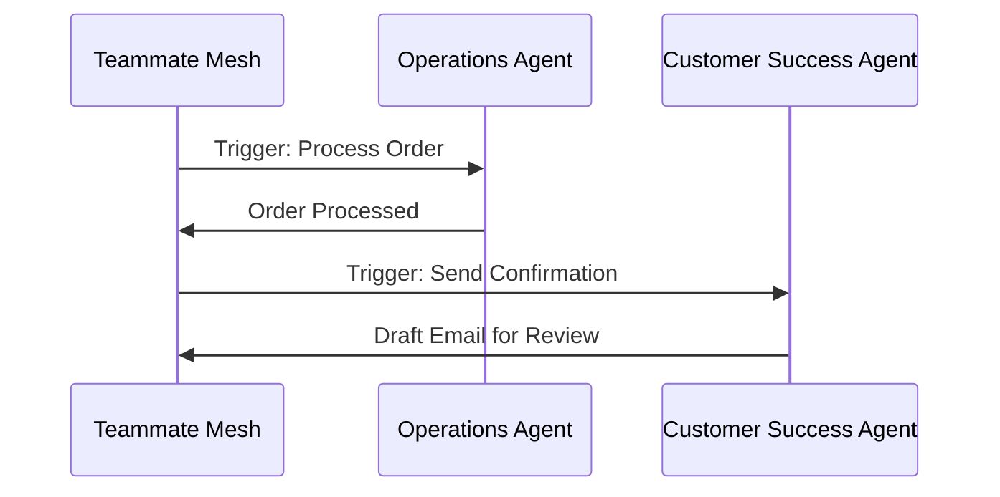

# Title: AI Agent Department Architecture
## Problem Statement
AI Agents must operate invisibly within the OHC platform. They need to mirror how a real business operates (Operations, Marketing, Sales, Customer Success, Finance, Legal, Advisory). The system must securely trigger and coordinate these agents while maintaining human-in-the-loop oversight for critical actions.

## Research Report
- **Departments**: The agent fleet is divided into semantic departments.
- **Triggers**: Scheduled (cron), Event-driven (webhooks/mesh), On-Demand (UI).
- **Coordination**: Teammate Mesh ensures durable handoffs without race conditions.

## Design Doc
### Architecture Diagram

### Key Design Decisions
- **Approval Workflows**: High-risk actions require 1-tap mobile approval.
- **Memory**: Vectors used for semantic context retrieval.
- **Throttling**: Bound by Multi-Tenant Tier limits.

## Implementation Prompt
**To Implementer Agent:**
Implement the AI Agent Approval Workflow Engine. Add an action-risk flag to agent task payloads. Provide a UI component for users to tap "Approve" or "Reject". Do not prescribe specific queueing solutions.

## Priority
P1

## Estimated Scope
Medium
