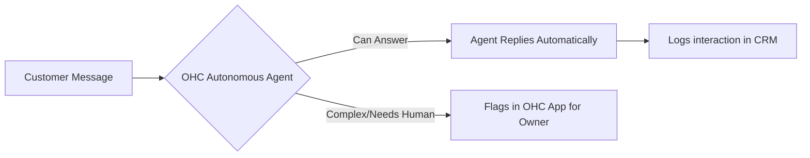

# Autonomous Customer Service Agent

## Problem Statement
Small business owners, especially solopreneurs like **Leo (music tutor)** and **Priya (boutique owner)**, waste countless hours managing customer inquiries via Instagram DMs, email, and website chat. Shopify Sidekick provides admin assistance, but it does NOT act as an autonomous agent talking directly to customers. SMB owners need an invisible agent that handles routine customer service autonomously, recovering time and preventing lost sales.

## Research Report
**Findings & Evidence:**
- **Shopify:** Offers Inbox and Sidekick (for merchant use), but requires the merchant or their staff to answer customer messages directly.
- **Wix:** Basic auto-replies, but no true conversational AI capable of answering specific product/service questions dynamically.
- **User Pain Points:** "I spend 2 hours a day answering the same questions", "I miss leads because I can't reply instantly while working".

**Competitive Comparison:**
| Platform | Customer-Facing AI | Auto-Resolution | Contextual Awareness |
|----------|--------------------|-----------------|----------------------|
| Shopify  | None (Merchant only)| Low             | Low                  |
| Wix      | Basic Chatbot      | Low             | Low                  |
| OHC      | **Autonomous Agent**| **High**        | **High (Syncs w/ DB)**|

## Design Doc

**High-Level Architecture & User Flow:**
1. **Customer Interaction:** Customer sends a message (via IG DM, SMS, or website chat).
2. **AI Intercept:** OHC Agent intercepts the message, analyzes intent, and checks the business's database (inventory, FAQs, policies).
3. **Autonomous Reply:** Agent replies conversationally (e.g., "Yes, we have the blue shirt in medium. Would you like me to hold it for you?").
4. **Escalation:** If the request is complex, the agent flags it in the OHC mobile app for human intervention.

**Key Relationships:**
- Messaging Channel -> AI Intercept Layer -> Business Knowledge Base
- AI Intercept Layer -> Human Escalation Queue

## Implementation Prompt
**Objective:** Implement a customer-facing AI agent capable of answering basic FAQs and product inquiries autonomously across connected channels.
**Critical User Journey:** Customer asks a question on the website -> AI references store inventory/policies -> AI answers instantly -> Interaction is logged in the CRM without notifying the owner unless escalation is needed.
**Acceptance Criteria:**
- The agent must be toggleable on/off by the business owner via a simple UI toggle.
- The agent must correctly reference the current product catalog and business policies.
- A seamless "handoff to human" protocol must be established for unrecognized intents.

## Priority
P1

## Estimated Scope
Medium
