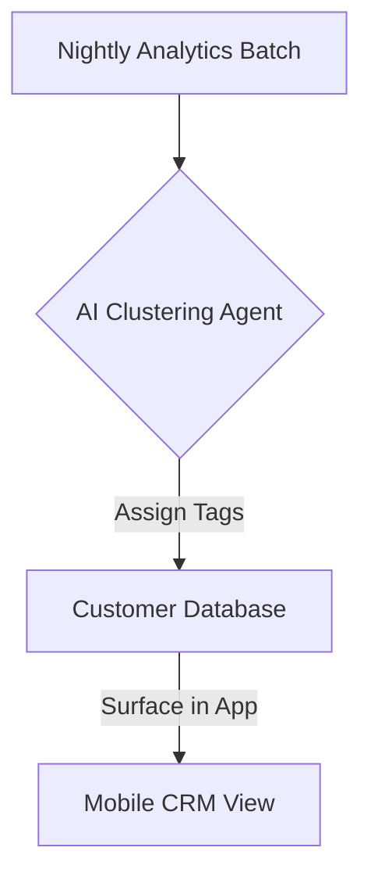

**Title**: Autonomous Customer Segmentation and VIP Tagging
**Problem Statement**: Treating all customers identically limits upselling potential. However, small business owners don't have the analytical skills to build segments like "High LTV, Churn Risk" manually.
**Research Report**: SMBs typically blast newsletters to their entire list, resulting in low conversion rates and high unsubscribe rates.
**Design Doc**:
*   Mobile UX Flow: "Customers" tab -> Filter by "AI Segments" (e.g., "VIPs", "Slipping Away").
*   Architecture: Nightly analytics batch -> Clustering Agent -> Customer tag updates.

**Implementation Prompt**: Create a background job that analyzes purchase frequency and total spend for all customers in a tenant's database. Automatically apply tags like 'VIP', 'New', and 'At Risk' without user configuration.
**Priority**: P2
**Estimated Scope**: Medium
