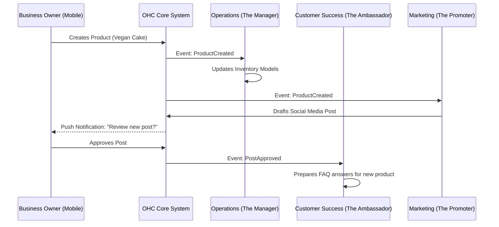

# AI Agent Department Architecture

## Problem Statement
Small business owners like Maya (the baker) and Carlos (the handyman) are overwhelmed by the operational complexity of running a business—they don't want to learn how to set up automated email flows, configure chatbot routing, or balance inventory sheets. They just want their business to run smoothly. Current platforms (Shopify, Wix) require users to manually string together complex apps and build workflows. OHC needs a system where AI agents work invisibly in the background, organized into intuitive "Departments" (like Operations, Marketing, and Customer Success) that mirror a real-world business, automatically handling tasks without the owner lifting a finger.

## Research Report
**Findings:**
- Non-technical users abandon platforms when forced to use visual workflow builders (e.g., Zapier, Shopify Flow).
- Users understand "hire a manager" conceptually much better than "configure a webhook."
- Mobile users need push-notification-based approvals (e.g., "The Promoter drafted an Instagram post. Approve?").

**Competitive Analysis:**
- **Shopify:** Requires 3rd-party apps for most agentic flows (e.g., Gorgias for CS, Klaviyo for marketing). Setup takes weeks.
- **Wix:** Basic AI site generation, but operational automations require manual setup.
- **Squarespace:** Very limited automations; mostly relies on email campaigns.
- **OHC Opportunity:** Pre-configured AI departments that activate instantly. When a user creates a store, "The Manager" and "The Promoter" are already hired and working.

## Design Doc

### Architecture Diagram

### UI Wireframes & Screen Flow (375px first)
1. **Home/Dashboard Screen:**
   - Top banner: "Your Team is Working"
   - Glassmorphism cards showing recent AI actions: "The Promoter drafted an email", "The Ambassador replied to 3 DMs".
2. **Department Detail Screen (e.g., The Promoter):**
   - Clean Outfit typography header: "The Promoter"
   - Toggle switch to pause/resume department.
   - List of recent actions and pending approvals.
3. **Approval Modal:**
   - Bottom sheet slides up.
   - Shows draft content (e.g., an Instagram caption).
   - "Approve" (Primary Button, subtle motion on tap) or "Edit" (Secondary).

### Mobile UX Flow
- The mobile app prioritizes an inbox-style feed where owners review and approve AI actions.
- Offline support: Approvals are queued locally and synced when online.
- Performance: Payload sizes minimized by only syncing summary data for AI actions; details are fetched on demand.

### AI Agent Integration Points
- **Event Bus:** All core entity changes (OrderCreated, MessageReceived) emit events to a central bus.
- **Department Subscriptions:** Each department subscribes to relevant events.
- **Approval Queue:** AI actions that mutate external state or send messages go to a tenant-scoped approval queue.
- **Token Budgets:** Executions are throttled per tenant tier at the API gateway layer.

### Key Design Decisions
- **Event-Driven AI Triggers:** Departments react to events rather than polling, ensuring real-time responsiveness and lower load.
- **Approval-by-Default for External Actions:** To maintain trust, agents draft actions for external communication until the user explicitly toggles "Auto-Execute".
- **Department Abstraction:** Users never see "LLM API" or "Prompt". They only interact with the friendly department persona.

## Implementation Prompt
**User-Facing Outcome:** The user opens their OHC app and sees a "Team" tab. Inside, they see their AI departments (Operations, Marketing, Customer Success). They can tap on a department to see what it did today and approve pending actions.
**CUJ (Critical User Journey):**
1. User receives a new booking request.
2. "The Manager" (Operations) automatically holds the time slot.
3. "The Ambassador" (Customer Success) drafts a confirmation message.
4. User receives a push notification, reviews the message, and taps "Approve".
**Acceptance Criteria:**
- Implement the "Team" tab UI in the mobile app (375px breakpoint).
- Create the backend event subscription for Operations and Customer Success departments.
- Implement the approval queue where actions remain in "draft" state until the user approves them.
- Ensure all AI usage strictly enforces tenant token budgets.
- UI must follow the Glassmorphism and Outfit/Inter typography tokens.

## Priority
P0

## Estimated Scope
Large
