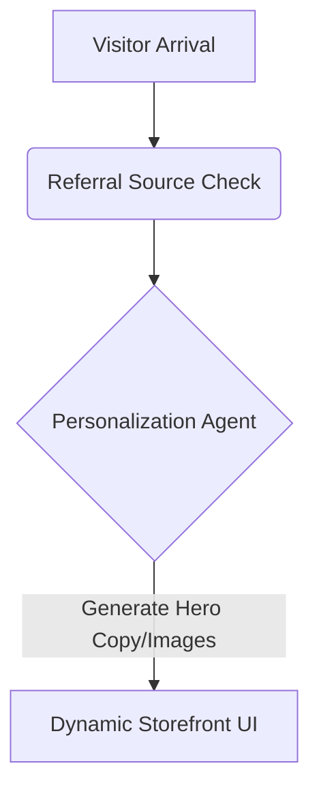

**Title**: Generative Storefront Personalization
**Problem Statement**: Static websites convert poorly because they show the same hero image and featured products to every visitor, regardless of how they arrived at the site.
**Research Report**: Personalization can lift sales by 10-15%. For an SMB, this is currently impossible without enterprise tools.
**Design Doc**:
*   Architecture: Ingress Router (checks referral source) -> Personalization Agent -> Render customized Hero component.

**Implementation Prompt**: Build an interceptor on the storefront rendering pipeline that identifies the incoming referral source (e.g., an Instagram ad for 'Dresses') and dynamically reorders the homepage to feature relevant items and generates custom welcome text.
**Priority**: P3
**Estimated Scope**: Large
