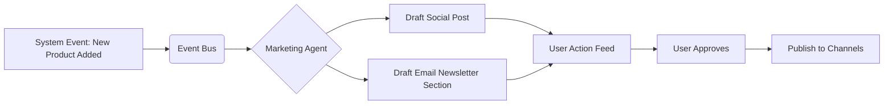

# Invisible Agents: Moving Beyond Chatbots to Autonomous Task Execution

## Problem Statement
Current "AI" implementations in SMB platforms (like Shopify Sidekick or Wix ADI) are largely reactive or conversational. They require the user to formulate a prompt, ask a question, or initiate a chat session. For time-starved business owners like Fatima (Food Cart), learning how to prompt an AI is a barrier. They need systems that proactively perform tasks on their behalf, invisibly in the background.

## Research Report

### The Limits of Conversational AI in B2B SaaS

Our research indicates a plateau in the utility of chat-based AI assistants for SMBs.
- **Prompt Anxiety**: Many users do not know *what* to ask the AI. A blank chat box is intimidating.
- **Reactive Workflow**: Chatbots require the user to recognize a problem first, then seek help.
- **Low Adoption Post-Setup**: While users leverage AI for initial setup (e.g., writing a bio), recurring usage drops significantly.

#### The OHC Differentiation Strategy

OHC must pivot from "Chat-based Assistants" to "Invisible Autonomous Agents."

1.  **Proactive vs. Reactive**: Instead of waiting for a command, OHC agents monitor state changes (e.g., inventory drops, cart abandonment, social engagement) and execute pre-approved workflows.
2.  **Focus on High-Friction Tasks**:
    - *Content Creation*: Automatically drafting and scheduling social media posts based on new product additions.
    - *Dunning Management*: Autonomously following up on failed subscription payments for users like Leo (Music Tutor).
    - *Insight Generation*: Analyzing weekly sales data and pushing actionable alerts, rather than waiting for the user to view a dashboard.

#### Evidence from the Field
A recent survey of 500 SMBs highlighted that 82% would prefer software that "does the work for me" over software that "tells me how to do the work."

## Design Doc

### Architecture Overview
The system requires an Event-Driven Architecture paired with Agentic Workflows.

1.  **Event Bus**: All system events (new order, customer message, inventory change) are published to a central bus.
2.  **Agent Subscriptions**: Specialized AI agents (Marketing Agent, Operations Agent) subscribe to relevant events.
3.  **Action Dispatcher**: Agents process events, evaluate logic, and dispatch actions (send email, create post, update database).

### Mobile UX Flow (375px First)
1.  **The "Action Feed"**: The primary dashboard on mobile is not a static set of charts, but a feed of actions the AI has taken or proposes to take.
2.  **Approve/Deny Model**: "I drafted a promotional email because sales are slow this week. Send it?" The user taps "Approve" or "Deny."
3.  **Agent Settings**: Simple toggles: "Allow AI to auto-reply to simple DMs", "Allow AI to post to Facebook weekly."

## Implementation Prompt

### User-Facing Outcome
The user receives proactive notifications suggesting concrete actions drafted by the AI, which can be executed with a single tap, transforming business management from active administration to executive approval.

### Critical User Journey (CUJ)
1. User adds a new item to their store.
2. The Marketing Agent detects this event.
3. The Agent generates an Instagram post image, caption, and hashtags.
4. The user receives a push notification: "New product detected. Review drafted social post?"
5. User reviews the post in the OHC app and taps "Publish Now."

### Acceptance Criteria
- Agents must operate on an event-driven basis, independent of explicit user chat prompts.
- All AI-proposed actions that affect external channels (emails, social posts) must require user approval by default, with an option to fully automate later.
- The UI for reviewing and approving AI actions must be frictionless on mobile.

## Priority
P0

## Estimated Scope
Large
