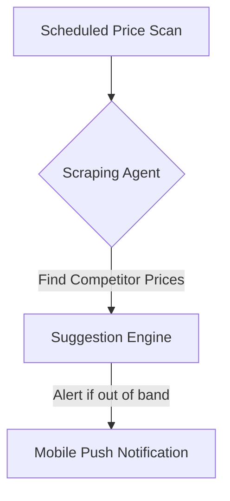

**Title**: Autonomous Competitor Pricing Monitor
**Problem Statement**: SMBs selling standardized items (e.g., electronics, specific brands) lose sales because they cannot continuously monitor competitor pricing manually.
**Research Report**: Dynamic pricing is heavily utilized by enterprise retailers but inaccessible to SMBs.
**Design Doc**:
*   Architecture: Scheduled Job -> Web Scraping Agent (searches Google Shopping for SKU/UPC) -> Price Suggestion Engine.

**Implementation Prompt**: Create a background service that periodically queries public shopping APIs or scrapes search results for specific SKUs in a merchant's catalog. If a competitor drops their price significantly below the merchant's price, send a push notification suggesting a price adjustment.
**Priority**: P3
**Estimated Scope**: Large
