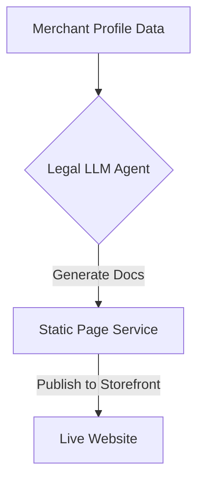

**Title**: Generative Terms of Service and Privacy Policy
**Problem Statement**: Small businesses rarely have the funds to hire legal counsel for standard website policies, exposing them to compliance risks (GDPR, CCPA).
**Research Report**: Lack of compliance pages often prevents businesses from being approved by payment gateways like Stripe.
**Design Doc**:
*   UX Flow: Onboarding Wizard -> "Generate Legal Pages" -> Review and publish.
*   Architecture: Merchant Profile Data -> Legal LLM Agent -> Static Page Generation.

**Implementation Prompt**: Build a tool within the onboarding wizard that takes the business name, address, and product categories as input, and uses an LLM to generate standard, jurisdiction-appropriate Terms of Service and Privacy Policy pages.
**Priority**: P1
**Estimated Scope**: Small
