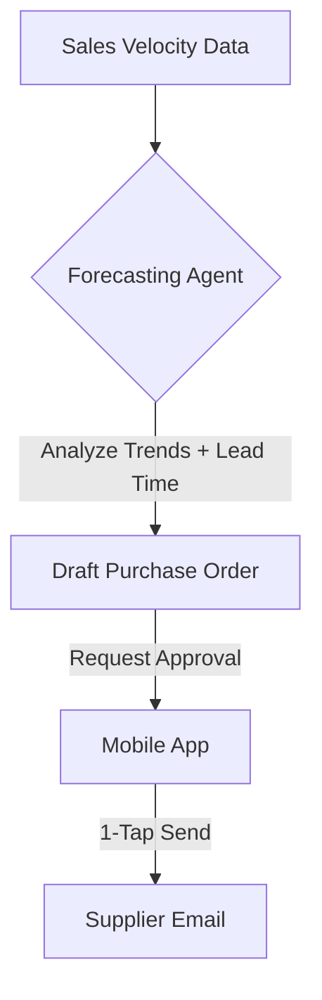

**Title**: Predictive AI Restock Engine
**Problem Statement**: "Low stock" alerts are reactive. By the time a user gets the alert, it may be too late to reorder from suppliers without facing a stockout.
**Research Report**: Inventory stockouts cost retailers billions globally. SMBs need a system that anticipates demand rather than just reporting current levels.
**Design Doc**:
*   Architecture: Sales Velocity Tracker -> Forecasting Agent (considers seasonality + lead times) -> Draft Purchase Order.

**Implementation Prompt**: Implement an AI forecasting agent that analyzes the past 90 days of sales velocity for each SKU. When the forecasted stock depletion date approaches the defined supplier lead time, automatically draft a purchase order and present it to the merchant for 1-tap approval.
**Priority**: P2
**Estimated Scope**: Large
