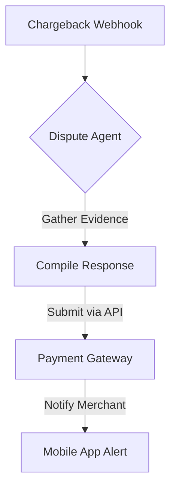

**Title**: Automated Chargeback Dispute Resolution
**Problem Statement**: Dealing with credit card chargebacks is a high-stress, time-consuming process for SMBs that often results in lost funds because evidence is submitted incorrectly or too late.
**Research Report**: Small businesses lose billions annually to friendly fraud because they lack dedicated fraud teams.
**Design Doc**:
*   Architecture: Stripe Webhook (charge.dispute.created) -> Dispute Agent (gathers shipping logs, comms) -> Auto-submits evidence via API.

**Implementation Prompt**: Develop a workflow triggered by a chargeback webhook that automatically aggregates tracking information, customer chat history, and order details, compiles a defense document, and submits it to the payment gateway without requiring manual merchant action.
**Priority**: P2
**Estimated Scope**: Medium
