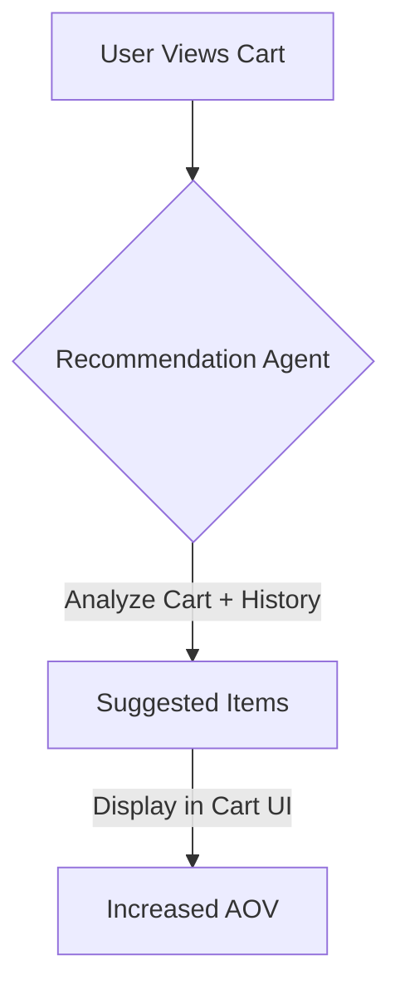

**Title**: Automated Contextual Upsell Engine
**Problem Statement**: SMBs leave money on the table by not offering relevant complementary products during the checkout flow or post-purchase.
**Research Report**: Amazon attributes up to 35% of revenue to cross-selling. Most SMB tools require manual "frequently bought together" configuration, which users ignore.
**Design Doc**:
*   Architecture: Checkout Service -> Recommendation Agent (analyzing cart contents + historical data) -> Return suggested items.

**Implementation Prompt**: Implement an AI recommendation endpoint that takes a cart's contents as input and returns 2-3 statistically relevant complementary items to display on the checkout page.
**Priority**: P1
**Estimated Scope**: Large
