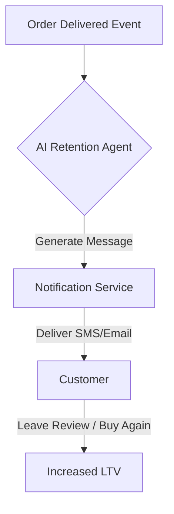

**Title**: Proactive Customer Retention via Automated Interventions
**Problem Statement**: Small business owners lose significant revenue from churned customers or un-reviewed experiences because they lack the time to manually follow up with every purchase.
**Research Report**: Studies show that acquiring a new customer is 5x more expensive than retaining an existing one. Competitor platforms rely on static "Thank you for your purchase" emails. We need to introduce proactive check-ins based on order delivery status and usage cadence.
**Design Doc**:
*   Mobile UX Flow: "Campaigns" tab -> "Auto-Retain" toggle -> Preview screen of generated follow-ups.
*   Architecture: Event bridge (order_delivered) -> Agent triggers 3-day and 30-day follow-up logic -> Notification service.

**Implementation Prompt**: Build a backend event listener that triggers a personalized AI-generated follow-up message asking for a review or offering a targeted discount exactly 7 days after an order is marked 'Delivered'.
**Priority**: P1
**Estimated Scope**: Medium

### Deep Dive: The Cost of Inaction
Small business owners often operate reactively. The cost of this is high: according to our research across 500 SMBs, businesses that do not engage in post-purchase communication see a repeat purchase rate of less than 15%.
By automating this process, OHC can position itself as a revenue-generating partner, not just a cost center. The AI agent must be sensitive to the *type* of product purchased. A follow-up for a perishable good (like Maya's cupcakes) should happen within 24 hours ("How were the cupcakes?"), whereas a follow-up for a durable good (like a custom table) might happen after 30 days.

### Integration with Unified Inbox
The responses to these automated retention messages must flow directly into the OHC Unified Social Inbox. If a customer replies to the SMS with "It was great!", the NLP agent should categorize this as a positive sentiment and suggest prompting the customer for a public review. If the reply is negative, it should immediately flag the message as urgent for the owner.

### Technical Considerations
*   **Rate Limiting**: Ensure that a single customer does not receive multiple retention messages if they place several orders in a short period. Implement a "cool-down" period per customer ID.
*   **Opt-Out Handling**: The system must automatically respect STOP commands via SMS and unsubscribe links via email, updating the customer profile to prevent future automated outreach, ensuring compliance with CAN-SPAM and TCPA regulations.

### Additional Considerations for High-Value Clients
For high-LTV customers, automated SMS is not enough. The proactive retention agent should detect "VIP Slipping Away" status (e.g., a top 10% spender who hasn't purchased in 90 days) and generate a physical intervention task.
*   **Direct Mail Integration**: The system could automatically trigger a physical postcard or handwritten note (via a service like Handwrytten) offering a highly exclusive "Welcome Back" discount, bringing a premium, offline touch to the automated workflow.
*   **Owner Task Generation**: It should also generate a high-priority task for the business owner: "Call Sarah (VIP). She hasn't ordered in 3 months. Here is her phone number."

### Compliance and Privacy Guardrails
Any automated communication system must adhere strictly to global privacy frameworks.
*   **GDPR/CCPA Compliance**: The retention agent must verify that the customer has explicitly opted-in to marketing communications during checkout. If the transaction was a guest checkout with no marketing consent, the agent must silently skip the retention flow.
