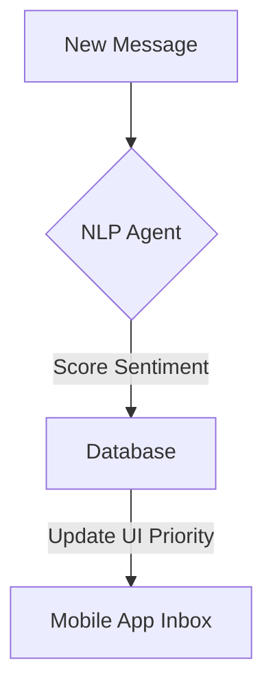

**Title**: Sentiment Analysis for Inbox Triage
**Problem Statement**: When an SMB owner logs in after a busy day, they face a wall of unread messages. They need to know which ones are angry customers demanding refunds versus casual inquiries.
**Research Report**: Customer satisfaction drops exponentially with response time for negative inquiries.
**Design Doc**:
*   Mobile UX Flow: Inbox tab -> Angry/Urgent messages are highlighted in red and pinned to the top.
*   Architecture: Ingestion Service -> NLP Agent (Sentiment Analysis) -> Message Metadata Update.

**Implementation Prompt**: Add an NLP processing step to the unified inbox ingestion pipeline that assigns a sentiment score (-1.0 to 1.0) to incoming messages. Update the mobile API to sort threads by sentiment urgency by default.
**Priority**: P2
**Estimated Scope**: Medium
