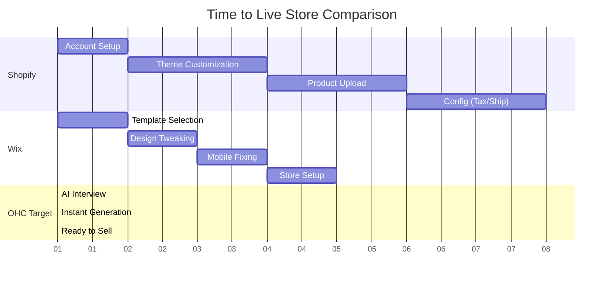

# [analysis] Deep Teardown: Shopify vs Wix vs GoDaddy

## Introduction
To understand how OneHumanCorp (OHC) can dominate the market, we must forensically examine the current user experience of the top three platforms. This teardown focuses entirely on the "Time to First Value" (TTFV) for a non-technical user attempting to sell a single product.

## 1. Shopify: The Powerhouse Built for Enterprises
### The Onboarding Flow Analysis
- **Step 1: The Questionnaire**: Shopify begins with a 4-step questionnaire ("Are you already selling?", "Where will you sell?"). This feels helpful but actually delays the user from seeing the product.
- **Step 2: The Dashboard of Doom**: Upon entering the dashboard, the user is greeted with a left-hand navigation menu containing 12 primary categories and dozens of sub-categories (Home, Orders, Products, Customers, Content, Analytics, Marketing, Discounts, Online Store, Point of Sale, Apps, Settings).
- **Step 3: Adding a Product**: The product creation page requires the user to understand the difference between "Product Category" and "Product Type," manage "Inventory policies," and configure "Customs Information" even if they only sell locally.
- **Step 4: The Theme Editor**: The customized theme editor operates on a proprietary block system. A beginner trying to simply center their logo will likely spend 30 minutes clicking through hierarchical menus.
- **Step 5: The Launch Blocker**: Before the site can go live, the user MUST navigate to settings, configure shipping zones (which requires understanding weight-based vs. price-based rates), set up tax jurisdictions, and verify a payment provider.

### Verdict
Shopify is incredibly powerful but assumes the user has business administration knowledge. It is a database interface disguised as a website builder. TTFV is measured in days.

## 2. Wix: The Template Trap
### The Onboarding Flow Analysis
- **Step 1: ADI vs. Classic**: The user is immediately forced to choose between Wix ADI (AI builder) and the Classic Editor. Beginners often choose ADI, but later realize its limitations and try to switch, causing massive layout breakage.
- **Step 2: The Template Gallery**: Wix offers 800+ templates. Paradoxically, this causes decision paralysis. The user spends 2 hours browsing templates instead of building their business.
- **Step 3: The Canvas Editor**: Once in the editor, Wix allows absolute positioning. A user can drag a button *anywhere*. While this feels freeing, it means the user inevitably drags elements outside the mobile safe zones.
- **Step 4: Mobile Breakage**: Because of absolute positioning, the mobile view is almost always broken by default. The user must switch to the mobile editor and manually rearrange elements to make them legible.
- **Step 5: E-commerce Add-on**: The actual store functionality feels bolted on. Managing products happens in a separate overlay dashboard that disconnects the user from the visual design of the site.

### Verdict
Wix optimizes for initial visual satisfaction but fails in responsive design and ongoing management. The absolute freedom leads to broken, unprofessional-looking mobile sites. TTFV is measured in hours, but quality degrades rapidly.

## 3. GoDaddy Airo: The Upsell Machine
### The Onboarding Flow Analysis
- **Step 1: Domain First**: GoDaddy's funnel is entirely built around selling a domain name first.
- **Step 2: Airo Generation**: The user enters their business name and industry. Airo (their AI) generates a logo, a color palette, and a single-page website in about 30 seconds.
- **Step 3: The Illusion of Completion**: The generated site looks okay, but the logo is generic (often a basic icon from a library) and the text is entirely filler.
- **Step 4: The Paywalls**: As soon as the user tries to do anything meaningful—like connect a custom domain, accept a payment, or send an email—they are hit with aggressive upselling dialogs.
- **Step 5: Shallow Features**: The actual store management tools are bare-bones. There is no advanced inventory management, no meaningful abandoned cart recovery, and very poor integrations.

### Verdict
GoDaddy provides the fastest "Time to First Value" visually, but it is a mirage. The platform is designed to lock the user into expensive, low-quality add-ons. It optimizes for domain registration over business success.

## The OHC Leapfrog Strategy
Based on this teardown, OHC must build an architecture that provides:
1. **Zero-Configuration Defaults**: Unlike Shopify, OHC must set intelligent defaults for shipping (e.g., standard flat rate based on location) and taxes instantly.
2. **Constrained Design**: Unlike Wix, OHC will use strict design tokens and flexbox/grid layouts. The user cannot break the site. If it looks good on desktop, it is mathematically guaranteed to look perfect on mobile.
3. **Honest Value**: Unlike GoDaddy, OHC will not hide basic business functions behind aggressive paywalls. The core platform must feel complete and focused on generating revenue for the user.

