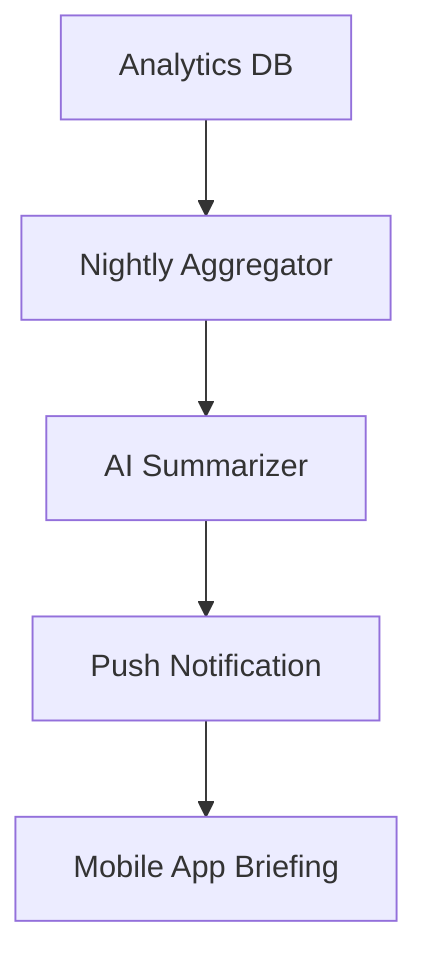

# Daily Plain-Language Business Briefing

## Problem Statement
Traditional analytics dashboards (graphs, charts, jargon like "viral coefficient" or "bounce rate") are useless to non-technical users like Fatima (food cart). They need actionable advice, not raw data to interpret.

## Research Report
- **Findings**: Non-technical owners ignore analytics dashboards entirely.
- **Competitors**: Shopify Analytics is highly detailed but overwhelming. Wix is similarly dense.
- **Evidence**: Trustpilot reviews indicate users want "someone to just tell me what to do to get more sales" instead of raw data.

## Design Doc
- **Architecture Flow**:
  - Nightly cron job aggregates daily metrics (sales, abandoned carts, low stock).
  - Data is passed to an LLM with instructions to output plain language.
  - A notification is pushed to the mobile app.
- **Mobile UX (375px first)**:
  - A friendly morning push notification.
  - Tapping opens a simple text summary with big action buttons.

## Implementation Prompt
**Outcome**: Replace the complex analytics dashboard with a daily conversational briefing.
**Critical User Journey (CUJ)**:
1. User wakes up and receives a notification: "Good morning! You made $400 yesterday."
2. User taps notification.
3. App shows: "3 people left items in their cart. Should I email them a 10% discount?"
4. User taps "Yes, do it."
**Acceptance Criteria**: No complex graphs or jargon. All terminology must pass the 8th-grade reading level 'Grandmother Test'.

## Priority
P1

## Estimated Scope
Small
