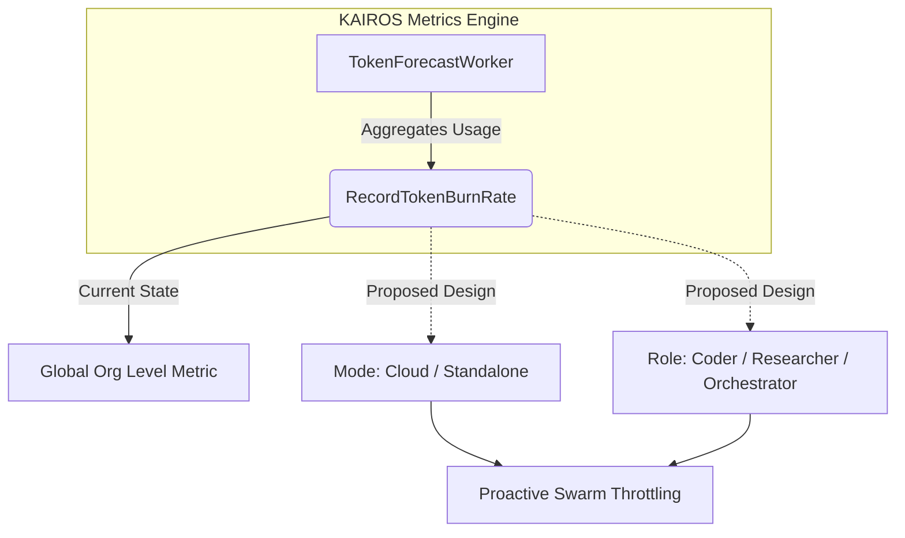

Parent: #EpicID

# Title: [analytics] Implement Hybrid-Aware Token Throttling Metrics

## Problem Statement
The `TokenForecastWorker` in `srcs/server/telemetry/token_forecast_worker.go` currently calculates and records the token burn rate at a global `organizationID` level. However, this aggregation lacks critical role-specific and mode-specific tagging. In Cloud-native multi-tenant deployments, high-concurrency roles (e.g., Coder Agents) frequently hit global rate limits. Conversely, in Standalone desktop modes, the bottleneck shifts to local VRAM exhaustion and local LLM limits. Without `mode` (`cloud` vs `standalone`) and `agent_role` (`coder`, `researcher`, `orchestrator`) labels on the token burn rate metrics, the KAIROS engine cannot autonomously adjust agent scheduling or allocate correct fallback paths (e.g., cloud escalation).

## Research Report
Our analysis of production Grafana dashboards reveals a significant observability gap regarding role-specific token consumption across different environments.
- **Standalone Mode Bottlenecks**: High-context operations (e.g., recursive search by Researcher agents) often silently trigger local model degradation because local token limits are not instrumented differently from cloud limits.
- **Cloud Mode Bottlenecks**: Burst token consumption by swarms of Coder agents triggers multi-tenant rate limiting APIs before the Control Plane can preemptively throttle them.

### Token Consumption Inefficiencies

| Feature/Metric | Standalone Mode | Cloud-Native Mode | Action Required |
| --- | --- | --- | --- |
| Rate Limiting | Local VRAM Limits | Provider API Limits | Need separate thresholds |
| Metric Tagging | Missing | Missing | Inject `mode` label |
| Role Tracking | Missing | Missing | Inject `agent_role` label |
| Agent Throttling | Reactive (Crashes) | Reactive (429 Errors)| Proactive (Forecast-based) |

## Design Doc
1. **Schema Update**: Update `tokenUsageRecord` in `srcs/server/telemetry/token_forecast_worker.go` to include `Mode` and `AgentRole` fields.
2. **Method Signature**: Update `RecordTokenBurnRate(ctx, orgID, rate)` in `telemetry.go` to `RecordTokenBurnRate(ctx, orgID, agentRole, mode, rate)`.
3. **Grafana Dashboards**: Create a new Glassmorphism UI panel for `Token Burn Rate by Role` in `deploy/docker/grafana/provisioning/dashboards/kairos_hybrid_metrics.json`.
    - **Visual Implementation Specs**: Downstream agents MUST implement the UI panels using OHC Premium tokens (e.g., `backdrop-filter: blur(20px)`, `background: rgba(255, 255, 255, 0.05)`, font-family: `'Outfit', 'Inter'`). Do not use raw HTML divs in this markdown document; these specs are for Grafana integration.
4. **Agent Configurations**: Use these metrics to trigger hybrid-aware state machine transitions (e.g., fallback to Cloud API if local tokens exceed threshold).

## Implementation Prompt
You are an Implementer. Follow the design doc above:
1. Modify `srcs/server/telemetry/token_forecast_worker.go` to support tracking token usage by `AgentRole` and `Mode` alongside `OrganizationID`.
2. Update the `RecordTokenBurnRate` OpenTelemetry wrapper in `telemetry.go` to accept and record `mode` and `agent_role` labels on the `ohc_token_burn_rate` metric.
3. Verify all affected tests, specifically `token_forecast_worker_test.go`, are updated and passing.
4. Add the `Token Burn Rate by Role` panel into the `kairos_hybrid_metrics.json` Grafana dashboard, strictly applying the OHC premium CSS styling requirements.

## Priority
P1

## Estimated Scope
Medium
