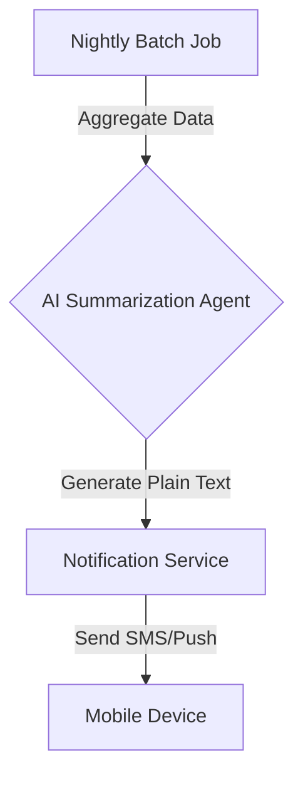

**Title**: Plain-Language Daily Business Briefing (SMS/Push)
**Problem Statement**: Complex analytics dashboards are useless to non-technical users. They want to know *what* happened and *what to do next*, not look at line charts.
**Research Report**: "Understanding Analytics" is a top 10 pain point. Users ignore complex dashboards.
**Design Doc**:
*   UX flow: User receives a morning push notification/SMS. Example: "Good morning! You made $350 yesterday (up 10%). You have 3 orders to fulfill. Tip: Run a promo on the red dress, it's slow-moving."
*   Architecture: Nightly batch job -> AI summarization agent -> Notification service.

**Implementation Prompt**: Develop a background service that aggregates daily sales and operational data, uses an LLM to generate a friendly, plain-language summary with one actionable insight, and delivers it via push notification or SMS.
**Priority**: P1
**Estimated Scope**: Medium

### The Failure of Traditional Dashboards
The "Understanding Analytics" pain point highlighted in Track 2 stems from a fundamental mismatch between software design and user needs. Dashboards are designed for data analysts; small business owners are operators.

When Maya (baker) opens a traditional analytics dashboard, she sees:
*   A line chart of "Sessions over time"
*   A pie chart of "Traffic sources"
*   A table of "Top landing pages"

This requires cognitive translation: *What does a 5% drop in sessions mean? Should I change my baking schedule?*

### The Plain-Language Solution
The OHC Daily Briefing replaces the dashboard with an executive summary. The AI summarization agent acts as a virtual Chief Operating Officer (COO), translating raw data into operational insights.

The nightly batch job must synthesize data across multiple domains:
*   **Sales**: Total revenue, average order value, daily comparison.
*   **Inventory**: Low stock alerts, fast-moving items, slow-moving items.
*   **Marketing**: Campaign performance (e.g., "Your email about cupcakes got 50 clicks").
*   **Operations**: Pending orders, upcoming bookings.

The LLM then crafts a personalized, concise message. This proactive delivery model (push/SMS) ensures the owner receives the information without needing to actively seek it out, fundamentally changing their relationship with their business data.

### The Psychology of the Daily Briefing
The tone of the plain-language briefing is critical. It must strike a balance between informative and encouraging. Small business ownership is lonely and stressful; the AI should act as a supportive partner.

### Example Briefing Variations
*   **High Performance Day**: "Incredible work today, Carlos! You closed 4 new jobs and generated $1,200 in revenue, which is your best Tuesday this month. Don't forget to send the invoice to the Smith family."
*   **Low Performance Day**: "It was a quieter day today, Maya, with 1 order. These slower days are normal! It might be a good time to try that 'Buy One Get One' promo on your new chocolate chip cookies. Tap here to set it up."
*   **Action Required**: "Good morning! Your revenue is steady, but heads up: you have 3 unread messages in your inbox, and 2 are marked as urgent. Also, you're running low on packaging supplies."

### Multi-Modal Delivery
While SMS/Push is the primary delivery mechanism, consider offering the briefing via an audio format. A user could tap "Listen to Briefing" while driving to their shop, utilizing text-to-speech technology to hear their business summary.
