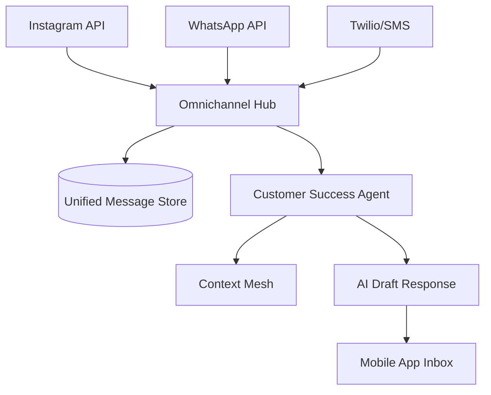

# [ARCH] Omnichannel AI Inbox Integration

**Status:** Proposed
**Estimated Scope: Large
Priority:** P0
**Persona Focus:** Maya (Home Baker - Instagram DMs), Fatima (Food Cart - Phone/SMS)

## 1. Problem Statement
Business owners are overwhelmed by messages across multiple channels: Instagram, WhatsApp, Email, and SMS. Maya misses "Is this vegan?" questions on Instagram because she's busy baking. Fatima needs to see all pickup inquiries in one place.

## 2. Research & Competitive Analysis
- **Shopify Inbox**: Good for web chat and Apple Business Chat, but integration with Instagram/WhatsApp is often clunky.
- **Wix Inbox**: Consolidates several channels but the AI response drafting is limited to "quick replies" rather than agentic reasoning.
- **OHC Opportunity**: Treat the Inbox not just as a UI, but as a data source for the **Customer Success Agent** to proactively manage the business reputation and conversion.

## 3. Proposed Architecture: AI Inbox Mesh

### Architecture Diagram

### Key Design Decisions
- **Unified Identity**: All messages for a single person across different channels are merged into a single **Customer360** profile.
- **Agent-First**: Every incoming message is first processed by the CS Agent to categorize (Support, Sales, Feedback) and draft a response.
- **Privacy-First**: Sensitive information (PII) is handled via the existing analytics redaction patterns before being used in LLM prompts for drafting.

## 4. Implementation Prompt for Implementer Agent
"Create an `OmnichannelHubService` that aggregates messages from external integrations (Instagram, WhatsApp, Twilio). Use the existing `CustomerSuccessAgent` to automatically draft replies for every incoming message. Ensure the drafts are stored in the `unified_inbox_messages` table and visible in the mobile UI for 1-tap approval."
