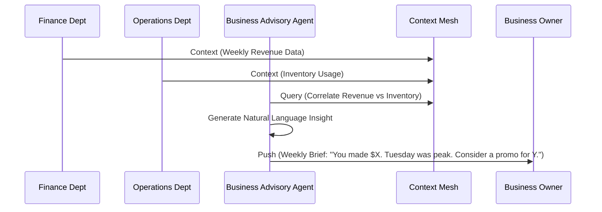

# [ARCH] Proactive Business Insights & Advisory Agent

**Status:** Proposed
**Estimated Scope: Large
Priority:** P2
**Persona Focus:** Fatima (Food Cart), Carlos (Handyman)

## 1. Problem Statement
Non-technical business owners often don't know how to interpret their data. Fatima knows she's busy, but she doesn't know that Tuesday lunch is her highest-margin window or that she's losing money on a specific menu item due to ingredient price spikes.

## 2. Research & Competitive Analysis
- **Shopify Analytics**: Powerful but requires the user to navigate complex dashboards and filters.
- **OHC Opportunity**: The **Business Advisory Agent** should push "plain-language" insights and actionable advice directly to the owner's mobile device, removing the need for dashboard diving.

## 3. Proposed Architecture: Advisory Push Mesh

### Architecture Diagram

### Key Design Decisions
- **Proactive**: Not a "Ask me anything" bot, but a "I noticed this, you should do that" agent.
- **Plain Language**: All technical/financial jargon is translated into simple business outcomes.
- **Actionable**: Every insight should ideally come with a "1-Tap Action" (e.g., "Run a sale", "Order more stock").

## 4. Implementation Prompt for Implementer Agent
"Enhance the `BusinessAdvisoryAgent` to perform periodic correlation analysis across the `ContextMesh`. Implement a natural language summarizer that converts raw transaction and inventory data into human-readable insights. Acceptance criteria: A scheduled job that generates a 'Weekly Health Report' JSON payload suitable for mobile display."
