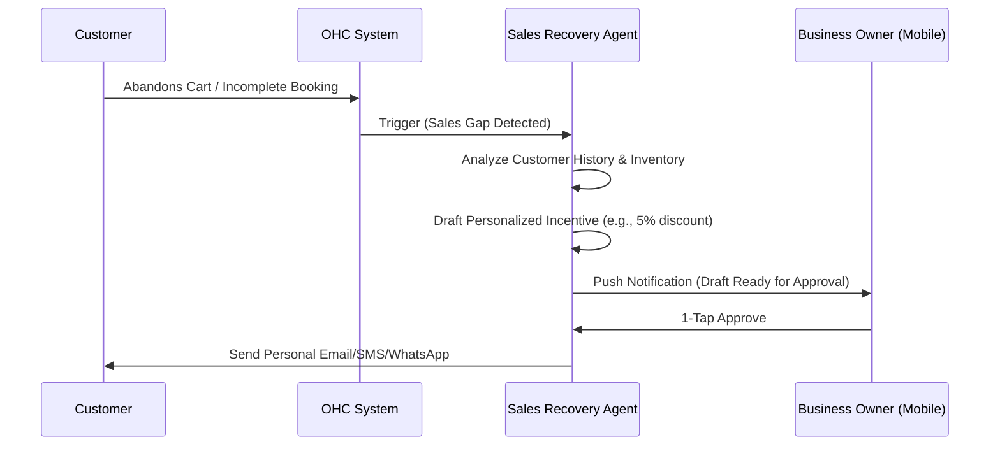

# [ARCH] Proactive Sales Recovery Agent (Abandoned Cart & Re-engagement)

**Status:** Proposed
**Estimated Scope: Large
Priority:** P1
**Persona Focus:** Priya (Boutique Owner), Leo (Music Tutor)

## 1. Problem Statement
Small business owners often lose revenue because potential customers drop out of the funnel (e.g., abandoned carts, incomplete bookings) or don't return after a first purchase. Manually following up is time-consuming and often forgotten. Priya doesn't have time to email everyone who looked at a dress but didn't buy.

## 2. Research & Competitive Analysis
- **Shopify**: Requires installing third-party apps like Klaviyo or Mailchimp, which have steep learning curves and additional monthly costs.
- **Wix**: Has basic "Automations" but they are template-based and lack "agentic" intelligence to personalize the message based on customer history and inventory context.
- **OHC Opportunity**: A native AI agent that "lives" in the Sales department and proactively drafts personalized re-engagement messages.

## 3. Proposed Architecture: Proactive Sales Agent

### Architecture Diagram

### Key Design Decisions
- **Event-Driven**: Triggers on `tenant.checkout.abandoned` or `tenant.booking.incomplete`.
- **Context-Aware**: Uses the **Context Mesh** to check if the product is low in stock (increasing urgency) or if the customer is a repeat buyer (increasing loyalty reward).
- **Multi-channel**: Can send via Email, SMS, or Social DM based on the customer's preferred contact method in their profile.

## 4. Implementation Prompt for Implementer Agent
"Extend the `SalesAgent` in `src/server/orchestration/departments/sales_agent.rs` to handle sales recovery scenarios. Implement handlers for abandonment events. Integrate with the `ContextMeshService` to pull product and customer history. Acceptance criteria: A generated draft message that includes a personalized reference to the abandoned item and a proposed discount based on tenant-defined limits."
