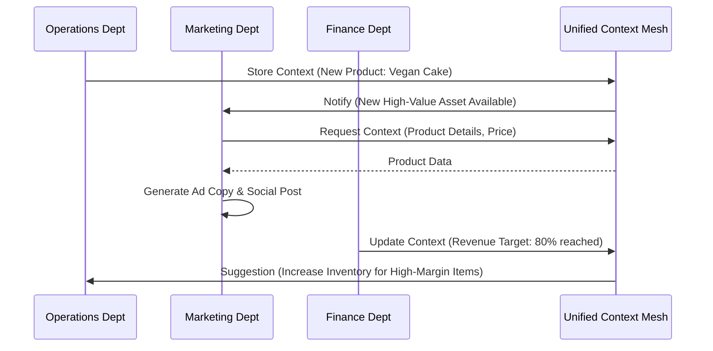
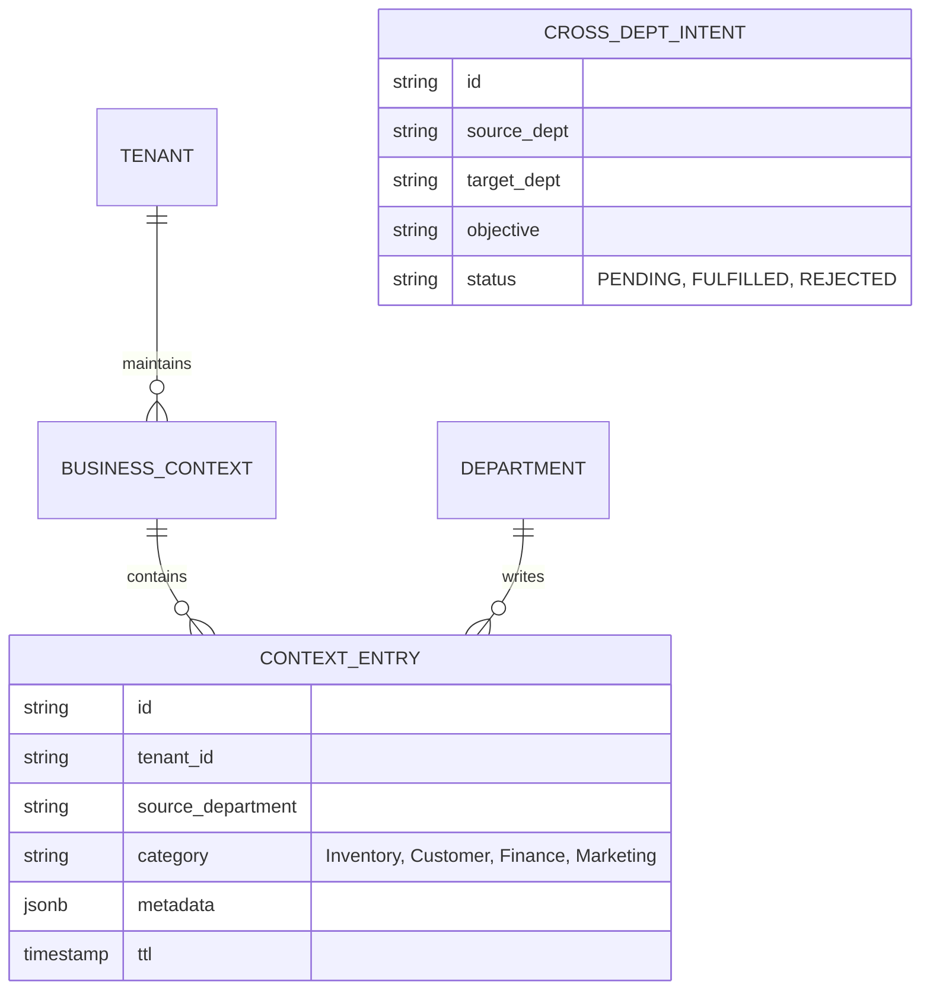

# [ARCH] Unified Agent Coordination & Context Mesh

**Status:** Proposed
**Estimated Scope: Large
Priority:** P0
**Persona Focus:** Maya (Home Baker), Carlos (Handyman)

## 1. Problem Statement
Currently, OHC departments (Operations, Marketing, Customer Success, etc.) operate in semi-isolation. While they can subscribe to events, there is no shared "Working Memory" or "Strategic Context" that allows them to coordinate complex multi-step business goals invisibly. For a non-technical owner like Maya, if she starts selling a new type of cake, she shouldn't have to manually tell the Marketing agent to post about it or the Business Advisory agent to track its trend.

## 2. Research & Competitive Analysis
- **Shopify Sidekick**: Operates mostly as a reactive chatbot. It doesn't "know" what the marketing apps are doing unless explicitly asked.
- **Wix AI**: High-level site generation but low-level cross-app coordination.
- **OHC Opportunity**: By implementing a **Unified Context Mesh**, OHC agents can proactively hand off tasks and share strategic insights, making the "Invisible Manager" promise a reality.

## 3. Proposed Architecture: The Context Mesh

### Architecture Diagram

### Data Model (Mermaid ER)

## 4. Mobile-First UX Flow (375px)
- **Maya's View**: Maya receives a single notification: "Your Operations Agent and Marketing Agent have coordinated! A new Vegan Cake order was received, and we've drafted a social post to celebrate. **[Approve Post]**"
- **Transparency**: An "Agent Activity" log shows the handoff: "Ops -> Marketing: New product photo available for promotion."

## 5. Implementation Prompt for Implementer Agent
"Implement a `ContextMeshService` in `src/server/orchestration/` that allows departments to publish and query structured `ContextEntries`. Extend the `DepartmentOrchestrator` to support `CrossDeptIntents`. Ensure multi-tenant isolation using the existing `tenant_id` RLS patterns. Add a new Proto message `ContextEntry` to `src/proto/common.proto`. Acceptance criteria: A mock interaction where the Operations agent successfully triggers a Marketing agent's social post draft via the Mesh."
