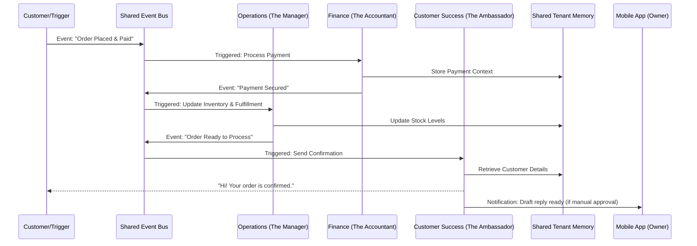

# AI Agent Department Architecture

## Title
Implement AI Agent Department Architecture for Seamless Business Operations

## Problem Statement
Small business owners—whether they are bakers, handymen, or boutique owners—are often overwhelmed by the sheer number of hats they need to wear. They are forced to be the marketer, the accountant, the customer service representative, and the legal compliance officer, taking time away from their core craft. Traditional platforms like Shopify or Wix provide tools for these tasks but still require the owner to do the work. Small business owners don't want software tools; they want an invisible team that handles the complexity in the background. They need AI to act as distinct "departments" within their business, automatically executing tasks and coordinating with each other without demanding technical knowledge or constant micromanagement.

## Research Report
### Market Context
Small and medium-sized businesses (SMBs) struggle with administrative overhead. Studies show that SMB owners spend up to 30-40% of their time on administrative tasks instead of growth or product creation. AI adoption among SMBs is rising, but most tools are disjointed chat interfaces rather than integrated operational systems.

### Competitive Analysis
- **Shopify:** Offers "Sidekick" (an AI chatbot) and "Shopify Magic" (AI text generation). These are bolted-on assistants that respond to prompts but do not autonomously run background departments.
- **Wix:** Has an AI website builder and some AI text generation, but lacks autonomous agents that handle post-launch operations like finance or customer success.
- **Squarespace:** Focuses on design and basic AI copywriting. Operations are entirely manual.
- **GoDaddy:** Offers basic AI tools for setup (Airo) but no autonomous, multi-department operational execution.

### OHC Differentiation
OHC introduces AI as infrastructure rather than a chatbot. Instead of asking the user to prompt an AI, OHC runs AI agents as specific "Departments" (e.g., "The Manager", "The Accountant") that proactively trigger on events, schedules, or demand, coordinating workflows autonomously.

## Design Doc

### Key Design Decisions
1. **Department Roles & Personas:** AI is organized into intuitive, human-like departments so non-technical users immediately understand their purpose.
   - *Operations ("The Manager")*: Order and booking processing, inventory tracking.
   - *Marketing & Advertising ("The Promoter")*: Website design, SEO, social media.
   - *Sales & Acquisition ("The Salesperson")*: Quotes, leads, referrals.
   - *Customer Success ("The Ambassador")*: Message replies, order updates, reviews.
   - *Finance & Payments ("The Accountant")*: Payments, financial reports.
   - *Legal & Compliance ("The Protector")*: Policies, contracts, GDPR.
   - *Business Advisory ("The Advisor")*: Weekly reports, actionable insights.
2. **Trigger Mechanisms:**
   - **On Schedule:** e.g., The Advisor generates weekly health reports; The Promoter schedules social media posts.
   - **On Event:** e.g., Customer pays deposit (Finance) $\rightarrow$ Order processed (Operations) $\rightarrow$ Confirmation sent (Customer Success).
   - **On Demand:** e.g., Owner clicks "Generate Quote" or user requests a vegan cake via Instagram DM.
3. **Approval Workflows:** Actions are either "Auto-Execute" (low risk, e.g., order confirmations) or "Draft-for-Review" (high risk, e.g., legal contracts or refunds), configurable per department.
4. **Memory and Context:** Agents access a shared, isolated context layer (vector memory + structured data) specific to the tenant. The Ambassador knows what The Salesperson quoted.
5. **Usage Budgeting:** AI compute is throttled based on the tenant's pricing tier, with graceful degradation and upgrade prompts when limits approach.

### Architecture Diagram (Mermaid.js)

### UI Wireframes & Mobile UX Flow (375px First)
1. **Dashboard (AI Feed):** The home screen acts as an inbox. Instead of raw data, the owner sees cards from departments.
   - *Card 1:* "The Advisor: Weekly report ready. View insights."
   - *Card 2:* "The Ambassador: Drafted reply to Maya. Tap to approve."
2. **Department Settings Screen:** A list of the 7 departments with toggle switches for "Auto-Execute" vs. "Review First" for specific task categories.
3. **Approval Flow:**
   - Owner taps "Drafted reply".
   - Screen shows customer message and AI's proposed response.
   - Buttons: [Approve & Send] [Edit] [Discard].

### AI Agent Integration Points
- **System Prompts & Personas:** Stored in the database and loaded dynamically per tenant.
- **Context Injection:** Agents automatically query the vector store for previous interactions before generating responses.
- **Action Tools:** Agents invoke structured internal APIs (e.g., `send_email`, `adjust_inventory`, `generate_invoice`).

## Implementation Prompt
**Prompt for Implementer:**
"Implement the core AI Agent Department Orchestration engine. Focus on the user-facing outcomes:
1. Create the system that allows events (e.g., 'Order Created') to seamlessly trigger the appropriate AI department (e.g., Customer Success, Operations) via an event bus.
2. Build the abstraction for 'Shared Tenant Memory' so that an agent in one department can retrieve context established by another department.
3. Implement the dual-mode approval workflow: ensure the system supports both 'Auto-Execute' actions and 'Draft-for-Review' actions that pause execution until the business owner approves via the mobile UI.
4. Set up usage tracking that ties agent invocations to the tenant's tier budget.

Ensure all workflows are fully functional from a mobile-first perspective, delivering notifications and approval requests directly to the 375px mobile UI. Include E2E tests simulating a customer order that triggers cross-department coordination resulting in an owner approval."

## Priority
`P0`

## Estimated Scope
Large
