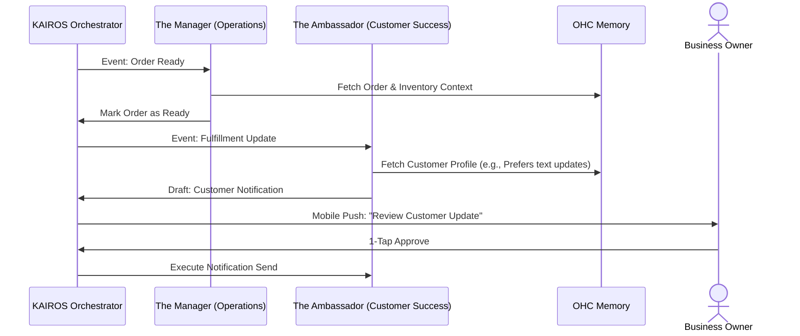

# Issue Brief: AI Agent Department Integration

## Title
Implement the AI Agent Department Architecture & Workflow Engine

## Problem Statement
Small business owners using OneHumanCorp (OHC) need a way to offload daily operations to AI without relinquishing complete control. Currently, the system lacks a structured framework for AI capabilities to act as distinct "departments" (e.g., Marketing, Operations, Customer Success) that coordinate tasks. Without a unified system for task coordination and a mobile-first "draft-for-review" approval process, business owners cannot trust the AI to perform external actions on their behalf. The goal is to provide a seamless, non-technical experience where agents do the heavy lifting, but the human remains in charge via simple 1-tap approvals.

## Research Report
The AI Agent Department architecture defines 7 specific functional roles (The Manager, The Promoter, The Salesperson, The Ambassador, The Accountant, The Protector, The Advisor). The architecture uses the KAIROS Orchestrator to coordinate events between these agents and requires a long-term vector truth memory store to provide agents with contextual history. Crucially, high-risk actions (such as sending emails to customers or publishing social media updates) must enter a "draft-for-review" state requiring explicit approval from the business owner, managed directly from a 375px mobile screen.

## Design Doc

### Architecture Diagram (Mermaid.js)

### Key Design Decisions
1.  **Draft-for-Review Workflow:** All external communications and major data modifications must be drafted by the agent and placed into a pending state. They only execute upon a "1-Tap Approve" from the business owner.
2.  **Mobile-First UX:** The review interface must be optimized for a 375px viewport. Action descriptions should be summarized in plain language (e.g., "Review your thank you email for the vegan cake order").
3.  **Cross-Department Coordination:** The KAIROS Orchestrator handles event routing between agents, ensuring that "The Manager" finishing a task appropriately signals "The Ambassador" to take the next step.

### Mobile UX Flow (375px First)
1.  **Notification:** The business owner receives a push notification on their phone: "The Ambassador has drafted a reply to Maya's email."
2.  **Review Screen:** Tapping the notification opens a simple, focused screen displaying the drafted message.
3.  **Action:** The user sees two large, touch-friendly buttons: "Approve & Send" and "Edit." Tapping "Approve & Send" dispatches the event back to the orchestrator to execute the task.

## Implementation Prompt
**To Implementer Agent:**
Implement the Draft-for-Review workflow engine within the KAIROS orchestrator. Differentiate between internal auto-execute tasks and external draft-for-review tasks based on risk level. Establish a resilient pending approval state management mechanism, ensuring all entries are properly isolated per tenant. Finally, construct the mobile-first mechanisms allowing the business owner to signal a 1-tap "Approve" or "Reject" via the UI. Ensure the system uses plain language for status messages and handles tier-based limits smoothly without prescribing explicit endpoint schemas.

## Priority
P0

## Estimated Scope
Large