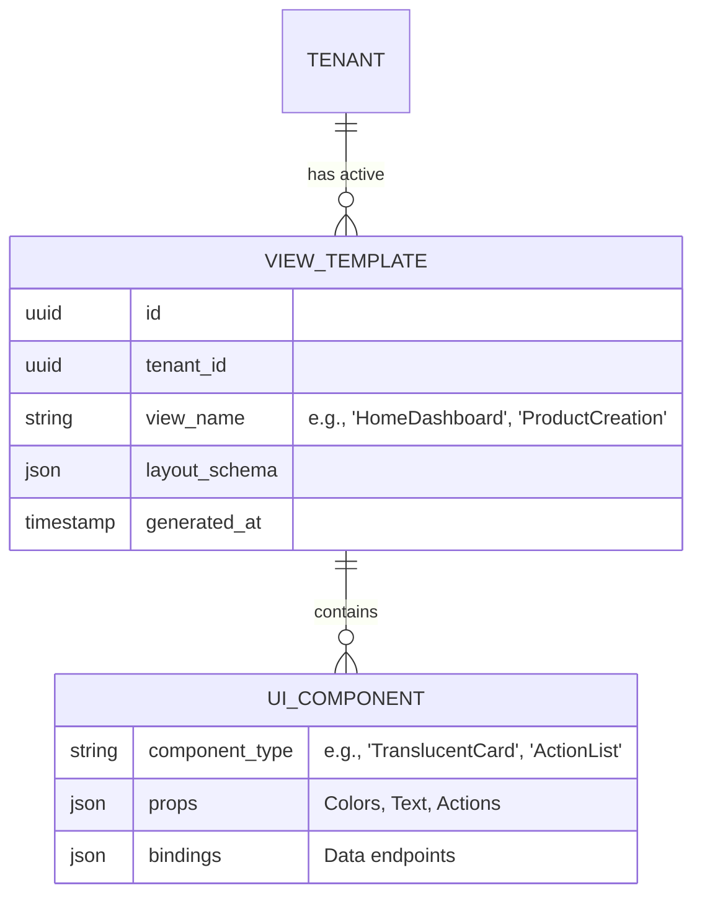

# [Architecture] Agentic Server-Driven UI (SDUI) Framework

## Title
Agentic Server-Driven UI (SDUI) Framework

## Problem Statement
The Small and Medium Business (SMB) ecosystem is highly fragmented. OneHumanCorp serves wildly diverse personas—Maya (baker needing pre-orders and a photo catalog), Carlos (handyman needing booking forms and quotes), and Priya (boutique owner needing tap-to-pay and variant inventory). Existing platforms handle this by cramming hundreds of settings, tabs, and menus into a static app interface, overwhelming non-technical users.

73% of 1-star reviews for legacy platforms cite confusing menus and configuration overhead as major pain points. Small business owners cannot figure out where to configure a "service" versus a "physical product". They need an interface that adapts instantly to *their* specific business model without navigating "Advanced Settings." We need an architecture where the UI itself is dynamically generated based on the user's business type and context, driven intelligently by AI agents.

## Research Report
**Competitive Analysis:**
- **Shopify & Wix:** Both rely on static client-side architectures with massive nested navigation structures (e.g., "Settings -> Shipping -> Profiles"). The client contains all possible UI paths, leading to immense bloat and a steep learning curve.
- **Airbnb & Uber:** Both heavily utilize Server-Driven UI (SDUI) to push dynamic screen layouts directly from the backend, optimizing the booking flow on the fly without requiring app store updates.
- **OHC Advantage:** By combining SDUI with AI Agents, OneHumanCorp can create an "Agentic SDUI." Instead of just pushing static JSON, the OHC backend AI dynamically curates the exact dashboard, cards, and input forms the user needs at that exact moment. Maya sees orders and oven schedules; Carlos sees calendar slots and pending quotes. The mobile app becomes a dumb renderer of intelligent, hyper-personalized business flows.

## Design Doc

### Architecture Diagram
```mermaid
graph TD;
    subgraph Mobile Client (375px)
        SDUIRenderer[SDUI Rendering Engine]
        UIComponents[Design System Components]
    end

    subgraph OHC Backend
        APIGateway[API Gateway / Edge]
        ViewBuilder[Dynamic View Builder]
        ContextEngine[Context & Persona Engine]
    end

    subgraph AI Agent Mesh
        Orchestrator[Orchestrator Agent]
        OnboardingAgent[Onboarding Agent]
    end

    SDUIRenderer -->|Requests Screen Context| APIGateway
    APIGateway --> ViewBuilder
    ViewBuilder -->|Fetches Business Model| ContextEngine
    ContextEngine <--> Orchestrator
    Orchestrator -->|Determines required UI layout based on persona| ViewBuilder
    ViewBuilder -->|Returns JSON UI Tree| APIGateway
    APIGateway -->|Returns JSON UI Tree| SDUIRenderer
    SDUIRenderer -->|Maps JSON to Native Elements| UIComponents
```

### Data Model & Invariants

**Invariants:**
- **Zero Client State:** The mobile app must not hardcode business logic or routing paths. All navigation and layout structures are dictated by the JSON response from the server.
- **Design System Fidelity:** The JSON payload only references pre-approved design tokens (macOS-style Translucent Glass, UniFi-style modular cards). The client guarantees the "grandmother test" visual excellence.

### Mobile UX Flow (375px First)
1. **Onboarding Context:** Maya finishes chatting with the Onboarding Agent on her iPhone. The Agent determines she is a "Baker needing Pre-orders".
2. **Dynamic Dashboard Load:** The mobile app requests the "Home Dashboard" view.
3. **Agentic Curation:** The View Builder constructs a JSON payload specific to Maya. It includes a `HeroCard` for today's cake orders and an `ActionList` for "Review Custom Quote Requests". It completely omits any UI related to "Shipping Settings" or "Digital Downloads".
4. **Instant Rendering:** The client parses the JSON and renders the native UI components instantly.
5. **Context Evolution:** If Maya later tells the AI, "I want to start shipping nationwide," the Orchestrator Agent updates her context. The next time the dashboard loads, the server dynamically injects a "Shipping Setup" card. No app update is required.

### AI Agent Integration Points
- **The Orchestrator Agent:** Maintains the "Persona Context" and dictates which UI modules are relevant.
- **The Onboarding Agent:** The initial catalyst that defines the starting UI state based on the user's conversational input.

### Key Design Decisions
- **JSON-Driven Architecture:** The contract between client and server is strictly defined by a JSON schema representing UI components and their properties.
- **Fallback Caching:** If the user is offline, the client renders the last known cached layout to ensure continuous operation (Offline-First POS mandate).

## Implementation Prompt
**To Implementer Agent:**
Implement the foundational framework for the Agentic Server-Driven UI (SDUI). Design the JSON schema contract that will dictate UI layouts (e.g., defining how a `Card`, `List`, and `Button` are represented in JSON). Build the `ViewBuilder` service on the backend that can construct this JSON dynamically based on a mock `tenant_id` and business persona (e.g., "Service" vs. "Physical Product"). On the client side (assuming React Native or similar mobile framework), build a generic `SDUIRenderer` component that parses the JSON and maps it to native design system components. Ensure strict adherence to the visual excellence mandate (clean, modular cards).

## Priority
P0

## Estimated Scope
Large
