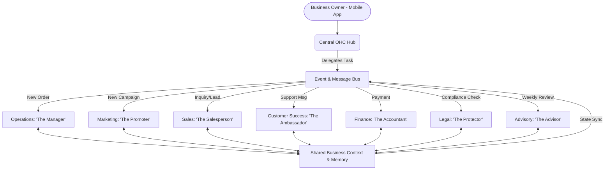

# AI Agent Department Architecture

## Title
AI Agent Department Architecture

## Problem Statement
Small business owners—from bakers to handymen—are overwhelmed by the complexity of managing operations, marketing, sales, customer success, finance, and legal compliance. They lack the time, expertise, and budget to hire specialists for each of these functions. OneHumanCorp (OHC) needs to invisibly handle this complexity by organizing AI agents into intuitive "Departments" that mirror a real business structure, allowing non-technical users to delegate tasks easily and operate as a one-person enterprise without feeling overwhelmed.

## Research Report
Competitive analysis of Shopify, Wix, Squarespace, and GoDaddy reveals that while they offer some AI-assisted features (like text generation or basic SEO), none provide a holistic, autonomous "departmental" AI structure. Users still have to manually orchestrate tools.
- **Shopify:** Requires installing multiple disjointed apps for operations, marketing, and customer success, leading to fragmented context.
- **Wix/Squarespace:** Basic AI website generation, but lacks ongoing autonomous operations (e.g., AI actively responding to Instagram DMs or sending follow-up quotes).
Our approach organizes AI into human-understandable roles: "The Manager", "The Promoter", "The Salesperson", "The Ambassador", "The Accountant", "The Protector", and "The Advisor". This reduces cognitive load and aligns with how owners intuitively think about their business.

## Design Doc

### Architecture Diagram

### UI Wireframes or screen flow description (375px first)
- **375px Mobile First Design:**
  - **Home Screen Dashboard:** Uses a Light Mode Translucent Glass aesthetic (`background: rgba(255, 255, 255, 0.65)`, `backdrop-filter: blur(30px) saturate(210%)`, 16px rounded corners).
  - **Action Cards:** Each department appears as an employee card (e.g., "The Manager: 3 pending orders", "The Promoter: 1 draft campaign").
  - **Advanced Settings:** Technical configurations are hidden stickily behind an "Advanced Settings" switch.

### Mobile UX flow
1. **Launch:** Owner opens the app and sees the Central Hub with a summary from "The Advisor".
2. **Review:** Owner taps on "The Ambassador" card showing an alert.
3. **Approve:** A chat interface opens displaying a drafted reply to a customer review. Owner taps the "Approve" button (8px rounded corners).
4. **Execute:** The system sends the reply, updates Shared Memory, and returns the user to the Hub.

### AI agent integration points
- **Triggering:** Departments are triggered via scheduled cron jobs, platform events, or on-demand via user delegation.
- **Coordination:** A central event bus allows departments to coordinate.
- **Approval Mechanism:** Actions are categorized by risk. Low-risk auto-execute. High-risk default to "draft-for-review".
- **Budgeting/Throttling:** AI usage is tracked per tenant according to their SaaS tier limits.

### Key design decisions and why
- **Humanized Naming Conventions:** Using roles like "The Manager" ensures the system passes the grandmother test, matching the user's mental model.
- **Shared Memory Architecture:** All departments read from and write to a shared vector memory and context store to prevent fragmented context.
- **Draft-for-Review Default:** Ensures the business owner feels in control initially, building trust.

## Implementation Prompt
**Task for Implementer Agent:**
Implement the user-facing AI Department Hub for the mobile app (375px baseline).
- Build the UI to display the 7 AI Departments (Operations, Marketing, Sales, Customer Success, Finance, Legal, Advisory) using the mandated Translucent Glass aesthetic (light/dark mode blur 30px, saturate 210%, 16px container corners, 8px control corners, Outfit/Inter typography).
- Create the interaction flow where a business owner can tap a department to view pending "draft-for-review" actions and approve them.
- Ensure the interface passes the grandmother test (usable in 30s by a novice) by hiding technical complexity behind an "Advanced Settings" toggle.
- Provide a clear, non-technical empty state or upgrade CTA if a department hits its monthly action limit based on the user's tier.
- Ensure 100% mobile parity.

## Priority
P0

## Estimated Scope
Large
