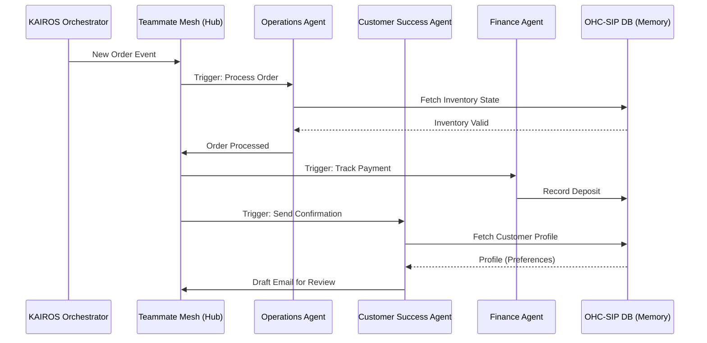

# Title
OHC AI Agent Department Architecture

## Problem Statement
Small business owners lack the time and expertise to manage all aspects of a business (operations, marketing, sales, customer success, finance, legal, advisory). They need AI to handle this complexity invisibly. OHC requires a defined architecture for 7 AI Agent Departments that seamlessly integrate into the daily workflow of non-technical small business owners, offloading cognitive overhead while maintaining safety, trust, and proper multi-tenant isolation.

## Research Report
- AI departments mirror real business functions: Operations, Marketing, Sales, Customer Success, Finance, Legal, Advisory.
- Competitors like Shopify and Wix offer isolated AI text generation or chatbot add-ons, but lack a cohesive, autonomous "departmental" structure that runs asynchronously and coordinates across domains (e.g., Sales talking to Ops).
- OHC's competitive edge is the invisible orchestration of these departments using a shared event mesh, allowing them to collaborate securely.

## Design Doc

### Architecture Diagram

### UI Wireframes or Screen Flow Description (375px first)
1. **Agent Dashboard**: A 375px optimized feed showing active tasks from various "Departments" (e.g., "The Manager", "The Ambassador").
2. **Draft Review Screen**: A card presenting a drafted social media post or customer email with a clear "Approve" (1-tap) or "Reject" button.

### Mobile UX Flow
- All agent interactions (approving drafts, viewing reports) happen via a 375px mobile UI.
- Action items are summarized in plain language.
- Draft-for-review actions show a persistent bottom-sheet notification until acted upon.

### AI Agent Integration Points
- **Scheduled (Cron)**: Business Advisory generates weekly reports.
- **Event-Driven**: Operations processes an order -> Customer Success drafts a thank you.
- **On-Demand**: Direct user prompts.
- **Memory**: Short-term context and long-term `autodream_memories` via `pgvector`.

### Key Design Decisions and Why
- **Approval Workflows**: Low-risk actions are auto-executed; high-risk actions (external communication, refunds) require 1-tap Draft-for-Review approval to maintain trust.
- **Departmental Boundaries**: Clear functional boundaries ensure predictable agent behavior and isolated failure domains.
- **Usage Throttling**: Actions are gated by the SaaS tier to control infrastructure costs while offering upgrades.

## Implementation Prompt
Implement the Draft-for-Review workflow engine within the KAIROS orchestrator. Agents must be able to submit high-risk actions (e.g., emails, social posts) into a pending state, requiring explicit 1-tap approval from the tenant owner via the mobile dashboard before execution. Include the unified API contract for submitting agent drafts and the user journey for reviewing and approving them on mobile. Do not prescribe specific database schemas or internal inference configurations. Ensure complete UI integration testing for the approval flow.

## Priority
P1

## Estimated Scope
Medium
