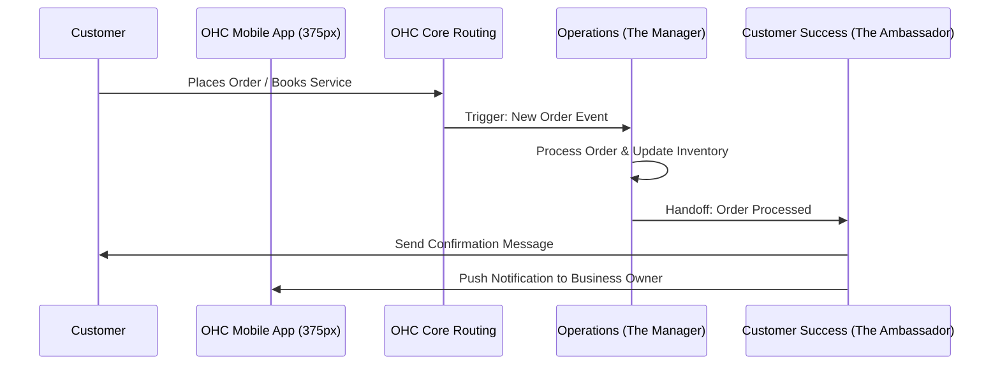

# Title: AI Agent Department Architecture

## Problem Statement
For a small business owner like Maya (the baker) or Carlos (the handyman), managing a business means wearing too many hats—answering customer inquiries, sending quotes, fulfilling orders, and updating the website. This constant context-switching is overwhelming and steals time from their actual craft. They don't want to configure complex automation rules or learn enterprise software; they just want invisible "employees" (departments) that handle these tasks automatically in the background, exactly how a real business operates.

## Research Report
Small business owners often piece together 5-10 different tools (Shopify for store, Mailchimp for marketing, Calendly for booking, Zendesk for support).
- **Shopify**: Offers some automated workflows via Shopify Flow, but it requires technical configuration and isn't a conversational AI agent acting autonomously.
- **Wix/Squarespace**: Basic auto-responders, but no concept of autonomous "departments" handling complex multi-step workflows.
- **GoDaddy**: Focuses on simple setups but lacks deep AI integration for ongoing business management.
Our approach introduces AI "Departments" (Operations, Marketing, Sales, Customer Success, Finance, Legal, Advisory) that mirror real business roles, providing a unified, autonomous experience without the configuration burden.

## Design Doc

### Architecture Diagram

### UI Wireframes & Screen Flow (375px Mobile-First)
1. **Home Dashboard (375px)**: Ubiquiti UniFi modular dashboard cards with translucent glass materials (Light mode: blur 30px, saturate 210%, 16px rounded corners). Clean typography (Outfit for headings, Inter for body).
2. **Department View**: Tapping on "The Manager" card opens a clean timeline of recent automated actions (e.g., "Updated inventory for 3 cakes", "Approved booking for Carlos").
3. **Action Approval**: A simple Tinder-like swipe card (8px rounded corners) to approve/reject an AI drafted response or action. "Grandmother test" applied: Actions are plain English ("Send 10% discount to Maya?").
4. **Advanced Settings**: All technical jargon (prompt configuration, execution limits) is hidden behind an "Advanced Settings" toggle.

### Mobile UX Flow
- **Step 1**: Owner receives a push notification: "The Salesperson drafted a quote for a wedding cake."
- **Step 2**: Owner taps notification, opening the app to the approval card.
- **Step 3**: Owner taps "Approve" (large, accessible button). The Salesperson sends the quote.

### AI Agent Integration Points
- **Event-Driven Triggers**: Core system events (new order, message received) route to the respective department.
- **Inter-Department Handoffs**: Departments can pass context and trigger each other (e.g., Sales -> Operations).
- **Draft-for-Review vs. Auto-Execute**: Configurable per department based on owner trust levels.
- **Memory & Context Retrieval**: Agents invisibly recall past customer interactions (e.g., "Maya ordered a vegan cake last year") by querying a centralized, secure customer history log before drafting responses.
- **Usage Throttling & Budgeting**: AI actions are implicitly bounded by the user's SaaS tier (e.g., Free vs. Starter). When approaching monthly limits, the system surfaces a clear, non-technical upgrade prompt rather than throwing errors.

### Key Design Decisions and Why
- **Department Metaphor**: Mirroring real business departments instead of technical "agents" or "bots" lowers the cognitive load for non-technical users.
- **Draft-for-Review Default**: Builds trust by allowing the owner to review high-stakes actions (quotes, legal docs) before they are sent.
- **Translucent Glass UI**: Follows the Visual Excellence Mandate, providing a premium, native macOS/iOS feel that enhances perceived value and simplicity.

## Implementation Prompt
**Role**: Implementer Agent
**User-Facing Outcome**: Maya the baker should see a dashboard with cards for her AI Departments (e.g., "The Manager", "The Ambassador"). When a customer messages her on Instagram, "The Ambassador" should draft a reply and present it as a simple approval card on her mobile app.
**CUJ (Critical User Journey)**:
1. System receives a customer inquiry.
2. Core routes the inquiry to "The Ambassador" department.
3. "The Ambassador" drafts a response and creates an approval request.
4. Business owner opens the mobile app, views the drafted response in a visually premium, glassmorphic card, and approves it with one tap.
**Acceptance Criteria**:
- All UI components strictly adhere to the Visual Excellence Mandate (Translucent Glass, Outfit/Inter typography, 8px/16px rounded corners).
- The flow passes the 30-second "grandmother test".
- No technical jargon is visible unless "Advanced Settings" is toggled.
- Departments can communicate and hand off tasks.

## Priority
P0

## Estimated Scope
Large
