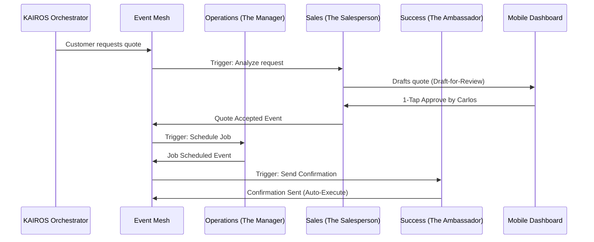

# [architecture]_ai_agent_department.md

## Title
OHC AI Agent Department Architecture: Invisible Coordination & 1-Tap Approvals

## Problem Statement
Small business owners (Maya, Carlos, Priya) do not want to manage AI prompts or configure agent workflows. They want a team of specialists that handles their operations, marketing, sales, and compliance invisibly in the background. Traditional AI tools require constant prompting and mental overhead. The gap is that our platform needs an architecture where AI operates as autonomous Departments that mirror a real business structure, requiring only simple 1-tap approvals on a mobile device when high-risk actions are proposed, all while feeling completely natural to a non-technical user.

## Research Report
- Competitive Analysis:
  - Shopify/Wix: Treat AI as a magic wand button where the user must initiate the action (e.g., Generate product description). This creates work.
  - OHC Advantage: Treats AI as a Teammate that operates proactively on an event-driven mesh, suggesting actions before the user even realizes they need them.
- Findings:
  - Non-technical users trust AI more when actions are categorized into familiar business roles (The Manager, The Accountant).
  - Users will abandon the platform if AI takes destructive or embarrassing actions (e.g., sending a wrong quote) without approval.
  - Multi-tenant tier limitations are necessary to prevent runaway AI costs while providing clear upgrade incentives.

## Design Doc

### Architecture Diagram (Mermaid.js)

### UI Wireframes or Screen Flow Description (375px first)
1. Home Feed (The Action List): A vertically scrolling feed of cards.
2. Draft Card: The Salesperson drafted a quote for Maya's custom cake.
    - Contains: Summary of the quote.
    - Actions: Big primary button Approve & Send, secondary button Edit.
3. Notification Bubble: A small, unobtrusive glassmorphism toast when an agent auto-executes a low-risk task (e.g., The Accountant logged a $50 deposit.).

### Mobile UX Flow
- Trigger: User receives a push notification (Review new quote).
- Action: Taps notification, opens directly to the Action List.
- Decision: Reviews the plain-language summary. Taps Approve.
- Feedback: Card slides away with a subtle checkmark animation; the KAIROS orchestrator handles the dispatch in the background (Optimistic UI).

### AI Agent Integration Points
- Operations (The Manager): Triggered by new orders, low inventory, or schedule changes. Auto-executes stock tags; drafts supplier reorders.
- Marketing & Advertising (The Promoter): Triggered by new product additions or positive reviews. Drafts social media posts and emails.
- Sales & Acquisition (The Salesperson): Triggered by inbound inquiries or abandoned carts. Drafts quotes and follow-ups.
- Customer Success (The Ambassador): Triggered by order fulfillment or complaints. Auto-executes tracking updates; drafts review responses.
- Finance & Payments (The Accountant): Triggered by payments or end-of-month. Auto-executes ledger entries; drafts tax summaries.
- Legal & Compliance (The Protector): Triggered by new regulations or terms updates. Drafts privacy policy updates.
- Business Advisory (The Advisor): Triggered by weekly cron or significant trend anomalies. Auto-executes dashboard health reports.

### Key Design Decisions and Why
- Familiar Naming: Agents are named after human roles so users instinctively understand their boundaries without needing technical documentation.
- Draft-for-Review vs. Auto-Execute: High-risk external actions are strictly Draft-for-Review to build trust. Internal administrative tasks are Auto-Execute to reduce notification fatigue.
- Centralized Memory: All agents access a unified vector memory store to maintain context.
- Tier-Based Budgeting: AI execution is throttled at the Orchestrator level based on the user's SaaS tier, returning graceful Upgrade prompts instead of hard errors when limits are reached.

## Implementation Prompt
To Implementer Agent:
Implement the KAIROS Orchestrator's agent routing and approval engine. Create the base interfaces for the 7 Agent Departments (Operations, Marketing, Sales, Customer Success, Finance, Legal, Advisory). Build the event listener that categorizes tasks into Auto-Execute or Draft-for-Review based on a predefined risk matrix. For Draft-for-Review tasks, expose an endpoint that allows the mobile dashboard to fetch pending actions and submit a 1-tap approval or rejection. Ensure that all agent actions are logged against the specific tenant_id and that total AI actions are incremented and checked against the tenant's tier limits. Provide E2E tests simulating a cross-department workflow: an Operations event triggering a Customer Success draft, followed by a user approval.

## Priority
P0

## Estimated Scope
Large
