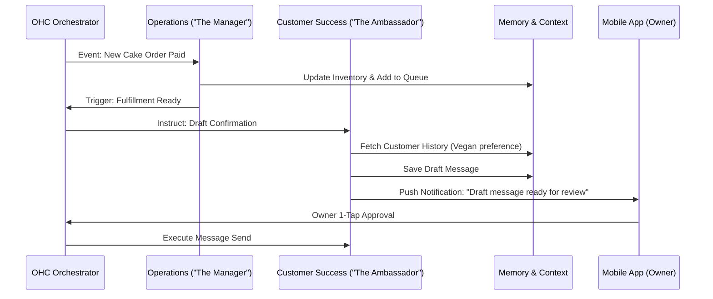

# [architecture] AI Agent Department Architecture

## Problem Statement
OneHumanCorp (OHC) is designed for non-technical small business owners (e.g., Maya the baker, Carlos the handyman) who need enterprise-grade capabilities without the cognitive overhead of managing complex software. The core value proposition of OHC is that AI agents handle business complexity invisibly. Currently, the platform lacks a formalized architecture defining how different specialized AI agents (organized as "Departments") operate, coordinate, access memory, and request approvals. Without a cohesive architecture, agents may overlap in duties, fail to share context, or execute actions that break user trust.

## Research Report
Small business owners typically juggle multiple specialized tools: Shopify for operations, Mailchimp for marketing, Calendly for sales/bookings, and QuickBooks for finance. In OHC, we collapse these into AI Agent Departments that mirror real-world business roles.

**Key Findings & Competitive Analysis:**
- **Shopify/Wix:** Rely on static apps and plugins. The user must configure everything manually.
- **OHC Advantage:** Instead of "installing an email app," Priya (boutique owner) has a "Promoter" agent that proactively drafts a newsletter when new inventory arrives.
- **Trust Factor:** A critical pain point is AI making mistakes (e.g., giving away a free cake). Therefore, actions must be clearly categorized into *Auto-Execute* vs. *Draft-for-Review*.
- **Context Sharing:** A siloed AI cannot provide value. The "Salesperson" agent needs to know what the "Manager" agent has in inventory.

## Design Doc

### AI Departments Overview
1. **Operations ("The Manager"):** Order and booking processing, inventory tracking, fulfillment, refunds.
2. **Marketing & Advertising ("The Promoter"):** Website design, SEO, social media posts, promotional content.
3. **Sales & Acquisition ("The Salesperson"):** Quote generation, lead follow-up, referral tracking, upsell suggestions.
4. **Customer Success ("The Ambassador"):** Message replies, order updates, review requests, re-engagement campaigns.
5. **Finance & Payments ("The Accountant"):** Payment processing, financial reports, subscription billing, tax summaries.
6. **Legal & Compliance ("The Protector"):** Terms/policies, contracts, GDPR compliance, license tracking.
7. **Business Advisory ("The Advisor"):** Weekly health reports, next-action suggestions, seasonal trends.

### Architecture Diagram

### Key Design Decisions
- **Triggering Mechanisms:** Departments are triggered via **Scheduled Tasks** (e.g., Monday health reports), **System Events** (e.g., payment received), or **On-Demand** (chat interface).
- **Coordination:** Agents do not call each other directly. They emit events to a central Orchestrator that routes tasks, ensuring conflict-free handoffs.
- **Memory & Context:** Agents use a shared memory bus. Short-term context is stored per session/order. Long-term memory is embedded to recall customer preferences.
- **Approval Workflows:** To build trust, any high-risk external action (sending emails, social posts, refunds) requires a "Draft-for-Review" step. The owner gets a mobile push notification and can approve with 1-tap. Low-risk internal actions (updating internal tags) are auto-executed.
- **Budgeting & Throttling:** Multi-tenant usage is tracked. Free tier users get 100 actions/mo, while Pro users have unlimited. Once limits are hit, tasks queue until upgrade or reset.

### Mobile UX Flow (375px First)
- **Screen 1 (Home Dashboard):** Clean interface. A floating action button (FAB) for the Advisory agent. "Needs Attention" cards at the top for Drafts.
- **Screen 2 (Draft Review):** Card showing the proposed action (e.g., "The Ambassador drafted a response to Fatima"). Buttons: "Send", "Edit", "Discard".
- **Screen 3 (Department Settings):** Simple toggles for each department ("Auto-pilot" vs "Review All").

## Implementation Prompt
**Goal:** Implement the "Draft-for-Review" approval engine for the Customer Success department.
**CUJ:** Maya receives a new DM asking about vegan options. "The Ambassador" drafts a reply based on past orders and memory, but does not send it. Maya receives a push notification, opens her OHC app on her iPhone, reads the drafted response, and taps "Approve" to send it.
**Acceptance Criteria:**
- The agent engine correctly identifies a drafted response and pauses execution.
- A pending action is surfaced to the mobile frontend.
- A 1-tap approval resumes execution and dispatches the response.
- The implementation must adhere to OHC Premium Design Standards (Glassmorphism, mobile-first).
- All data access must respect multi-tenant boundaries using the authenticated session context.

**Priority:** P0
**Estimated Scope:** Large
