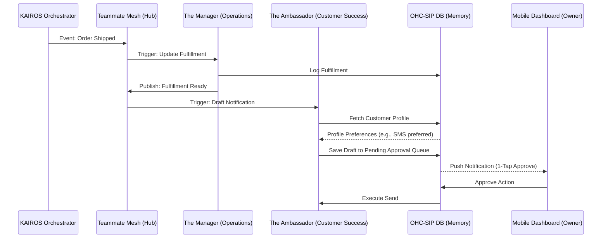

# Title
AI Agent Department Architecture and Implementation Playbook

## Problem Statement
Small business owners often manage too many tools and processes, from handling simple inquiries via Instagram DMs to updating inventory, and publishing posts on social media. Existing platforms act as disjointed tools requiring complex integrations or constant manual input. They do not operate seamlessly to take the cognitive load off the business owner. OneHumanCorp needs a structured architecture to organize its AI agents into intuitive, business-friendly departments ("The Promoter", "The Manager", etc.) that coordinate invisibly and proactively to run a small business end-to-end, with minimum setup and mobile-first, one-tap approvals.

## Research Report
Based on a synthesis of user feedback (e.g., from r/smallbusiness, Trustpilot, app stores):
- **Operational Fatigue (68%):** Responding to repetitive questions across multiple channels exhausts owners.
- **Marketing Dread (55%):** Maintaining a social media presence is the leading cause of business burn-out after 3 months.
- **Communication Lag (40%):** Owners lose out on sales because they cannot reply to leads/messages 24/7.
- **Tool Complexity & Cost Creep (73% & 45%):** Setting up disjointed tools and paying for multiple apps ("subscription hell") drives users away.

**Competitor Analysis:**
Competitors (Shopify, Wix, Squarespace) treat AI as reactive "tools" requiring prompts and manual editing.
OHC differentiates by treating AI as proactive "teammates" driven by the KAIROS Orchestrator. Agents respond to business events (e.g., new order placed, inventory low) and prepare complete actions waiting for a simple "1-Tap Approve" on a mobile device.

## Design Doc

### Core Departments
The OHC Swarm consists of 7 functional departments:
1.  **Operations ("The Manager"):** Order/booking processing, fulfillment, and inventory tracking.
2.  **Marketing & Advertising ("The Promoter"):** SEO, social media calendar creation, email marketing.
3.  **Sales & Acquisition ("The Salesperson"):** Lead follow-up, quote generation, and referral tracking.
4.  **Customer Success ("The Ambassador"):** Order updates, message replies, review requests.
5.  **Finance & Payments ("The Accountant"):** Payment processing and financial reporting.
6.  **Legal & Compliance ("The Protector"):** Contract drafting and compliance checks.
7.  **Business Advisory ("The Advisor"):** Plain language health reports and next-action suggestions.

### Architecture Diagram

### Execution Triggers & Coordination
- **Event-Driven:** Uses the Teammate Mesh to broadcast intents and status updates. E.g., when "The Manager" fulfills an order, it publishes a `tenant.order.fulfillment_ready` event.
- **Scheduled:** Cron jobs executed by KAIROS. E.g., "The Advisor" runs weekly to publish the health report.
- **Draft-for-Review (1-Tap Approval):** High-risk actions (e.g., publishing external emails or social posts) are drafted and saved to the `OHC-SIP DB` pending approval queue, triggering a mobile push notification.

### Memory & Tier Integration
- Agents leverage `autodream_memories` with `pgvector` for contextual recall (e.g., Maya's vegan cake trends).
- Tenant limits (Free/Starter/Pro) dictate token budgets and action limits natively enforced by the KAIROS Orchestrator to protect system stability.
- PostgreSQL RLS enforces complete data isolation between tenants.

### UI & UX Focus
- Follows the OHC premium visual mandate: Glassmorphism (`backdrop-filter: blur(20px) saturate(200%)`), minimum touch targets of 44x44px.
- Designed strictly mobile-first (375px viewport baseline).

## Implementation Prompt
**Task:** Implement the Draft-for-Review 1-Tap Approval engine in the KAIROS Orchestrator for the Customer Success department ("The Ambassador").
**Context:** When a specific event triggers "The Ambassador" (e.g., an order is shipped or an inquiry is received), it must autonomously construct a tailored response using customer history, but it cannot send it directly. It must place the drafted message in an approval queue and notify the user.
**Acceptance Criteria:**
1.  Implement the backend service capability allowing agents to transition actions into a `PENDING_APPROVAL` state.
2.  Implement the notification payload required to alert the owner's mobile app.
3.  Implement the API endpoints to handle `APPROVE` or `REJECT` actions from the mobile app, triggering execution upon approval.
4.  Ensure that the implementation adheres to OHC's strict multi-tenancy requirements and uses the established Teammate Mesh for asynchronous execution.

## Priority
P0

## Estimated Scope
Medium
