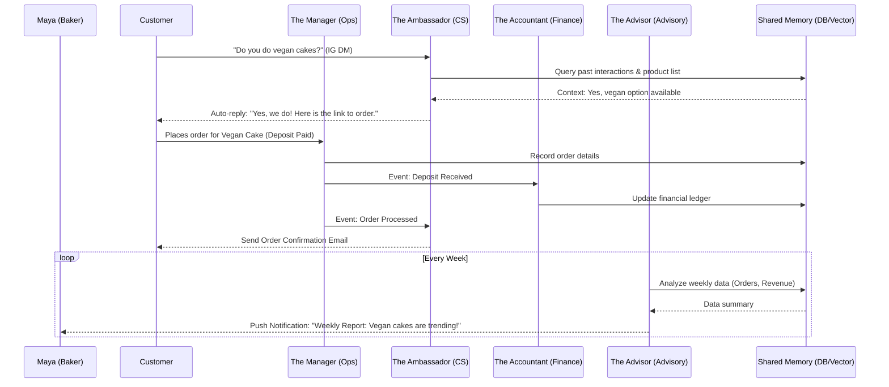

# AI Agent Department Architecture

## Problem Statement

Small business owners—whether they are bakers, handymen, boutique owners, or food cart operators—often lack the time, technical expertise, and financial resources to manage all aspects of their business. They need an invisible, highly capable team to handle operations, marketing, sales, customer success, finance, legal, and advisory tasks. The gap is that existing platforms (Shopify, Wix) treat AI as an add-on chatbot, rather than fundamental infrastructure that mirrors a real business's operational departments. This architecture must design how these specialized AI departments run in the background, coordinate with each other, store memory, and are governed, all while maintaining absolute simplicity for the non-technical user.

## Research Report

**Competitor Analysis:**
*   **Shopify:** Offers "Sidekick" which is primarily a conversational interface for support and basic tasks, but lacks autonomous, multi-departmental orchestration.
*   **Wix:** Features Wix AI, which assists in website creation and basic text generation, but does not provide end-to-end, proactive business management.
*   **Squarespace / GoDaddy:** Offer limited AI tools focused mainly on content generation.

**Key Findings:**
1.  **Anthropomorphization Works:** Organizing AI into recognizable "departments" (e.g., "The Manager", "The Accountant") makes the concept approachable for non-technical users.
2.  **Proactive > Reactive:** Users don't just want an AI that answers questions; they want an AI that takes action (e.g., auto-replying to DMs, generating weekly reports) without being constantly prompted.
3.  **Coordination is Crucial:** Departments cannot exist in silos. An order processed by Operations must trigger Customer Success to send a confirmation and Finance to track the revenue.
4.  **Trust & Control:** Users need visibility into what the AI is doing. While some actions can be fully autonomous, others (like sending quotes or issuing large refunds) should require draft-and-review.

## Design Doc

### Key Architectural Decisions

1.  **Event-Driven Coordination:** Departments communicate via an event bus (e.g., `OrderPlaced`, `CustomerMessageReceived`). This decouples the departments while allowing complex workflows (Operations processes order -> Customer Success sends email -> Finance updates ledger).
2.  **Shared Memory & Context:** All departments access a shared memory layer (Vector DB + relational data) to ensure a consistent understanding of the business state and past customer interactions.
3.  **Action Approval System:** Every AI action is categorized as either `AUTO_EXECUTE` or `DRAFT_FOR_REVIEW`. High-risk actions require user approval via a push notification.
4.  **Tenant-Scoped Execution:** Every AI execution is strictly scoped to a `tenant_id` to ensure data isolation. Budgets and throttling are applied per tenant based on their subscription tier.

### Architecture Diagram (Mermaid)

### Mobile UX Flow (375px First)

1.  **Dashboard (Home):**
    *   Top: Business Health Summary (Revenue today, Active Orders).
    *   Middle: "Department Activity" feed. E.g., "The Ambassador replied to 3 DMs", "The Promoter posted to Instagram".
    *   Bottom: Action Items requiring approval (e.g., "Draft Quote for Carlos").
2.  **Approval Flow (Draft for Review):**
    *   User taps an action item: "Review Quote for Custom Cake".
    *   Screen shows the AI-generated draft.
    *   Actions: [Approve & Send] | [Edit Draft] | [Reject].
3.  **Department Settings:**
    *   User navigates to "The Ambassador" settings.
    *   Toggle: "Auto-reply to Instagram DMs" [ON/OFF].
    *   Slider: "Tone: Professional <-> Friendly".

## Implementation Prompt

**Objective:** Implement the backend event-driven coordination and shared memory access for the AI Agent Departments.

**User-Facing Outcome:** The system should autonomously route events (like a new customer message or a completed order) to the appropriate AI department. The AI should retrieve context from the shared memory, perform the necessary action (e.g., draft a reply, update a ledger), and record the outcome back to memory. The user should see a log of these actions in their dashboard and be prompted to approve high-risk actions.

**Critical User Journey (CUJ):**
1.  A webhook receives a customer inquiry via Instagram DM.
2.  The system publishes a `CustomerMessageReceived` event.
3.  "The Ambassador" (Customer Success department) picks up the event.
4.  The agent queries the Vector DB for context regarding the customer and product.
5.  The agent drafts a response.
6.  If the user's settings allow `AUTO_EXECUTE`, the response is sent. Otherwise, a `DRAFT_FOR_REVIEW` item is created for the user.

**Acceptance Criteria:**
*   Event bus successfully routes defined events to specific departments.
*   Agents can query and write to the shared memory layer (Vector DB).
*   Action approval mechanism correctly halts execution for `DRAFT_FOR_REVIEW` actions until user confirmation.
*   All operations are strictly isolated by `tenant_id`.

**Priority:** P0 (Critical)
**Estimated Scope:** Large

