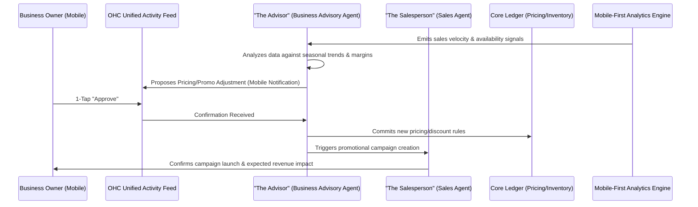

# Title: AI-Driven Dynamic Pricing & Promotional Yield Engine

## Problem Statement
Small business owners like Leo (Music Tutor) and Maya (Baker) often struggle with setting the right prices or creating effective promotions. They guess at pricing, leave money on the table during peak seasons, and fail to discount appropriately during slow periods. Implementing dynamic pricing or yield management on platforms like Shopify or Squarespace requires specialized, expensive third-party apps, complex configuration, and manual monitoring—which non-technical users simply don't have the time or expertise for. They need an automated system that intelligently analyzes demand, inventory, and seasonality to suggest and apply optimized pricing and promotions, all through a simple "1-Tap Approve" interface on their mobile phone.

## Research Report
*   **Current Architecture Limits:** Most SMB platforms rely on static pricing models. Any changes or promotional discounts require manual creation of coupon codes, updating individual product variants, and broadcasting to customers manually.
*   **Competitor Analysis:**
    *   *Shopify:* Offers discounts and basic sale pricing, but dynamic pricing requires apps like "Dynamic Pricing" which cost monthly fees and require complex rule setup.
    *   *Wix & Squarespace:* Provide static pricing and manual coupon generation. No native, intelligent yield management or demand-based pricing adjustments.
    *   *Airlines/Hotels:* Utilize advanced yield management, but these enterprise systems are entirely inaccessible to an SMB.
*   **Discovery:** OHC can democratize yield management by utilizing its Business Advisory Agent and Finance & Payments Agent. The AI will monitor sales velocity, upcoming calendar availability, and seasonal trends to proactively suggest dynamic pricing adjustments (e.g., "Increase custom cake prices by 10% for the busy wedding season") or targeted promotions (e.g., "Offer a 15% discount on remaining Tuesday guitar slots"). The owner simply taps "Approve" on a mobile notification.

## Design Doc

### Architecture Diagram

### UI Wireframes & Mobile UX Flow (375px)
*   **Mobile Activity Feed (OHC Mobile App - 375px):**
    *   **Notification Card:** "High Demand Alert: Your weekend slots for custom cakes are filling up fast. We suggest a 15% 'Rush Order' premium for remaining slots this weekend."
    *   **Data Visualization:** A simple, glassmorphism-styled micro-chart showing demand spike vs. available capacity.
    *   **Actions:**
        *   [Approve Premium Pricing] (Primary, solid button)
        *   [Dismiss] (Secondary, ghost button)
*   **Implementation Flow:** Upon approval, the Advisor agent instantly updates the pricing in the Core Ledger, ensuring the website, checkout, and any outstanding un-booked quotes reflect the new pricing.

### AI Agent Integration Points
*   **The Advisor (Business Advisory Agent):** Constantly monitors inventory depletion rates, calendar vacancy, and historical trends to formulate margin-optimizing pricing suggestions.
*   **The Salesperson (Sales Agent):** If a promotional discount is approved for slow-moving inventory, this agent drafts and schedules the necessary social posts and targeted emails to clear it out.
*   **The Accountant (Finance Agent):** Ensures all dynamic pricing changes still adhere to the business's minimum viable profit margins.

### Key Design Decisions
1.  **Opt-In Approval Only:** Pricing is sensitive. The AI will *suggest* changes, but never autonomously mutate base prices without the owner's 1-Tap approval.
2.  **Margin Protection:** The system will require a baseline cost input (or estimate it) to ensure dynamic discounting never results in negative margins.
3.  **Real-Time Synchronization:** Pricing updates must instantly sync across the OHC Storefront, Mobile POS, and any active digital channels.

## Implementation Prompt
**Task for Implementer Agent:**
Implement the "AI-Driven Dynamic Pricing & Promotional Yield Engine" core flow.
1.  Extend the `Product` and `Service` data models to support dynamic pricing rules, including base price, minimum margin, and active promotional modifiers.
2.  Create a background worker service for "The Advisor" agent that periodically evaluates sales velocity/capacity against predefined or learned thresholds to generate pricing suggestions.
3.  Develop the API endpoints to serve these suggestions to the mobile activity feed and to accept the owner's "1-Tap Approve" decision.
4.  Ensure that approved pricing modifiers are immediately reflected in the checkout flow and integrated with the Sales agent for promotional broadcasting.
5.  All user interfaces must strictly adhere to the 375px mobile-first constraint and use the OHC premium glassmorphism design tokens. Do not implement complex rule-builder UIs; focus entirely on the AI-proposed, single-tap approval flow.

## Priority
P1

## Estimated Scope
Medium
