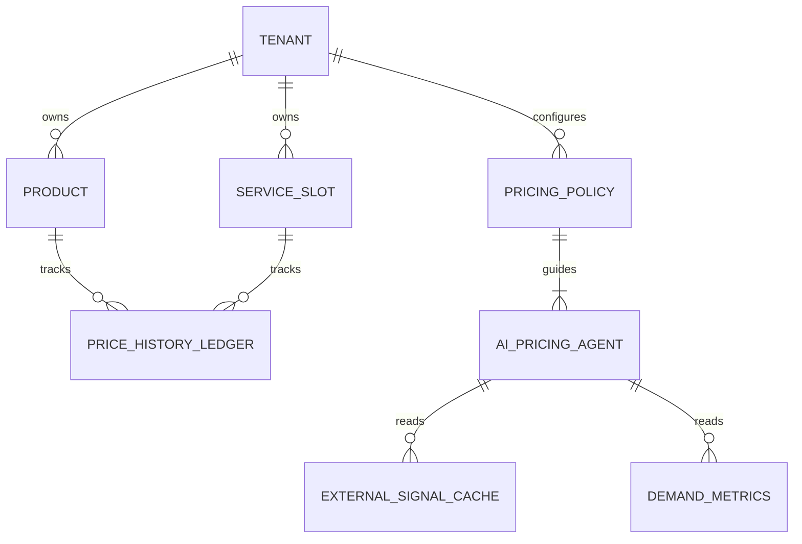
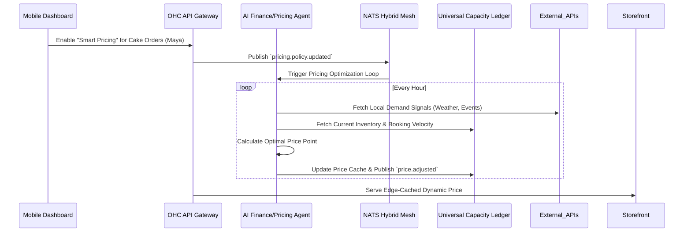

# [Architecture] AI Dynamic Pricing & Yield Management Engine

## Title
Implement AI Dynamic Pricing & Yield Management Engine for Autonomous Revenue Optimization

## Problem Statement
Small business owners—whether it's Priya running a boutique, Carlos scheduling handyman services, or Leo booking tutoring sessions—struggle to price their offerings optimally. They frequently leave money on the table during peak demand (e.g., Carlos during a local storm needing urgent repairs) and suffer from unbooked slots or unsold inventory during slow periods. Manually analyzing local demand, competitor pricing, weather, or seasonality to adjust prices across a catalog or calendar is impossible for a busy owner who lacks a revenue management team. They need an invisible, AI-driven dynamic pricing and yield management engine that automatically adjusts prices and offers targeted discounts to maximize total revenue without requiring complex manual rule configuration.

## Research Report
**Market Context & Findings:**
- **Enterprise Domination:** Large enterprises (airlines, Uber, Hilton) heavily rely on dynamic pricing (yield management) to maximize revenue per available unit (RevPAU).
- **SMB Gap:** SMBs historically lack the data pipelines, ML models, and time to implement similar strategies.
- **Competitor Analysis:**
  - *Shopify:* Offers dynamic pricing via third-party apps (e.g., Prisync), which require complex manual rule setup and high monthly fees.
  - *Wix / Squarespace:* Basic discount codes, but no native AI yield management.
  - *Stripe:* Supports basic billing, but does not provide dynamic demand-based pricing adjustments.
- **Opportunity:** OneHumanCorp can democratize enterprise-grade yield management by embedding it invisibly. The system can synthesize external signals (local weather, events, time of day) and internal signals (booking velocity, inventory levels, abandoned carts) to automatically adjust prices within user-approved bounds, driving an estimated 15-25% increase in bottom-line revenue for merchants.

## Design Doc

### Architecture Diagram

### Mobile-First UX Flow (375px Viewport)
**Screen 1: Smart Pricing Activation (The Grandmother Test)**
- **Header:** Translucent Glass App Bar "Pricing Settings".
- **Card 1:** Ubiquiti UniFi modular card style.
  - **Title:** "Smart Pricing" (Toggle Switch: ON).
  - **Subtitle:** "Let AI adjust prices slightly to get you more bookings and sales."
- **Card 2 (Conditional on ON):**
  - **Slider:** "Minimum Acceptable Price" (e.g., $50).
  - **Slider:** "Maximum Price Limit" (e.g., $150).
  - **Info Text:** "We'll never price outside this range."
- **Action:** Floating Action Button (FAB) "Save".

### Key Design Decisions
- **Zero Configuration Default:** The engine defaults to a conservative +/- 10% price fluctuation unless the merchant manually adjusts the min/max bounds. No complex rule trees or "if-this-then-that" required.
- **Multi-Tenant Isolation:** The pricing agent uses strictly scoped API tokens (`SPIFFE/SPIRE` authenticated) to ensure it only reads signals and updates prices for the specific tenant ID.
- **Immutable Ledger:** All automated price changes are logged to a `PRICE_HISTORY_LEDGER` to ensure transparency and allow the owner to review AI decisions.
- **Edge Caching Compatibility:** Dynamic prices are injected client-side via a lightweight SDK or resolved at the CDN edge using Edge Functions, ensuring the storefront remains globally cached and instantaneous.

### AI Agent Integration Points
- **Finance Agent:** Owns the primary reinforcement learning loop for pricing.
- **Marketing Agent:** If the Finance Agent drops a price to fill a slow Tuesday for Carlos, it signals the Marketing Agent to autonomously draft and send an SMS/Email blast: "Flash deal: 20% off handyman services this Tuesday only!"

## Implementation Prompt
**To the Implementer:**
Implement the core background workers and API endpoints for the AI Dynamic Pricing & Yield Management Engine.
- Create the data models (or extend existing inventory/catalog models) to support min/max pricing bounds and track historical price points.
- Implement a background worker (subscribing to our NATS mesh) that periodically evaluates tenant inventory/booking velocity against external signals (mock the external signals for now) and adjusts the active price within the permitted bounds.
- Build the REST/gRPC endpoints for the mobile dashboard to toggle "Smart Pricing" on/off and set bounds.
- Ensure strict tenant isolation: the worker must operate securely within the context of a single tenant.
- Do not build a complex rules engine; rely on an LLM or a simple heuristic algorithm in the background worker to make pricing decisions.
- Deliver the mobile UI components matching the 375px translucent glass design system.

## Priority
P1

## Estimated Scope
Large
