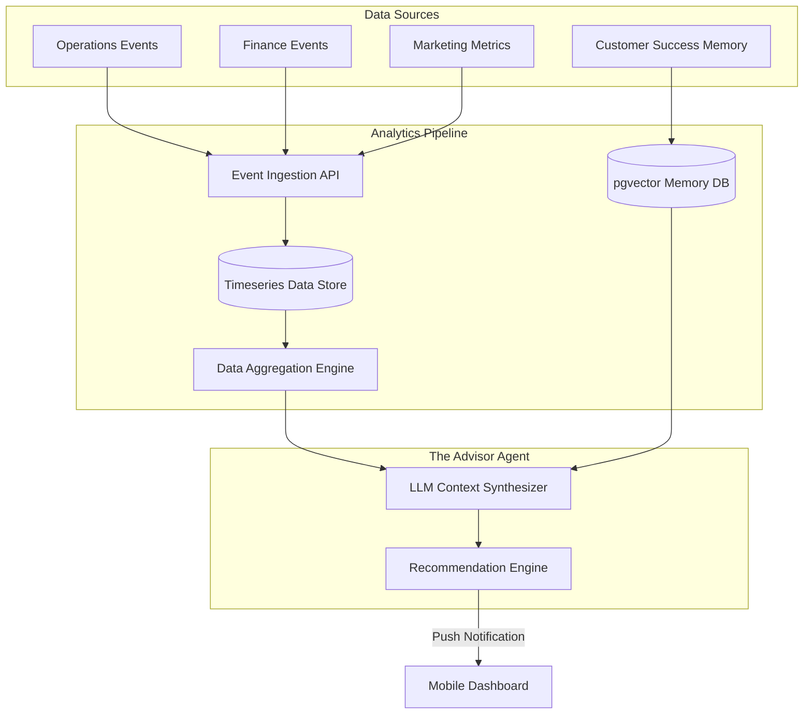

# AI Omnichannel Analytics Architecture

## Problem Statement
Small business owners lack the time and expertise to aggregate data from multiple isolated sources (e.g., website sales, in-store POS, Instagram DMs, online bookings). Currently, they must manually piece together their financial health, customer engagement, and operational efficiency, often leading to missed opportunities or cash flow crises. The platform requires a unified "AI Omnichannel Analytics" system that automatically ingests data from all AI Departments and external integrations, synthesizes this data using the Business Advisory agent ("The Advisor"), and presents actionable, plain-language insights directly to the mobile dashboard.

## Research Report
### Competitive Landscape
- **Shopify**: Provides robust reporting but is primarily e-commerce focused. It lacks deep integration with service-based bookings or AI-driven qualitative insights (like analyzing Instagram DM sentiment).
- **Wix/Squarespace**: Offers basic site analytics, but the user must interpret the data themselves.
- **OHC's Opportunity**: Leverage the pgvector shared memory layer to not only track quantitative data (sales, bookings) but also qualitative data (customer interactions). "The Advisor" can proactively highlight trends ("Vegan cake inquiries are up 40% on Instagram; you should add a new variant") rather than just presenting a raw chart.

### Findings
1. **Data Silos**: Operations (sales), Customer Success (messages), and Marketing (campaigns) currently generate events, but lack a unified aggregation layer.
2. **Cognitive Overload**: Business owners ignore complex dashboards. Insights must be presented as a simple "News Feed" or push notifications.
3. **Proactive Intelligence**: The analytics system should not wait for the user to ask questions; it should periodically run background jobs to detect anomalies and opportunities.

## Design Doc

### Architecture Diagram

### Mobile UX Flow
1. **Weekly Briefing**: Every Monday morning, the user receives a push notification: "Your Weekly Business Briefing is ready."
2. **Insight Feed**: Tapping the notification opens a 375px-optimized feed.
   - *Card 1 (Quantitative)*: "You made $1,200 this week (↑ 15%). Best seller: Custom Painting."
   - *Card 2 (Qualitative)*: "3 customers asked about your availability for next month. Want me to open more calendar slots?"
3. **One-Tap Actions**: Each insight comes with an actionable button (e.g., [Open Slots], [Ignore]).

### Key Design Decisions
1. **Hybrid Data Store**: We use a Timeseries Database (TSDB) for quantitative metrics (revenue, page views) and pgvector for qualitative data (customer sentiment, agent interactions).
2. **Scheduled Synthesis**: "The Advisor" runs as a scheduled job (e.g., via a Redis-backed distributed cron) to synthesize data during low-traffic periods, minimizing real-time LLM inference costs.
3. **Actionable Outputs**: Analytics are never just numbers. Every insight generated by the Action Engine must map to a specific capability of another department (e.g., instructing the Operations agent to update inventory).

## Implementation Prompt
**Objective**: Implement the data aggregation and synthesis pipeline for "The Advisor" agent.
**Critical User Journey (CUJ)**:
1. The system simulates a week of business activity (orders placed, DMs received).
2. A scheduled cron job triggers "The Advisor" synthesis process.
3. The Advisor queries the TSDB for sales data and the Vector DB for recent customer interactions.
4. The Advisor generates a concise, plain-language summary with at least one actionable recommendation.
5. The summary is persisted and pushed to the mobile client via WebSocket/Notification.

**Acceptance Criteria**:
- Create the core `AggregationEngine` Go interface to query both quantitative and qualitative stores.
- Implement the scheduled worker that triggers the synthesis using the LLM provider.
- Provide unit tests mocking the data sources to verify the LLM prompt construction and parsing of the actionable recommendation.

## Priority
P1

## Estimated Scope
Medium

