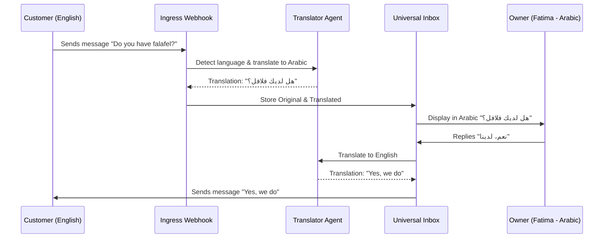

# Problem Statement
Fatima (a food cart operator with limited English proficiency) needs to interact with both English-speaking and Arabic-speaking customers. Current platforms lack real-time native translation, making it impossible for business owners to serve a diverse, multilingual customer base smoothly. Miscommunication leads to lost orders and bad reviews. Owners need an invisible translation layer that automatically bridges the language gap in chats, emails, and order notes without requiring external tools.

# Research Report
- **Competitor Analysis**:
  - **Shopify / Wix**: Support static multilingual storefronts but do not offer real-time, bi-directional chat or order-note translation natively within the merchant dashboard. Merchants rely on browser extensions or third-party apps.
- **OHC Advantage**: By integrating AI-driven translation at the edge of the communication ingestion pipeline, OHC can instantly present inbound messages in the owner's preferred language and automatically translate outbound replies back to the customer's language. This empowers owners like Fatima to expand their customer base confidently.

# Design Doc
## Architecture Diagram (Mermaid.js)

## Mobile UX Flow (375px First)
- Inbox cards show messages in the owner's preferred language natively.
- A subtle "Translated from [Language]" badge exists, which when tapped, reveals the original text.
- Keyboard and text input remain in the owner's language. The UI handles the translation in the background before sending.
- Premium Translucent Glass aesthetics applied to chat bubbles.

## AI Agent Integration Points
- **Customer Success (The Ambassador)**: The agent that intercepts incoming communications, uses LLM providers (Gemini Pro / GPT-4o) to determine language, translate text, and persist both versions to the Universal Inbox database.

# Implementation Prompt
**Goal**: Implement the real-time, bi-directional translation engine for the Universal Omnichannel Inbox.

**Core User Journey (CUJ)**:
Fatima receives an English inquiry ("Is the chicken halal?") via Instagram DM. The inbox displays it to her in Arabic. She replies in Arabic ("Yes"). The system translates her reply to English and sends it back to the customer.

**Acceptance Criteria**:
1. Add language preference columns to the `Tenant` and `Customer` tables.
2. Implement a background translation pipeline triggered on new message ingestion.
3. Modify the Universal Inbox API to return messages in the tenant's preferred language while keeping the original.
4. Ensure translation tasks are handled by the AI job queue with exponential backoff for resilience.

# Priority
P1

# Estimated Scope
Medium
