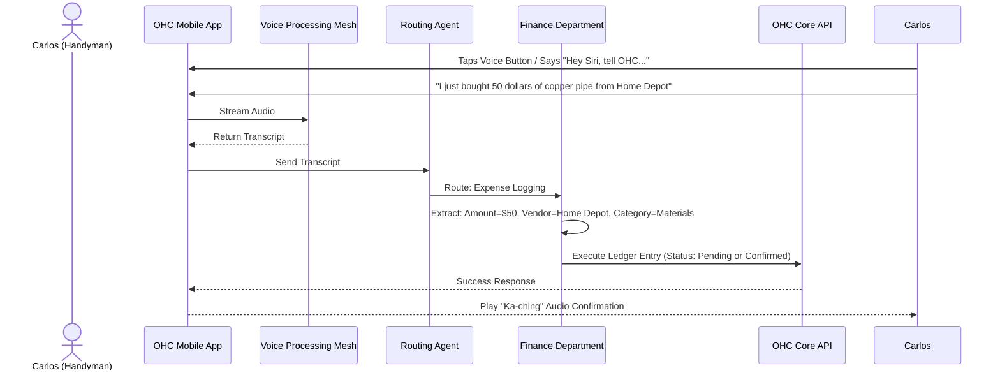
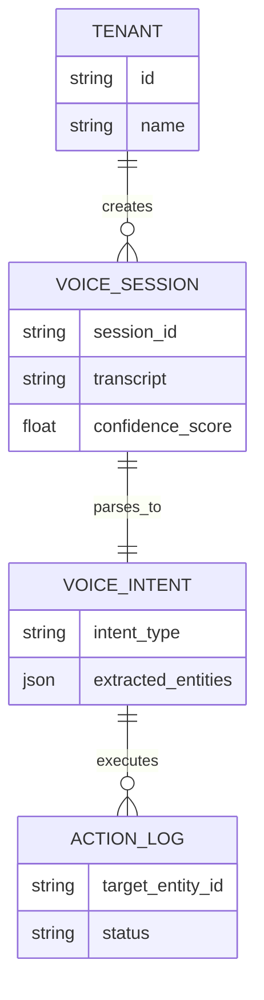

# [Architecture] Ambient Voice Command & Dictation Mesh

## Title
OHC "Hands-Free Hustle": Ambient Voice Command & Dictation Mesh

## Problem Statement
Small business owners like Carlos (handyman) and Fatima (food cart operator) often work with their hands full. Whether they are underneath a sink fixing a pipe or serving a long line of hungry customers, interacting with a graphical user interface (GUI)—even a beautifully designed mobile one—is often impossible or significantly slows them down. They need a way to log expenses, update inventory, or schedule appointments instantly using just their voice, without breaking their physical flow.

## Research Report

### Context and Market Analysis
- **Current Paradigms:** Existing small business tools rely heavily on screen interactions. If a user needs to log a $50 expense, they have to unlock their phone, open an app, navigate to the expense section, and type it in. This friction often leads to delayed logging or forgotten tasks.
- **Competitor Landscape:**
  - **Shopify & Wix:** Primarily GUI-driven. While some have basic chat interfaces or AI text assistants, they are not designed for true "eyes-free, hands-free" ambient usage.
  - **Siri/Google Assistant:** Can set general reminders, but lack deep integration into the business's specific ledger, inventory, or CRM.
- **The Opportunity:** By integrating a highly accurate, ambient voice mesh directly into the OHC app (and potentially extending to wearables like Apple Watch or AirPods), we can capture business data at the exact moment it occurs, effectively giving every solopreneur a dedicated assistant standing next to them.

### Key Learnings
1. **Context is King:** The system must understand business context ("Add 5 more vegan cakes to stock" vs "Remind me to buy flour").
2. **Speed & Reliability:** Voice transcription must be near-instant and highly accurate, even in noisy environments (e.g., a busy street for a food cart).
3. **Confirmation without Distraction:** The system needs a way to confirm actions (e.g., a subtle chime or a brief synthesized voice confirmation) without requiring the user to look at the screen.

## Design Doc

### Key Design Decisions
- **Always-Available Trigger:** A prominent, easily accessible voice activation button on the main dashboard, plus integration with native OS voice intents (e.g., "Hey Siri, tell OneHumanCorp to...") where possible.
- **Multi-Modal AI Pipeline:**
  1. High-speed speech-to-text (STT).
  2. Intent classification (is this a ledger entry, an inventory update, a CRM note?).
  3. Entity extraction (amounts, dates, items, customer names).
  4. Execution by the relevant AI Department (Finance, Operations, CS).
- **Asynchronous Execution & Review:** If the system has low confidence, it drafts the action and places it in the "Activity Feed for 1-Tap Approval" rather than executing it blindly.
- **Audio Feedback Loop:** Use distinct audio chimes for success, failure, or "needs clarification" to keep the user's eyes on their work.

### Architecture Diagram (Mermaid.js)

```mermaid
graph TD
    UserVoice[Voice Input: "Log $50 for gas"] --> STT[Speech-to-Text Service]
    STT --> TranscribedText[Transcribed Text]

    TranscribedText --> NLU[NLU / Intent Router Agent]

    NLU -->|Intent: Expense| FinanceAgent[Finance Agent]
    NLU -->|Intent: Inventory| OpsAgent[Operations Agent]
    NLU -->|Intent: Meeting| BookingAgent[Booking Agent]

    FinanceAgent -->|High Confidence| LedgerDB[(Ledger DB)]
    FinanceAgent -->|Low Confidence| ActivityFeed[(Activity Feed - Needs Approval)]

    LedgerDB --> AudioFeedback[Success Chime / TTS Confirm]
    ActivityFeed --> AudioFeedback[Review Needed Chime]
```



### Mobile-First UX Flow (375px)
1. **The "Listen" State:** The main dashboard features a persistent, floating action button (FAB) that resembles a microphone. When tapped, the screen dims slightly, and a dynamic, fluid waveform appears in the center, indicating the app is listening.
2. **Real-time Transcription:** As the user speaks, text appears instantly above the waveform in large, highly legible font (Outfit).
3. **Processing State:** The waveform turns into a subtle spinning loader.
4. **Result State:** A clean, glassmorphic card slides down from the top.
   - *Success:* Green accent, shows the exact action taken (e.g., "-$50 Home Depot"). Plays a success chime. Disappears after 3 seconds.
   - *Needs Review:* Yellow accent, prompts the user to tap to confirm the extracted details. Plays a distinct "notification" chime.

## Implementation Prompt
**Prompt for Implementer Agent:**
Implement the "Ambient Voice Command Mesh" for the OHC mobile application.
- Integrate a reliable, high-speed Speech-to-Text (STT) capability (e.g., Whisper API or native on-device dictation).
- Create an "Intent Router" layer that takes the transcribed text and determines which AI Department (Finance, Operations, CRM) should handle the request.
- Implement the "Listen" UI state: a floating action button that triggers a fullscreen overlay with a dynamic audio waveform and real-time transcription text.
- Ensure the system provides clear audio feedback (chimes) for success and failure, allowing true hands-free operation.
- Implement a fallback mechanism: if the intent extraction confidence is below a defined threshold, route the proposed action to the user's Activity Feed for 1-tap manual approval later.
- Design the necessary backend endpoints to accept voice transcripts, process them via the chosen LLM/provider, and mutate the underlying business state (Ledger, Inventory, etc.).

## Priority
P1

## Estimated Scope
Medium

### Data Model & Invariants
- **Data Entities:**
  - `VoiceSession`: Stores transcript fragments, confidence scores, and raw audio blob references.
  - `VoiceIntent`: Links a resolved intent to the corresponding downstream entity (e.g., `LedgerEntry` or `InventoryDelta`).
- **Invariants:**
  - A `VoiceSession` must exclusively belong to a single `TenantID`.
  - Transcripts must be scrubbed of PII before persisting for analytics.

### ER Diagram (Mermaid.js)


### Zero Trust & Security
- **Multi-Tenant Isolation:** Every voice session initialization must be accompanied by a tenant-scoped JWT. The Voice Engine API drops requests without an active, verified `tenant_id`.
- **SPIFFE/SPIRE Identity:** The Intent Routing Agent and internal processing pipelines authenticate with downstream AI departments (e.g., Finance, Operations) using dynamically issued SPIFFE/SPIRE certificates, ensuring that an impersonated or hijacked voice payload cannot arbitrarily escalate privileges across the internal mesh.

### Offline & Performance Targets
- **Performance:** End-to-end latency (voice activation to audio success chime) must be under 800ms.
- **Offline Capability:** If the device loses connection, the Voice Mesh must locally queue compressed audio payloads using the device's secure enclave storage. It will seamlessly flush the queue to the STT API upon reconnection, triggering asynchronous intent execution without requiring the user to remain on the screen.
