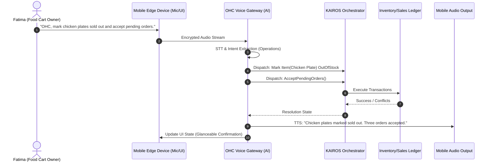

# Ambient Voice Commerce and Hands-Free POS Architecture

## Title
Architect and Implement Ambient Voice Commerce and Hands-Free POS Engine

## Problem Statement
For high-velocity, physically demanding small businesses—like Fatima's food cart, Carlos's hands-on repair jobs, or Priya managing a busy checkout line—interacting with a screen is a bottleneck. When Fatima is cooking and has gloves on, she cannot safely or quickly tap a 375px screen to accept a new pre-order, mark an item as sold out, or ring up a walk-up customer. Traditional POS systems (Square, Shopify) and even our current mobile-first OHC platform require physical touch, pulling the business owner away from their core craft. The gap is the lack of a secure, always-on, hands-free conversational interface that can orchestrate business operations in real-time.

## Research Report

**Competitor & Market Analysis:**
*   **Square / Shopify POS:** Highly optimized for touch interfaces and dedicated hardware. They offer some basic voice search for products, but lack ambient conversational AI to drive end-to-end checkout, inventory updates, or order management.
*   **Voice Assistants (Alexa, Google Assistant, Siri):** These are consumer-focused. While they have "skills" or integrations, they are clunky for real-time, multi-turn business operations (e.g., "Siri, charge the next customer $15 for the Halal Plate and print a receipt").
*   **Market Opportunity:** Ambient computing in the enterprise/SMB space is an untapped frontier. By leveraging advanced speech-to-text (STT), large language models (LLMs) with low latency, and our AI Swarm architecture, OHC can become the first truly invisible POS.

**User Sentiment & Pain Points:**
*   "I always have flour on my hands, touching my iPad POS is a nightmare." (Baker)
*   "When the lunch rush hits, I can't look at my phone to accept DoorDash or online pre-orders, I just need to yell 'Accept' to my system." (Food Cart Operator)
*   "I want to tell my phone 'Schedule Carlos for a plumbing quote tomorrow at 2pm' without taking my hands off the pipes." (Handyman)

## Design Doc

### Key Design Decisions and Why
1.  **Always-On Local Wake Word + Edge Processing:** To ensure low latency and privacy, the initial wake word and basic STT processing should be heavily edge-optimized (e.g., utilizing on-device Neural Engines where available), minimizing round-trips for basic commands.
2.  **Context-Aware Intent Routing:** The voice command must be routed to the correct AI Department (Operations for inventory, Sales for checkout, Calendar for bookings). The system must maintain contextual memory (e.g., knowing who "the last customer" is).
3.  **Audio-Visual Feedback Loop:** Voice commands must be confirmed via a quick, non-intrusive audio chime and a large, high-contrast visual confirmation on the device screen (glanceable from 3 feet away).
4.  **Zero-Trust Voice Authentication (Future-proofing):** As a baseline, the ambient mic only listens when explicitly enabled for a "shift". We must design the architecture to support voice biometrics to prevent unauthorized customers from shouting commands at the POS.

### Architecture Diagram (Mermaid)

### Mobile UX Flow (375px First)
1.  **Shift Start:** Fatima opens the OHC app. She taps a prominent, large "Start Voice Shift" toggle on her dashboard. The UI enters a "listening" mode, characterized by a soft, glowing ambient animation around the screen edges (Translucent Glass aesthetic).
2.  **Listening State:** The screen goes dark or displays a high-contrast, large-font "Dashboard" meant to be viewed from an arm's length or more.
3.  **Command Execution:** Fatima says, "OHC, charge the customer $12 for a Gyro."
4.  **Glanceable Confirmation:** The screen flashes a large green confirmation card: **"$12 Gyro - Ready for Tap to Pay"** and plays a subtle chime. The NFC reader on the phone activates automatically.
5.  **Completion:** The customer taps their card on Fatima's phone. A success chime plays, and the screen returns to the ambient dashboard.

## Implementation Prompt

**User-Facing Outcome:**
Business owners can interact with the OHC app using natural voice commands to perform critical actions hands-free. This includes charging customers, updating inventory (marking items sold out), accepting incoming pre-orders, and querying daily metrics. The system should feel like a reliable, invisible assistant standing next to them.

**Critical User Journey (CUJ):**
1. User activates "Voice Assistant Mode" in their OHC mobile app for the duration of their working shift.
2. User issues a natural language voice command (e.g., "Charge 15 dollars for a vegan cake" or "Mark cookies as sold out").
3. The app transcribes the audio, interprets the intent, and routes the action to the appropriate background AI agent.
4. The system executes the action securely.
5. The system provides immediate, concise auditory feedback ("Charged $15" or "Cookies are now sold out") AND a high-visibility visual confirmation on the device screen.
6. The app returns to its ambient listening state.

**Acceptance Criteria:**
*   Implement a robust, low-latency audio capture and streaming mechanism from the mobile client to the backend voice gateway.
*   Integrate STT (Speech-to-Text) capabilities to convert audio to text reliably in noisy environments.
*   Develop an intent classification pipeline that maps natural language directly to KAIROS orchestrator actions (Inventory, POS, Order Management).
*   Implement TTS (Text-to-Speech) for concise auditory feedback.
*   Design and implement the "glanceable" UI state (375px viewport optimized) that provides visual confirmation of voice actions without requiring physical touch.
*   Ensure strict multi-tenant isolation: Voice commands must only affect the authenticated user's active tenant and ledger.

## Priority
**P1** (High) - Critical for penetrating the physical food/beverage and hands-on service markets where our personas (Fatima, Carlos) struggle with touch-only POS systems.

## Estimated Scope
**Large** - Involves audio streaming, ML inference integration (STT/TTS), real-time agent dispatch, and significant UI/UX development for the new ambient mode.
