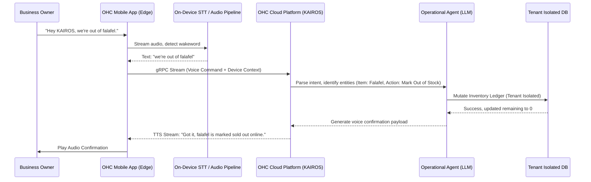
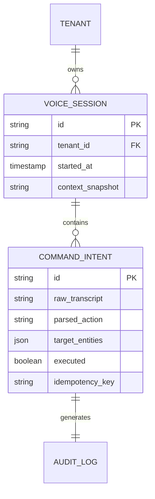

# Architecture Brief: Ambient Voice Operations & Commerce Engine

## Title
Ambient Voice Operations & Commerce Engine: Hands-Free Business Management

## Problem Statement
Small business owners like Maya (baker, hands covered in flour), Carlos (handyman, under a sink with tools), and Fatima (food cart operator, actively cooking and serving a long line) operate in highly physical, distracting environments. They cannot always stop to dry their hands, unlock their phone, navigate a dashboard, and tap buttons to update inventory, send quotes, or accept orders. Requiring a graphical interface for every critical business action introduces friction and delays revenue-generating tasks.

## Research Report
- **The Physical Friction**: Industry studies show that micro-business owners lose up to 1.5 hours daily simply context-switching between physical tasks and digital administration.
- **Competitor Gap**: Platforms like Shopify POS and Square Terminal are strictly touch-based. Voice assistants (Siri/Google Assistant) are generic and cannot execute complex, multi-tenant authenticated business logic (e.g., "Charge the deposit for John's quote and reserve the Saturday slot").
- **Accessibility & Inclusion**: For older demographics or those with limited tech literacy, conversational voice is the ultimate "Grandmother Test" interface. It removes the need to learn UI layouts or terminology.
- **Technology Readiness**: On-device Wakeword detection, streaming STT, and fast LLM intent parsing via the KAIROS engine allow us to build a secure, private, and highly responsive voice bridge.

## Design Doc

### Business Journey Mapping
- **Acquisition**: A social media video showing Maya successfully sending a quote using only her voice while icing a cake acts as powerful proof-of-concept marketing.
- **Onboarding**: Minimal setup; standard "Allow Microphone Access" permission with an immediate interactive tutorial ("Try saying: 'Hey KAIROS, check my schedule for today'").
- **Activation**: The "Aha!" moment happens when a user successfully completes their first hands-free transaction (e.g., confirming a booking while driving to a job).
- **Retention**: Consistent daily usage builds as users offload micro-tasks (inventory checks, status updates) to the voice agent instead of manually opening the app.
- **Revenue**: Enables impulse "in-the-moment" actions like "Add a $5 tip to the last order" or instantly capturing a lead's contact info hands-free, preventing lost sales.
- **Referral**: High visibility when used in front of customers (e.g., Carlos taking a verbal note for a client while looking at their sink) naturally prompts the question, "What app is that?"

### Architecture Diagram

### Data Model & Invariants

### Mobile UX Flow (375px First)
1. **Always-On Listener Toggle**: A prominent but unobtrusive microphone icon in the bottom navigation bar or floating action button. Tapping it manually starts a session, or it can be set to "Always Listen" mode (with clear privacy indicators).
2. **Visual Feedback Overlay**: When a command is heard, a translucent glassmorphism Siri-like waveform appears at the bottom of the screen.
3. **Execution Shimmer**: A brief loading shimmer card pops up showing the transcribed intent (e.g., "Updating Inventory: Falafel -> 0") with an "Undo" button that lasts for 5 seconds.
4. **Hands-Free Fallback**: If the phone is locked, a rich push notification appears confirming the action, requiring zero physical interaction unless an error occurred.

### AI Agent Integration Points
- **Operations Department**: Parses inventory updates ("Sold out of X", "I received 10 more Y").
- **Sales/Finance Department**: Handles quoting and invoicing ("Draft a $300 quote for the sink repair and text it to the last caller").
- **Customer Service Department**: Manages bookings ("Reschedule 2 PM lesson to 3 PM").

### Key Design Decisions
1. **On-Device Wakeword & STT**: To ensure privacy and reduce latency, the initial wakeword and audio-to-text translation happen on the edge (mobile device). Only the transcribed text is sent to the KAIROS cloud.
2. **Context-Aware Parsing**: The AI agent is injected with the current screen context (e.g., if Maya is looking at an order from "Sarah", saying "Approve this order" knows exactly which order is meant).
3. **Strict Multi-Tenant Isolation**: The voice session is cryptographically bound to the active user's JWT. All database mutations use Row-Level Security (RLS) ensuring one tenant cannot modify another's data.
4. **Idempotency**: Every transcribed command generates an idempotency key to prevent double execution if the network drops.

### Zero Trust & Security
- The voice channel operates over an authenticated, TLS-encrypted stream.
- Audio data is NEVER stored on the server; it is processed purely ephemerally. Only the text transcript is logged for the audit trail.
- High-risk actions (e.g., "Refund $500") require a physical biometric confirmation (FaceID/Fingerprint) as a step-up authentication challenge.

### Mobile-First Performance Targets
- **Wakeword to Intent Resolution Latency**: < 800ms
- **TTS Response Latency**: < 500ms
- **Background Battery Impact**: < 3% drain per hour while in active listening mode.

## Implementation Prompt
**To Implementer Agent:**
Implement the Ambient Voice Operations Engine.
Create an on-device audio processing module using a lightweight STT engine (like Whisper.cpp or platform native speech recognition) that securely captures voice commands.
Build a new endpoint `ExecuteVoiceCommand` that accepts the text transcript, authenticates the tenant, and passes the command to the KAIROS LLM orchestrator. The orchestrator must parse the intent and route it to the appropriate subsystem (Inventory, Billing, CRM).
Implement the mobile UI overlay: a glassmorphic waveform that appears during active listening, and a temporary "Undo" toast card upon execution.
Ensure the system prompts for biometric step-up authentication for destructive or high-value financial actions. Do not define the exact schema, but guarantee all mutations use idempotency keys and strict tenant scoping.

## Priority
P1

## Estimated Scope
Large
