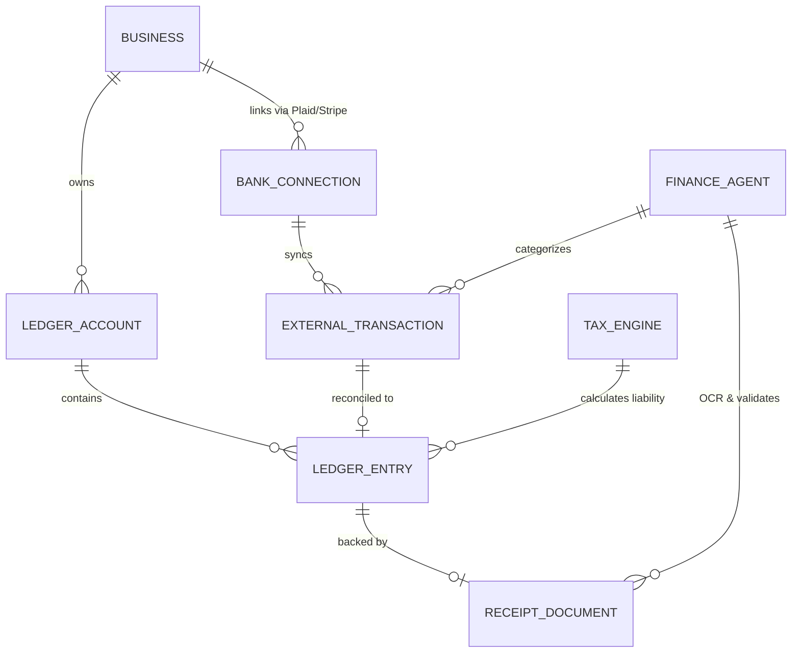

# Autonomous Accounting & Zero-Touch Tax Reconciliation Engine

## Problem Statement

Small business owners—whether Maya the baker, Carlos the handyman, or Fatima the food cart operator—dread the administrative burden of bookkeeping. Traditional tools like Quickbooks or Xero are complex, require manual reconciliation, and fail the "grandmother test." They are built for accountants, not for a 42-year-old handyman running his business entirely from an Android phone.

Current pain points include:
1. **Shoebox of Receipts:** Managing physical and digital receipts is manual and disconnected from the bank feed.
2. **End-of-Year Panic:** Tax season creates massive anxiety due to un-categorized expenses and unknown tax liabilities.
3. **Cash Flow Blindness:** Owners lack real-time visibility into their actual net profit because transactions aren't categorized instantly.
4. **Disconnected Systems:** Sales on OHC, expenses on a business card, and payroll for a helper exist in silos.

A non-technical business owner needs an invisible bookkeeping system that categorizes every transaction in real-time, estimates tax liabilities automatically, and prepares audit-ready reports without requiring them to understand "double-entry accounting" or "chart of accounts."

## Research Report

**Competitor Analysis:**
- **Quickbooks / Xero:** Powerful, but the UI is dense and heavily desktop-oriented. Requires significant setup and ongoing manual input (e.g., matching transactions). They lack truly proactive, invisible AI.
- **Shopify:** Primarily focused on sales and revenue. Expense tracking is non-existent natively; it relies entirely on third-party app integrations which add cost and complexity.
- **Wix / Squarespace:** Basic financial reporting, but no unified ledger handling both incoming revenue and outgoing expenses.

**Industry Standards & Scale:**
- Large-scale fintech platforms (Stripe, Square) use immutable ledgers for precision and auditability.
- Open Banking (Plaid) APIs enable real-time transaction ingestion.
- The state of the art in SMB fintech is moving towards "embedded accounting"—where the platform handling operations also manages the books.

**OHC Advantage:**
By owning the transaction layer (checkout, invoicing) and leveraging our core AI Agent swarm, OHC can build a zero-touch ledger. Our Finance AI Agent can act as a continuous, background bookkeeper, cross-referencing sales data with connected bank feeds and uploaded receipts via OCR, achieving 99% automated categorization.

## Design Doc

### Business Journey Mapping

1. **Acquisition / Trigger:** Maya buys flour and sugar for her custom cakes. She uses her linked business debit card.
2. **Ingestion:** The transaction ($45.00 at "Bob's Supply") flows into the OHC Autonomous Accounting Engine via a secure Open Banking (Plaid) integration.
3. **AI Augmentation:**
   - The Finance AI Agent instantly recognizes the vendor and Maya's business type.
   - It categorizes the transaction as "Cost of Goods Sold (COGS) - Ingredients."
   - If a receipt is needed, it sends a push notification: "Tap to snap a photo of the receipt for your $45 purchase at Bob's Supply."
4. **Mobile UX Flow:** Maya taps the notification. The camera opens (translucent glass UI). She snaps the receipt. The OCR Engine extracts line items and attaches the image to the immutable ledger entry.
5. **Tax Reconciliation:** The engine automatically sets aside an estimated percentage of Maya's recent profit for quarterly tax estimates, updating her real-time "Safe to Spend" balance.

### Architecture Diagram

### Mobile UX & UI Flows (375px First)

- **The Financial Dashboard:**
  - A clean, Ubiquiti UniFi style card layout.
  - Top Card: **"Safe to Spend"** balance (Actual Bank Balance minus Estimated Taxes minus Upcoming Bills).
  - Middle Card: **"Recent Activity"** with a visual feed. Fully categorized transactions have a green checkmark.
  - Bottom Card: **"Action Needed"** - AI-curated tasks (e.g., "Snap a picture of your Home Depot receipt").
- **Receipt Scanner:**
  - Full-screen camera view with a macOS-style translucent glass overlay guiding the user to align the receipt.
  - Instant haptic feedback and a shimmer effect when the AI successfully extracts data.

### Key Design Decisions & Invariants

1. **Immutable Double-Entry Ledger:** All financial movements must be recorded in a cryptographically verifiable, append-only double-entry ledger. No updates or deletes; only reversing entries.
2. **Multi-Tenant Zero Trust Isolation:** Ledger data is highly sensitive. Strict row-level security (RLS) or namespace isolation must be enforced. A tenant's Finance Agent operates strictly within the boundaries of that tenant's identity (SPIFFE/SPIRE).
3. **Event-Driven Reconciliation:** The system uses an asynchronous event mesh (e.g., NATS) to process incoming bank webhooks and trigger the Finance Agent, ensuring the mobile app remains snappy and responsive.
4. **Graceful Degradation:** If the AI confidence for categorization is below a threshold (e.g., 85%), it routes to a human-in-the-loop (HITL) queue within the OHC app ("What was this $200 charge at Amazon for?").

## Implementation Prompt

**To the Engineering Swarm:**

Implement the Autonomous Accounting & Zero-Touch Tax Reconciliation Engine.

**User Journey (CUJ):**
A user (like Carlos or Maya) connects their external bank account. The system automatically ingests their past 30 days of transactions. The Finance AI Agent categorizes these transactions based on their business profile. The user sees a clean mobile dashboard showing their "Safe to Spend" balance (accounting for estimated taxes) and a feed of categorized expenses. The user can take a photo of a receipt, which is automatically parsed and attached to the correct transaction.

**Acceptance Criteria:**
1. Secure integration point for ingesting external financial transactions (e.g., webhook receiver for bank feeds).
2. An immutable, append-only ledger structure to store categorized transactions.
3. Implementation of the Finance AI Agent workflow to auto-categorize transactions and calculate a running estimated tax liability.
4. Mobile-first UI components for the Financial Dashboard, displaying "Safe to Spend" and the categorized transaction feed.
5. Receipt upload pipeline with OCR capabilities, linking the extracted data and raw image to specific ledger entries.
6. Strict multi-tenant isolation and security controls on all financial data.

**Do not** prescribe specific database schemas or internal function signatures. Design the data layer for high performance, strict ACID compliance, and clear auditability.

## Priority & Scope

- **Priority:** P0 (Critical path for full business lifecycle management)
- **Scope:** Large
