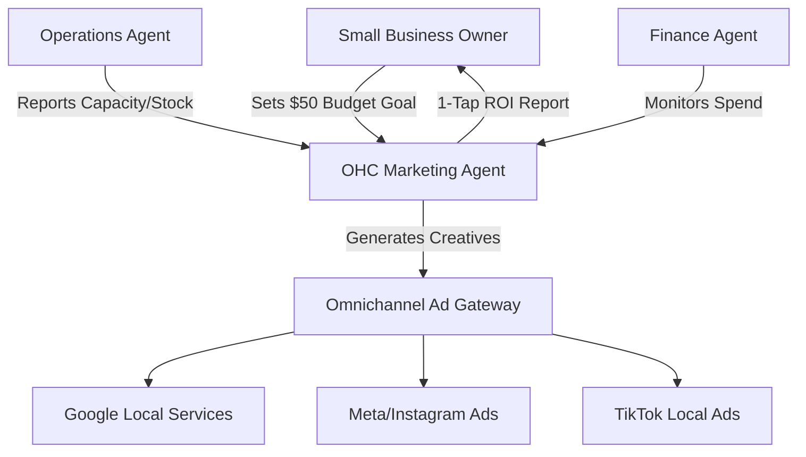

# Autonomous Ad Bidding & Hyper-Local Marketing Engine

## Problem Statement
Small business owners like Carlos (Handyman, 42) and Priya (Boutique, 35) know they need to "run ads" on Google or Facebook to acquire new customers, but the process is highly technical. Managing Ad managers, setting daily budgets, understanding CPC (Cost Per Click), and tweaking hyper-local targeting radii requires expertise they don't have. They often lose money on poorly targeted campaigns. They need an invisible, AI-driven marketing engine that takes a simple goal ("I want to spend $50 this week to get 3 more plumbing jobs in my zip code") and autonomously creates, bids, and optimizes the campaign across multiple platforms without requiring them to learn ad-tech jargon.

## Research Report
### Competitive Landscape
*   **Shopify/Wix:** Offer basic integrations with Google/Facebook Ads but still require the user to build the campaigns, write copy, set budgets, and understand targeting.
*   **GoDaddy:** Provides basic automated ads (Airo), but lacks deep integration with inventory/capacity to pause ads when fully booked or sold out.
*   **Agencies:** Too expensive for micro-businesses ($1000+ monthly retainers).

### Market Data
*   Most SMBs waste over 50% of their ad spend due to poor targeting or failing to turn off ads when they have no capacity/inventory.
*   Hyper-local businesses (services, food carts) require dynamic targeting (e.g., turning on ads only when it rains for a handyman, or when the food cart moves to a new street).

### Opportunity
By linking the **Marketing Agent** directly to the **Operations Agent** (capacity/inventory) and the **Finance Agent** (budget), OHC can launch a Zero-Touch Ad Engine. It auto-generates creatives based on the catalog, automatically pauses campaigns if Carlos is fully booked for the week, and dynamically adjusts bids for a 5-mile radius around Fatima's moving food cart.

## Design Doc

### High-Level Architecture

### Key Design Decisions & Invariants
*   **Zero-Jargon UI:** The interface only asks for a budget, a business goal, and an audience area. No CPC, CPA, or ad-set configuration exposed.
*   **Capacity-Aware Pausing:** If the business's calendar is full or a promoted item sells out, the Marketing Agent must automatically pause the ad spend via the Ad Gateway.
*   **Automated Creatives:** Uses Vision AI and LLMs to auto-generate the ad images and copy from the merchant's existing catalog or gallery.

### Mobile UX Flow (375px First)
1. **Activation:** The Marketing Agent pushes a notification: "Carlos, you have 3 open slots tomorrow. Want to spend $20 to run a hyper-local ad to fill them?"
2. **1-Tap Approval:** Carlos clicks "Run Ad".
3. **Monitoring:** A Unifi-style card in his dashboard shows: "Ad Running. Spend: $5 / $20. Jobs Booked: 1."
4. **Auto-Pause:** When the slot is booked, the card updates: "Slot filled. Ad paused. $15 saved."

## Implementation Prompt
**For the Implementer Agent:**
Implement the Autonomous Ad Bidding & Hyper-Local Marketing Engine backend.
- Create the `AdCampaignLedger` table in PostgreSQL with strict `tenant_id` isolation.
- Build the `OmnichannelAdGateway` service that acts as a unified interface to Google/Meta APIs, handling authentication and campaign creation.
- Implement a background worker that listens to the `InventoryUpdated` or `CalendarSlotBooked` events on the Hybrid Event Mesh. If a promoted item/slot is exhausted, it must automatically call the `OmnichannelAdGateway` to pause the associated campaign.
- Ensure the AI Marketing Agent has a defined tool to generate ad copy and creatives from the business memory.
- Write Playwright E2E tests simulating the 1-tap campaign creation flow and asserting the database state.

Estimated Scope: Medium
