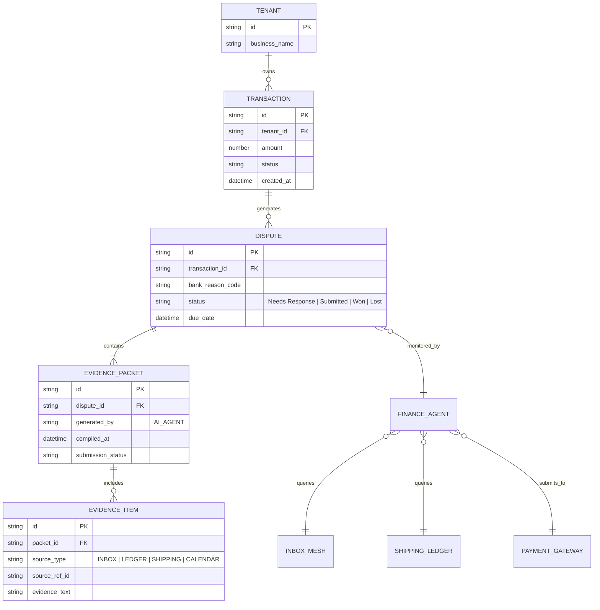

# Issue Brief: Autonomous AI Dispute & Chargeback Resolution Engine

## Title
Architect and Implement the Autonomous AI Dispute & Chargeback Resolution Engine

## Problem Statement
For small business owners like Maya (the baker) and Carlos (the handyman), chargebacks and payment disputes are existential threats. When a customer disputes a transaction with their bank, the business owner is forced to compile evidence (receipts, communication logs, proof of delivery) within a strict timeframe, all while losing the disputed funds instantly. This manual, high-stress process requires them to navigate complex banking portals, understand legal/financial jargon, and takes time away from actually running their business. If they fail to respond correctly or fast enough, they lose the money permanently. They need a system that invisibly fights these battles for them.

## Research Report

**The Gap:**
Leading platforms (Shopify, Wix, Stripe) offer dispute management dashboards, but they still put the burden of proof on the merchant. Shopify provides "Fraud Analysis" and template responses, but the merchant must still click through and submit the evidence. Stripe has Radar for fraud prevention, but when a dispute happens, the merchant must manually construct the evidence payload in the Stripe Dashboard. There is a massive gap for a truly *autonomous* agent that detects a dispute, immediately gathers all context across the platform (inbox, calendar, ledger), constructs a banking-compliant response, and submits it—all without the business owner lifting a finger.

**Competitive Landscape:**
*   **Stripe / Shopify:** Reactive. Provides the UI to upload evidence and alerts the merchant via email. High friction, high cognitive load.
*   **Chargehound / Midigator (Enterprise):** Automated chargeback resolution, but aimed at enterprise businesses with massive transaction volumes. Too complex and expensive for a sole proprietor.
*   **OneHumanCorp (Our Target):** Proactive & Autonomous. The AI Legal/Finance department detects the webhook, compiles the evidence automatically by searching the platform's multi-tenant ledger and communication history, and drafts the response. The merchant is merely notified of the victory.

**Key Findings:**
1.  **Time Sensitivity:** Disputes have strict deadlines (e.g., 7-21 days). Missing the deadline is an automatic loss.
2.  **Evidence Quality:** Winning requires specific types of evidence: AVS matches, CVV matches, IP addresses, communication logs (e.g., "customer said the cake was great via Instagram DM"), and proof of delivery/service.
3.  **Stress Factor:** Non-technical users find banking jargon ("Inquiry", "Chargeback", "Retrieval Request") intimidating.

## Design Doc

### Architecture Diagram

### Mobile UX Flow (375px First)

The goal is to keep this process entirely out of the user's way. The UX is primarily a notification system, not a management interface.

**Screen 1: The "We Handled It" Push Notification**
*   **Trigger:** AI successfully compiles and submits evidence.
*   **Content:** "A customer disputed a $150 charge. Don't worry! Your AI Finance Agent already gathered the receipts and fought it for you. We'll let you know when the bank decides."
*   **Action:** Tap to view summary (optional).

**Screen 2: Dispute Summary Card (Dashboard Feed)**
*   **Layout:** Clean, uniFi-style modular card.
*   **Header:** "Dispute Handled" with a green checkmark icon.
*   **Body:**
    *   Amount: $150.00
    *   Customer: John Doe (links to CRM profile)
    *   Reason: "Product not received"
*   **AI Action Summary:** "Gathered FedEx delivery confirmation (delivered Tuesday at 2 PM) and Instagram DM where John said 'Thanks!'. Submitted to bank."
*   **Visuals:** Frosted glass background, subtle pulsing green dot indicating "Waiting on Bank".
*   **Advanced Settings (Hidden behind toggle):** Raw banking reason codes, raw JSON evidence payload sent to Stripe.

### AI Agent Integration Points

*   **Trigger:** Payment gateway (e.g., Stripe) fires a `charge.dispute.created` webhook.
*   **Finance/Ops Agent Task:**
    1.  Parse the dispute reason code (e.g., "fraudulent", "product_not_received").
    2.  Query the Cross-Channel Identity Engine for the customer.
    3.  Query the Unified Inbox for recent communications regarding the transaction.
    4.  Query the Shipping/Fulfillment ledger for tracking numbers and delivery status.
    5.  Assemble the `EVIDENCE_PACKET`.
    6.  Call the Payment Gateway API to submit the compiled evidence.
*   **Memory Layer:** Record the incident and outcome in the tenant's memory layer to adjust future fraud risk scores for that specific customer.

### Key Design Decisions
1.  **Zero-Touch Default:** We do not ask the merchant to review the evidence before submission unless the AI's confidence score in the evidence is extremely low. Speed and reduced cognitive load are prioritized.
2.  **Cross-Department Synergy:** The Finance Agent cannot resolve disputes alone; it relies heavily on the Inbox Mesh (for communication proof) and the Fulfillment Ledger (for delivery proof). This mandates strict internal API contracts between these domains.
3.  **Isolation:** Evidence compilation must strictly respect multi-tenant boundaries. A dispute for Tenant A cannot accidentally query Tenant B's inbox.

## Implementation Prompt

**To the Implementer Swarm:**
Your task is to build the backend logic and data models for the Autonomous AI Dispute & Chargeback Resolution Engine.

**Customer Use Journey (CUJ):**
A customer initiates a chargeback on their credit card for a cake ordered from Maya. The payment gateway sends a dispute webhook to OHC. Within seconds, the OHC backend catches the webhook, uses the AI Finance Agent to scan Maya's platform data (order history, delivery confirmation, and Instagram DMs confirming receipt), compiles a formatted evidence payload, and automatically submits it back to the payment gateway to fight the chargeback. Maya receives a simple push notification telling her a dispute occurred but that her AI assistant has already handled it.

**Acceptance Criteria:**
1.  **Webhook Ingestion:** Define the API endpoints and routing logic to securely ingest dispute webhooks from external payment providers.
2.  **Data Modeling:** Implement the core entities (`Dispute`, `EvidencePacket`, `EvidenceItem`) ensuring strict tenant isolation (Zero Trust).
3.  **Agent Orchestration:** Create the specific background job/queue mechanism that triggers the Finance Agent upon dispute creation.
4.  **Cross-Domain Queries:** Provide the secure internal query interfaces for the Finance Agent to pull data from the Orders, Shipping, and Inbox domains without violating multi-tenancy rules.
5.  **Gateway Submission:** Implement the outbound API integration to format and send the gathered evidence back to the payment provider.
6.  **Mobile-First State:** Ensure the API provides a clean, simplified summary of the dispute status suitable for rendering the 375px mobile UI card described in the design doc. Do not expose raw banking codes unless requested via an "advanced" query parameter.

**Priority:** P1
**Estimated Scope:** Large
