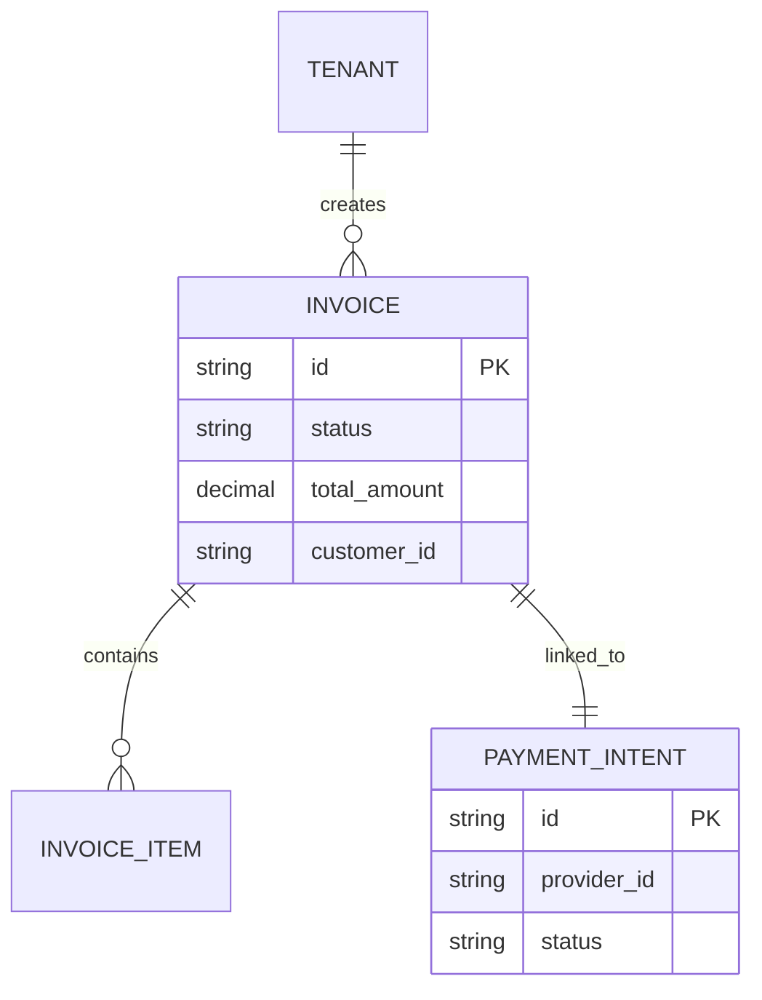

# [Architecture] Autonomous AI Omnichannel Invoicing Engine

## Problem Statement
Small business owners like Carlos (Handyman) and Priya (Boutique) struggle with sending invoices across multiple platforms. Carlos creates invoices manually when on a job site, often forgetting to send them later. Priya needs an easy way to generate a digital invoice to a customer who buys over Instagram. Current platforms require logging into a complex web dashboard. OHC needs an architecture that allows seamless, AI-generated invoicing across WhatsApp, SMS, and Email, fully controllable via a mobile device (375px).

## Research Report
### Competitive Analysis
*   **Shopify:** Complex invoice generation; mainly geared towards physical orders.
*   **Square:** Good POS invoicing but limited omnichannel agentic support.
*   **QuickBooks:** Powerful but intimidating. Too complex for simple SMB needs.
*   **OHC (Target):** Generate invoices via conversational AI (e.g., "Send an invoice for $50 to John for plumbing repair").

### Key Findings
1.  **Mobile-First Creation:** Invoicing must happen natively on the phone, often through voice or quick text.
2.  **Omnichannel Delivery:** Customers expect payment links via WhatsApp/SMS, not just email.
3.  **Auto-Chasing:** AI must automatically follow up on unpaid invoices.

## Design Doc
### Architecture Diagram

### UI Wireframes / Mobile UX Flow
1.  **Creation:** User taps "New Invoice" or uses voice prompt.
2.  **AI Drafting:** AI drafts the line items based on natural language input.
3.  **Review:** Translucent glass card showing the invoice preview.
4.  **Delivery:** 1-tap send via WhatsApp, SMS, or Email.

### AI Integration Points
*   **Sales Agent:** Parses natural language to create structured line items.
*   **Finance Agent:** Tracks payment status and triggers Stripe APIs.
*   **Customer Success Agent:** Handles follow-up messages for overdue payments.

## Implementation Prompt
**To the Implementer Swarm:**
Implement the Autonomous AI Omnichannel Invoicing Engine. Create the necessary gRPC endpoints and PostgreSQL database schema (with RLS for multi-tenancy) to support creating invoices from natural language prompts. Integrate with Stripe to generate Payment Links. Ensure the UI implementation uses the OHC Premium Token library for a native mobile experience.

## Priority
P1

## Estimated Scope
Medium
