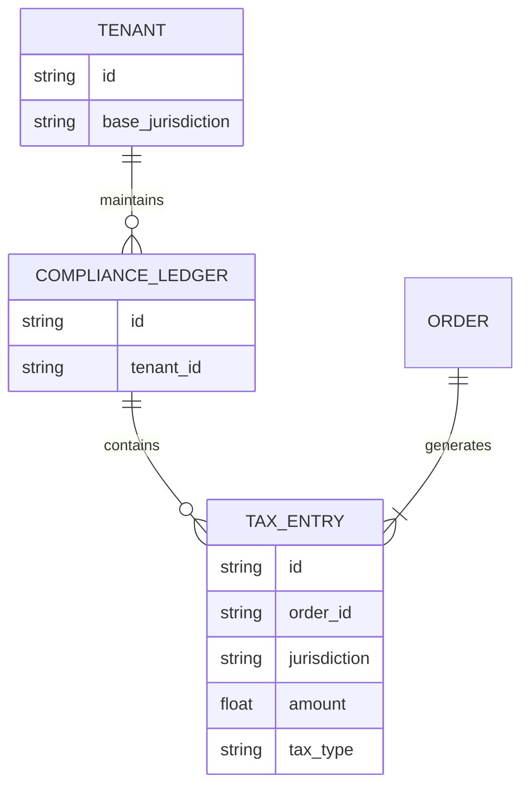

# [Architecture] Autonomous AI Tax and Compliance Engine

## Title
Implement the Autonomous AI Tax and Compliance Engine

## Problem Statement
Small business owners often lack the financial expertise to navigate local and international tax laws. Features like calculating sales tax based on jurisdiction, handling digital vs. physical good tax implications, and preparing year-end compliance reports are manual, error-prone, and stressful. They need an automated system that correctly categorizes transactions, computes real-time tax liabilities at checkout, and generates audit-ready reports without requiring an external CPA right away.

## Research Report
- **Shopify/Wix:** Rely heavily on integrations (like Avalara or TaxJar) for dynamic tax rates, adding significant cost and configuration overhead for small businesses.
- **Current OHC Platform:** Lacks a native, unified engine that abstracts jurisdictional tax complexity across different product types (physical, digital, services).
- **Proposed Solution:** The Autonomous AI Tax and Compliance Engine. This engine will sit between the Checkout/Ledger and the AI Finance/Legal agents. It will use the merchant's location, the buyer's IP/shipping address, and the product category to autonomously calculate tax dynamically at checkout. Furthermore, it will maintain a real-time compliance ledger and flag regulatory risks to the business owner proactively.

## Design Doc

### Core Components
- `Tax Computation Engine`: Evaluates jurisdiction rules based on tenant profile and buyer location context.
- `Compliance Ledger`: An immutable record of calculated and collected taxes, strictly isolated by `tenant_id`.
- `Regulatory AI Agent`: Monitors transaction volumes against nexus thresholds and generates plain-language compliance alerts (e.g., "You are nearing the economic nexus for California sales tax").

### Architecture Diagram

### Mobile UX Flow (375px)
- **Checkout (Buyer):** Real-time localized tax line item smoothly added to the order total.
- **Dashboard (Owner):** A "Tax Health" widget showing estimated collected tax versus liabilities, with 1-tap generation of end-of-quarter plain-language reports.

### Key Design Decisions
- Zero-config for the merchant: the system leverages platform-wide ML models to categorize products and map them to tax codes implicitly.
- Offline resilience: The engine caches regional tax rules for the most common buyer locations at the edge to support offline POS scenarios.

## Implementation Prompt
Implement the Autonomous AI Tax and Compliance Engine. Your task is to design the core database schemas (e.g., `tax_jurisdictions`, `tax_ledgers`), establish the API boundaries for real-time checkout tax calculation, and integrate the `Regulatory AI Agent` to monitor and report on these liabilities. Ensure strict multi-tenant isolation, edge-caching capability for offline support, and provide comprehensive E2E tests verifying accurate calculation across multiple simulated jurisdictions. Do not prescribe specific tax rate providers; focus on the engine architecture and AI integration points.

## Priority
P1

## Estimated Scope
Large
