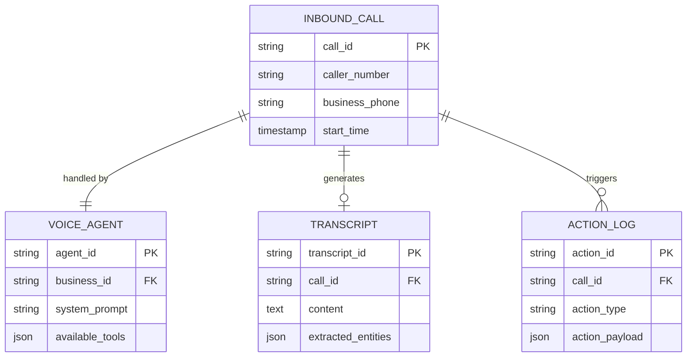

# [Architecture] Autonomous AI Voice Attendant (Zero-Drop Phone Calls)

## Title
Implement an Autonomous AI Voice Attendant for Zero-Drop Call Management

## Problem Statement
Small business owners like Carlos (handyman) and Fatima (food cart operator) rely heavily on phone calls for leads, quotes, and pre-orders. However, they are often in the middle of a job or serving customers, causing them to miss critical calls. Missed calls equal lost revenue and poor customer experience. A non-technical business owner needs an AI agent that can answer the phone 24/7, converse naturally in multiple languages, take messages, schedule appointments, handle basic FAQs ("Are you open today?"), and securely record this information directly into their OneHumanCorp app without any manual intervention.

## Research Report
*   **Target Personas:** Handymen, food carts, tutors, service providers where hands are often full.
*   **Competitive Landscape:**
    *   *Traditional Voicemail:* Passive, leads to hang-ups.
    *   *Shopify/Wix:* Lack native voice AI solutions for inbound calls.
    *   *Standalone tools (e.g., Bland AI, Vapi):* Powerful but require integration (API keys, webhooks) which fails the "no code" requirement for our users.
*   **Gap Analysis:** OHC needs a natively integrated, turnkey Voice AI that routes phone numbers directly to an autonomous agent capable of mutating the business state (booking, ordering, taking messages) seamlessly.
*   **Key Requirements:**
    *   Real-time latency (<800ms response time).
    *   Multilingual support (e.g., Arabic/English for Fatima).
    *   Context-awareness (knows business hours, services, prices).
    *   Action execution (booking appointments, logging CRM notes).

## Design Doc

### Architecture Diagram

### Mobile UX Flow (375px)
1.  **Dashboard Alert:** User sees a missed call but with a green checkmark indicating "AI Handled".
2.  **Call Detail Card:** Tapping the alert opens a glassmorphic card.
    *   **Header:** Caller ID/Name & Duration.
    *   **Summary:** Bullet points generated by AI (e.g., "Wants quote for sink repair", "Requested callback after 5 PM").
    *   **Action Taken:** "Appointment booked for Tuesday 10 AM" with a link to the Calendar.
    *   **Audio/Transcript Toggle:** Play button for the recording and a tab for the full transcript.
3.  **Settings (Advanced):** Toggle to turn AI answering on/off, set "Ring me first for 15s", and adjust the agent's tone (Professional, Friendly).

### AI Agent Integration Points
*   **CS Department:** The Voice Agent acts as the front-line Customer Service representative.
*   **Operations Department:** It triggers operations (like adding a task or booking a slot in the Calendar Mesh).
*   **Memory Layer:** The agent queries the business context (menu, services, hours) dynamically and updates the CRM with caller preferences.

### Zero Trust & Security
*   **SPIFFE/SPIRE:** The Voice Agent microservice will have a dedicated identity. All tool calls (e.g., booking an appointment) must be signed and validated against the tenant's policies.
*   **Multi-tenant Isolation:** Audio streams and transcripts are strictly isolated per tenant using tenant-specific KMS keys for encryption at rest.
*   **Data Minimization:** PII (credit cards) should be recognized and handled via a secure DTMF/PCI-compliant offramp, not stored in plain text transcripts.

## Implementation Prompt
**Objective:** Build the foundational infrastructure for the Autonomous AI Voice Attendant that can receive inbound SIP trunks/calls, stream audio to a conversational AI model, and execute function calls against the OHC backend.

**User Journey (CUJ):**
As a small business owner, I want to provision a phone number in the OHC app with one tap. When a customer calls that number, an AI answers immediately, converses naturally, answers FAQs based on my business profile, and logs a summary of the call in my inbox.

**Acceptance Criteria:**
1.  Establish a mechanism to provision and map phone numbers to tenant IDs.
2.  Implement the real-time audio streaming bridge between the telephony provider (e.g., Twilio/Plivo) and the Voice AI service.
3.  The Voice AI must be injected with the specific tenant's context (business name, hours, basic services).
4.  The system must generate a transcript and a concise summary card in the unified AI inbox.
5.  All infrastructure must respect multi-tenant isolation and secure identity protocols (SPIFFE/SPIRE).

*(Note: Do not define specific database schemas or API endpoints. Design the interfaces and event flows required to satisfy the CUJ.)*

## Priority
P0

## Estimated Scope
Large