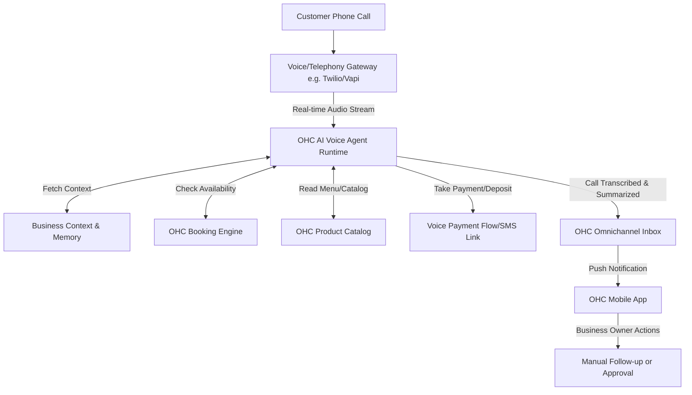

# Architecture Brief: Autonomous AI Voice Receptionist

## Title
OHC "VoiceDesk": Autonomous 24/7 AI Voice Receptionist Architecture

## Problem Statement
Small business owners (especially service providers like Carlos the handyman, or food cart operators like Fatima) cannot answer their phones while working. Missing a phone call often means losing a lead or an order. They need an AI receptionist that can answer calls in real-time, speak in multiple languages (like Arabic/English for Fatima), answer common questions (hours, pricing), take deposits for bookings, and capture pre-orders—all integrated directly into the OHC omnichannel inbox.

## Research Report
- **Competitive Benchmark**: Traditional answering services cost $100-$300/mo. Current AI voice agents (like Bland AI or Vapi) are powerful but require technical setup (API keys, webhooks, Twilio configuration).
- **Market Gap**: No platform offers a "1-tap" voice agent natively integrated with a business's calendar, inventory, and POS.
- **Pain Point**: "I missed a call because I was under a sink, and they hired someone else."
- **Opportunity**: Give every OHC business a dedicated phone number (or port theirs) that routes to an AI agent configured with their exact business metadata (services, prices, availability) and "vibe."

## Design Doc

### High-Level Architecture (Mermaid.js)

### Mobile UX Flow (375px First)
1.  **Voice Settings Screen**: A simple toggle: "Enable AI Receptionist".
2.  **Number Selection**: "Pick your business phone number" (Local area code search).
3.  **Agent Persona Setup**:
    - Voice Selection: Play a sample of 3-4 professional/friendly voices.
    - Language: Toggle English, Spanish, Arabic, etc.
    - Instructions: Simple text box: "What should the agent know? (e.g., 'Tell them I am booked until next week, but can take emergencies for $150')."
4.  **Inbox Integration**: In the unified inbox, voice calls appear as a chat thread. The AI's summary is at the top ("Caller wants a plumbing quote. Sent booking link via SMS."), followed by the full transcript and an audio playback button.

### AI Agent Integration Points
- **The Receptionist Agent**: A specialized sub-agent fine-tuned for low-latency conversational audio. It has access to tools like `check_availability`, `create_lead`, `send_sms_link`.
- **The Operations Agent**: Monitors the Voice Agent's transcripts to automatically block off calendar time if a tentative booking was made, or update inventory if a pre-order was initiated.

### Key Design Decisions
- **Zero-Config Telephony**: The user never sees Twilio or SIP credentials. OHC abstracts the phone number provisioning entirely.
- **Omnichannel Sync**: Voice is not a silo. Every call becomes a standard thread in the existing Omnichannel Inbox.
- **Graceful Handoff**: If the AI detects an emergency or cannot answer a complex question, it says, "Let me text you Carlos's direct emergency line," or "I will have Carlos call you back the moment he is free."

## Implementation Prompt
**To Implementer Agent:**
Implement the "VoiceDesk" capability within the OHC platform. Create the telephony integration layer that connects an incoming PSTN call to a real-time LLM voice service (e.g., using WebRTC or SIP over WebSockets). Integrate the agent's context window with the business's data model (catalog, calendar). Ensure that when a call completes, a structured summary and transcript are injected into the unified Omnichannel Inbox database. Build the mobile-first (375px) configuration UI where a user can activate the agent with a single tap and configure basic instructions without any developer terminology. Ensure the agent can securely send an SMS payment/booking link to the caller's phone number during or immediately after the call.

## Priority
P1

## Estimated Scope
Large